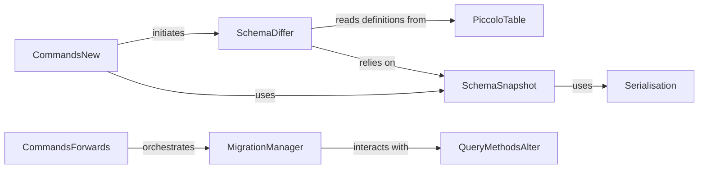

## Details

The Piccolo migration subsystem automates database schema evolution. It centers around `SchemaDiffer`, which compares the current `PiccoloTable` definitions with a `SchemaSnapshot` to identify schema changes. These changes are then used by `CommandsNew` to generate new migration files. For applying these migrations, `CommandsForwards` orchestrates the `MigrationManager`, which in turn interacts with `QueryMethodsAlter` to execute the necessary DDL operations on the database. `SchemaSnapshot` relies on `Serialisation` for storing and retrieving schema definitions, ensuring a consistent reference point for schema comparisons. This design ensures a robust and automated process for managing database schema changes.

### SchemaDiffer
Compares the current application's ORM `PiccoloTable` definitions with a stored `SchemaSnapshot` to identify differences and generates `AlterStatements` (migration operations).

**Related Classes/Methods**:

- <a href="https://github.com/piccolo-orm/piccolo/blob/master/piccolo/apps/migrations/auto/schema_differ.py#L108-L706" target="_blank" rel="noopener noreferrer">`SchemaDiffer`:108-706</a>

### MigrationManager
Executes generated `AlterStatements` against the database to modify the schema, handling both forward application and backward reversion of migrations.

**Related Classes/Methods**:

- <a href="https://github.com/piccolo-orm/piccolo/blob/master/piccolo/apps/migrations/auto/migration_manager.py#L139-L1013" target="_blank" rel="noopener noreferrer">`MigrationManager`:139-1013</a>

### SchemaSnapshot
Manages the creation, storage, and retrieval of database schema snapshots, serving as a historical reference point for schema comparisons.

**Related Classes/Methods**:

- <a href="https://github.com/piccolo-orm/piccolo/blob/master/piccolo/apps/migrations/auto/schema_snapshot.py#L9-L114" target="_blank" rel="noopener noreferrer">`SchemaSnapshot`:9-114</a>

### Serialisation
Handles the serialization and deserialization of Python objects (specifically `Table` and `Column` definitions) to enable `SchemaSnapshot` storage and retrieval.

**Related Classes/Methods**:

- <a href="https://github.com/piccolo-orm/piccolo/blob/master/piccolo/apps/migrations/auto/serialisation.py" target="_blank" rel="noopener noreferrer">`Serialisation`</a>

### CommandsNew
The CLI command responsible for automatically generating new migration files based on schema changes detected by `SchemaDiffer`.

**Related Classes/Methods**:

- <a href="https://github.com/piccolo-orm/piccolo/blob/master/piccolo/apps/migrations/commands/new.py" target="_blank" rel="noopener noreferrer">`CommandsNew`</a>

### CommandsForwards
The CLI command for applying pending migrations to the database by orchestrating the `MigrationManager`.

**Related Classes/Methods**:

- <a href="https://github.com/piccolo-orm/piccolo/blob/master/piccolo/apps/migrations/commands/forwards.py" target="_blank" rel="noopener noreferrer">`CommandsForwards`</a>

### PiccoloTable
Represents the desired database schema as defined by the application's ORM models, serving as the authoritative input for `SchemaDiffer`.

**Related Classes/Methods**:

- <a href="https://github.com/piccolo-orm/piccolo/blob/master/piccolo/table.py" target="_blank" rel="noopener noreferrer">`PiccoloTable`</a>

### QueryMethodsAlter
Part of Piccolo's Query Builder, responsible for performing DDL (Data Definition Language) operations on the database, utilized by `MigrationManager` to execute schema changes.

**Related Classes/Methods**:

- <a href="https://github.com/piccolo-orm/piccolo/blob/master/piccolo/query/methods/alter.py" target="_blank" rel="noopener noreferrer">`QueryMethodsAlter`</a>

### [FAQ](https://github.com/CodeBoarding/GeneratedOnBoardings/tree/main?tab=readme-ov-file#faq)