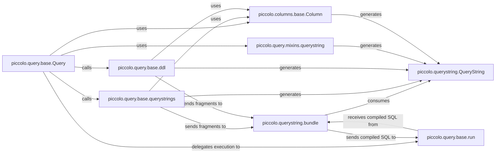

## Details

The `piccolo.query` subsystem is central to Piccolo's ORM, providing a robust and extensible framework for constructing and executing SQL queries. At its core, the `piccolo.query.base.Query` component orchestrates the entire query building process, leveraging specialized components for different aspects of SQL generation. `piccolo.query.mixins.querystring` and `piccolo.columns.base.Column` are key in generating atomic `piccolo.querystring.QueryString` fragments, which serve as the fundamental building blocks of all SQL statements. For complete SQL generation, `Query` delegates to `piccolo.query.base.querystrings` (for DML) and `piccolo.query.base.ddl` (for DDL), both of which assemble `QueryString` objects. These fragments are then passed to `piccolo.querystring.bundle`, which is responsible for compiling them into a final, executable SQL string. The compiled SQL is then handed off to `piccolo.query.base.run` for asynchronous execution against the database, completing the query lifecycle. This modular design ensures clear separation of concerns, reusability of SQL components, and secure parameterization.

### piccolo.query.base.Query
The foundational abstract class for all query types (e.g., Select, Insert, Update, Delete). It provides the fluent API for users to define queries and orchestrates the query building process.

**Related Classes/Methods**:

- <a href="https://github.com/piccolo-orm/piccolo/blob/master/piccolo/query/base.py" target="_blank" rel="noopener noreferrer">`piccolo.query.base.Query`</a>
- <a href="https://github.com/piccolo-orm/piccolo/blob/master/piccolo/query/base.py" target="_blank" rel="noopener noreferrer">`piccolo.query.base.Query:querystrings`</a>
- <a href="https://github.com/piccolo-orm/piccolo/blob/master/piccolo/query/base.py" target="_blank" rel="noopener noreferrer">`piccolo.query.base.Query:ddl`</a>
- <a href="https://github.com/piccolo-orm/piccolo/blob/master/piccolo/query/base.py" target="_blank" rel="noopener noreferrer">`piccolo.query.base.Query:run`</a>

### piccolo.querystring.QueryString
Represents an atomic SQL fragment or a parameter. It's the fundamental, immutable building block used to compose complex SQL statements, ensuring secure parameterization.

**Related Classes/Methods**:

- <a href="https://github.com/piccolo-orm/piccolo/blob/master/piccolo/querystring.py#L58-L318" target="_blank" rel="noopener noreferrer">`piccolo.querystring.QueryString`:58-318</a>

### piccolo.querystring.bundle
Responsible for compiling a collection of QueryString objects into a complete, executable SQL string, handling parameterization for secure query execution. This is the final step in SQL generation.

**Related Classes/Methods**:

- <a href="https://github.com/piccolo-orm/piccolo/blob/master/piccolo/querystring.py#L167-L204" target="_blank" rel="noopener noreferrer">`piccolo.querystring.bundle`:167-204</a>

### piccolo.query.base.querystrings
A method within Query responsible for generating the appropriate Data Manipulation Language (DML) SQL (e.g., SELECT, INSERT, UPDATE, DELETE) tailored to the specific database engine.

**Related Classes/Methods**:

- <a href="https://github.com/piccolo-orm/piccolo/blob/master/piccolo/query/base.py" target="_blank" rel="noopener noreferrer">`piccolo.query.base.Query:querystrings`</a>

### piccolo.query.base.ddl
A method within Query responsible for generating Data Definition Language (DDL) statements (e.g., CREATE TABLE, ALTER TABLE, DROP TABLE) adapted for the target database engine, crucial for schema management.

**Related Classes/Methods**:

- <a href="https://github.com/piccolo-orm/piccolo/blob/master/piccolo/query/base.py" target="_blank" rel="noopener noreferrer">`piccolo.query.base.Query:ddl`</a>

### piccolo.query.mixins.querystring
A mixin providing common logic for generating reusable SQL clauses (e.g., WHERE, ORDER BY, LIMIT, JOIN) that are integrated into various query types, promoting code reuse and consistency.

**Related Classes/Methods**:

- <a href="https://github.com/piccolo-orm/piccolo/blob/master/piccolo/query/mixins.py#L822-L835" target="_blank" rel="noopener noreferrer">`piccolo.query.mixins.querystring`:822-835</a>

### piccolo.columns.base.Column
While part of the ORM Core, Column objects are crucial for the Query Builder as they provide their own SQL fragments and metadata, contributing to the SELECT, WHERE, and DDL parts of a query.

**Related Classes/Methods**:

- <a href="https://github.com/piccolo-orm/piccolo/blob/master/piccolo/columns/base.py" target="_blank" rel="noopener noreferrer">`piccolo.columns.base.Column`</a>

### piccolo.query.base.run
The method responsible for delegating the compiled SQL and parameters to the appropriate database engine's run_querystring function for asynchronous execution, completing the query lifecycle.

**Related Classes/Methods**:

- <a href="https://github.com/piccolo-orm/piccolo/blob/master/piccolo/query/base.py" target="_blank" rel="noopener noreferrer">`piccolo.query.base.Query:run`</a>

### [FAQ](https://github.com/CodeBoarding/GeneratedOnBoardings/tree/main?tab=readme-ov-file#faq)