```mermaid
graph LR
    piccolo_table_reflection_reflect["piccolo.table_reflection.reflect"]
    piccolo_table_reflection_get_table["piccolo.table_reflection.get_table"]
    piccolo_apps_schema_commands_generate_create_table_class_from_db["piccolo.apps.schema.commands.generate.create_table_class_from_db"]
    piccolo_apps_schema_commands_generate_get_output_schema["piccolo.apps.schema.commands.generate.get_output_schema"]
    piccolo_apps_schema_commands_generate_generate["piccolo.apps.schema.commands.generate.generate"]
    piccolo_apps_schema_commands_graph_graph["piccolo.apps.schema.commands.graph.graph"]
    piccolo_apps_schema_commands_generate_generate -- "initiates" --> piccolo_apps_schema_commands_generate_get_output_schema
    piccolo_apps_schema_commands_generate_get_output_schema -- "uses" --> piccolo_table_reflection_reflect
    piccolo_apps_schema_commands_generate_get_output_schema -- "calls" --> piccolo_apps_schema_commands_generate_create_table_class_from_db
    piccolo_apps_schema_commands_generate_create_table_class_from_db -- "uses" --> piccolo_table_reflection_get_table
    piccolo_table_reflection_get_table -- "uses" --> piccolo_table_reflection_reflect
    piccolo_apps_schema_commands_graph_graph -- "uses" --> piccolo_table_reflection_reflect
```

## Details

The `Schema Management` subsystem encompasses functionalities related to database schema introspection, generation of Piccolo ORM models from existing schemas, and visualization of schema relationships.

### piccolo.table_reflection.reflect
This component performs the fundamental low-level database introspection. It discovers all tables within the connected database and retrieves their basic properties, serving as the primary interface for raw schema discovery.

**Related Classes/Methods**:

- <a href="https://github.com/piccolo-orm/piccolo/blob/master/piccolo/table_reflection.py#L94-L144" target="_blank" rel="noopener noreferrer">`piccolo.table_reflection.reflect`:94-144</a>

### piccolo.table_reflection.get_table
Builds upon `reflect` to retrieve comprehensive and detailed information for a *specific* table from the database. This includes granular details like column types, constraints, and relationships, essential for accurate model generation.

**Related Classes/Methods**:

- <a href="https://github.com/piccolo-orm/piccolo/blob/master/piccolo/table_reflection.py#L157-L178" target="_blank" rel="noopener noreferrer">`piccolo.table_reflection.get_table`:157-178</a>

### piccolo.apps.schema.commands.generate.create_table_class_from_db
This is a core transformation component. It takes the raw, introspected database schema details for a single table and translates them into a complete, executable Python `Table` class definition, effectively generating a Piccolo ORM model.

**Related Classes/Methods**:

- <a href="https://github.com/piccolo-orm/piccolo/blob/master/piccolo/apps/schema/commands/generate.py#L654-L803" target="_blank" rel="noopener noreferrer">`piccolo.apps.schema.commands.generate.create_table_class_from_db`:654-803</a>

### piccolo.apps.schema.commands.generate.get_output_schema
Orchestrates the end-to-end process of generating the entire Piccolo schema. It identifies all tables in the database (using `reflect`) and iteratively calls `create_table_class_from_db` for each, ensuring all necessary ORM models are created.

**Related Classes/Methods**:

- <a href="https://github.com/piccolo-orm/piccolo/blob/master/piccolo/apps/schema/commands/generate.py#L806-L895" target="_blank" rel="noopener noreferrer">`piccolo.apps.schema.commands.generate.get_output_schema`:806-895</a>

### piccolo.apps.schema.commands.generate.generate
Serves as the primary command-line interface (CLI) entry point for the schema generation feature (`piccolo schema generate`). It initiates the overall schema generation workflow, making the ORM model scaffolding accessible to developers.

**Related Classes/Methods**:

- <a href="https://github.com/piccolo-orm/piccolo/blob/master/piccolo/apps/schema/commands/generate.py#L901-L946" target="_blank" rel="noopener noreferrer">`piccolo.apps.schema.commands.generate.generate`:901-946</a>

### piccolo.apps.schema.commands.graph.graph
Generates a visual representation (e.g., a graph diagram) of the database schema. This visualization aids in understanding the database structure, table relationships, and column details, which is vital for effective database management and ORM usage.

**Related Classes/Methods**:

- <a href="https://github.com/piccolo-orm/piccolo/blob/master/piccolo/apps/schema/commands/graph.py#L47-L113" target="_blank" rel="noopener noreferrer">`piccolo.apps.schema.commands.graph.graph`:47-113</a>

### [FAQ](https://github.com/CodeBoarding/GeneratedOnBoardings/tree/main?tab=readme-ov-file#faq)