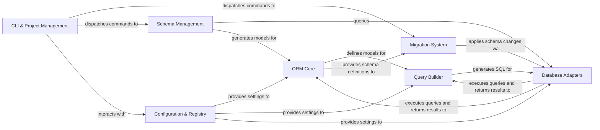

## Details

Piccolo's architecture is designed around a clear separation of concerns, facilitating robust ORM functionalities and database interactions. The `ORM Core` serves as the central definition point for data models, which are then utilized by the `Query Builder` to construct SQL queries. These queries are executed against various databases through the `Database Adapters`, ensuring broad compatibility. Schema evolution is managed by the `Migration System`, which interacts with the `ORM Core` for schema definitions and the `Database Adapters` for applying changes. The `Configuration & Registry` component provides essential settings and discovers registered applications, tables, and database engines, influencing the behavior of the `ORM Core`, `Query Builder`, and `Database Adapters`. `Schema Management` tools introspect and generate models, relying on `Database Adapters` for schema information and feeding generated models back to the `ORM Core`. Finally, the `CLI & Project Management` component acts as the primary user interface, orchestrating operations across the `Migration System`, `Schema Management`, and interacting with the `Configuration & Registry` for project-wide settings.

### ORM Core
The foundational layer for defining database models (tables and columns) and providing an object-oriented interface for data manipulation.

**Related Classes/Methods**:

- <a href="https://github.com/piccolo-orm/piccolo/blob/master/piccolo/table.py" target="_blank" rel="noopener noreferrer">`piccolo/table.py`</a>
- <a href="https://github.com/piccolo-orm/piccolo/blob/master/piccolo/columns/base.py" target="_blank" rel="noopener noreferrer">`piccolo/columns/base.py`</a>

### Query Builder [[Expand]](./Query_Builder.md)
Responsible for constructing and managing SQL queries based on the ORM models, offering a fluent API for complex data retrieval and manipulation.

**Related Classes/Methods**:

- <a href="https://github.com/piccolo-orm/piccolo/blob/master/piccolo/querystring.py" target="_blank" rel="noopener noreferrer">`piccolo/querystring.py`</a>
- <a href="https://github.com/piccolo-orm/piccolo/blob/master/piccolo/query/base.py" target="_blank" rel="noopener noreferrer">`piccolo/query/base.py`</a>

### Database Adapters [[Expand]](./Database_Adapters.md)
Provides a standardized interface for connecting to and interacting with various relational database systems (e.g., PostgreSQL, SQLite, CockroachDB).

**Related Classes/Methods**:

- <a href="https://github.com/piccolo-orm/piccolo/blob/master/piccolo/engine/base.py" target="_blank" rel="noopener noreferrer">`piccolo/engine/base.py`</a>
- <a href="https://github.com/piccolo-orm/piccolo/blob/master/piccolo/engine/postgres.py" target="_blank" rel="noopener noreferrer">`piccolo/engine/postgres.py`</a>
- <a href="https://github.com/piccolo-orm/piccolo/blob/master/piccolo/engine/sqlite.py" target="_blank" rel="noopener noreferrer">`piccolo/engine/sqlite.py`</a>
- <a href="https://github.com/piccolo-orm/piccolo/blob/master/piccolo/engine/cockroach.py" target="_blank" rel="noopener noreferrer">`piccolo/engine/cockroach.py`</a>

### Migration System [[Expand]](./Migration_System.md)
Manages the evolution of the database schema, enabling version-controlled changes and ensuring schema consistency across environments.

**Related Classes/Methods**:

- <a href="https://github.com/piccolo-orm/piccolo/blob/master/piccolo/apps/migrations/auto/schema_differ.py" target="_blank" rel="noopener noreferrer">`piccolo/apps/migrations/auto/schema_differ.py`</a>
- <a href="https://github.com/piccolo-orm/piccolo/blob/master/piccolo/apps/migrations/auto/migration_manager.py" target="_blank" rel="noopener noreferrer">`piccolo/apps/migrations/auto/migration_manager.py`</a>

### Configuration & Registry
Centralized management of Piccolo application settings, including discovery of registered applications, tables, and database engines.

**Related Classes/Methods**:

- <a href="https://github.com/piccolo-orm/piccolo/blob/master/piccolo/conf/apps.py" target="_blank" rel="noopener noreferrer">`piccolo/conf/apps.py`</a>

### CLI & Project Management [[Expand]](./CLI_Project_Management.md)
The main command-line interface for interacting with Piccolo, providing tools for project initialization, application scaffolding, and dispatching commands to other components.

**Related Classes/Methods**:

- <a href="https://github.com/piccolo-orm/piccolo/blob/master/piccolo/main.py" target="_blank" rel="noopener noreferrer">`piccolo/main.py`</a>
- <a href="https://github.com/piccolo-orm/piccolo/blob/master/piccolo/apps/project/commands/new.py" target="_blank" rel="noopener noreferrer">`piccolo/apps/project/commands/new.py`</a>
- <a href="https://github.com/piccolo-orm/piccolo/blob/master/piccolo/apps/asgi/commands/new.py" target="_blank" rel="noopener noreferrer">`piccolo/apps/asgi/commands/new.py`</a>

### Schema Management [[Expand]](./Schema_Management.md)
Tools for introspecting existing database schemas, generating Piccolo models from them, and visualizing schema relationships.

**Related Classes/Methods**:

- <a href="https://github.com/piccolo-orm/piccolo/blob/master/piccolo/table_reflection.py" target="_blank" rel="noopener noreferrer">`piccolo/table_reflection.py`</a>
- <a href="https://github.com/piccolo-orm/piccolo/blob/master/piccolo/apps/schema/commands/generate.py" target="_blank" rel="noopener noreferrer">`piccolo/apps/schema/commands/generate.py`</a>

### [FAQ](https://github.com/CodeBoarding/GeneratedOnBoardings/tree/main?tab=readme-ov-file#faq)