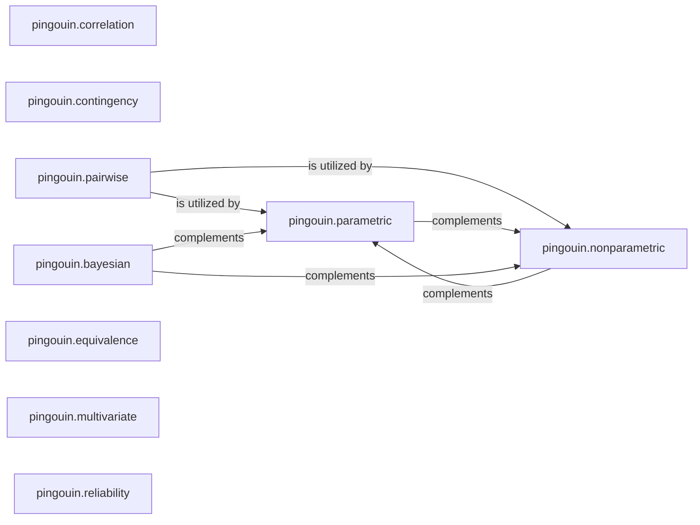

## Details

The `Core Statistical Tests` subsystem is the heart of the `pingouin` library, providing a comprehensive suite of statistical analysis tools. It adheres to the "Statistical Library/Toolkit Pattern" by organizing functionalities into distinct, specialized modules.

### pingouin.parametric
Provides a comprehensive suite of parametric tests, including various ANOVA types (anova, mixed_anova, anova2, anovan, rm_anova) and t-tests (ttest). It serves as the foundation for statistical inference under parametric assumptions.

**Related Classes/Methods**:

- <a href="https://github.com/raphaelvallat/pingouin/blob/main/src/pingouin/parametric.py" target="_blank" rel="noopener noreferrer">`pingouin.parametric`</a>

### pingouin.nonparametric
Implements non-parametric statistical tests and related utility functions, such as Median Absolute Deviation (mad, madmedianrule), which are robust to distributional assumptions.

**Related Classes/Methods**:

- <a href="https://github.com/raphaelvallat/pingouin/blob/main/src/pingouin/nonparametric.py" target="_blank" rel="noopener noreferrer">`pingouin.nonparametric`</a>

### pingouin.correlation
Offers a versatile interface (corr) for various correlation analyses, dispatching to specialized methods like percentage bend correlation (percbend), biweight midcorrelation (bicor), Shepherd's pi correlation (shepherd), and partial correlation (partial_corr).

**Related Classes/Methods**:

- <a href="https://github.com/raphaelvallat/pingouin/blob/main/src/pingouin/correlation.py" target="_blank" rel="noopener noreferrer">`pingouin.correlation`</a>

### pingouin.contingency
Manages statistical analysis for categorical data organized in contingency tables. This includes foundational methods for creating and analyzing dichotomous tables (dichotomous_crosstab) and specific tests like the chi-squared McNemar test (chi2_mcnemar).

**Related Classes/Methods**:

- <a href="https://github.com/raphaelvallat/pingouin/blob/main/src/pingouin/contingency.py" target="_blank" rel="noopener noreferrer">`pingouin.contingency`</a>

### pingouin.pairwise
Orchestrates and executes multiple pairwise statistical comparisons, a common requirement in post-hoc analysis. It provides high-level functions such as pairwise_tests and pairwise_ttests.

**Related Classes/Methods**:

- <a href="https://github.com/raphaelvallat/pingouin/blob/main/src/pingouin/pairwise.py" target="_blank" rel="noopener noreferrer">`pingouin.pairwise`</a>

### pingouin.bayesian
Implements Bayesian statistical methods, providing tools for Bayesian inference and hypothesis testing, offering an alternative probabilistic framework for analysis.

**Related Classes/Methods**:

- <a href="https://github.com/raphaelvallat/pingouin/blob/main/src/pingouin/bayesian.py" target="_blank" rel="noopener noreferrer">`pingouin.bayesian`</a>

### pingouin.equivalence
Focuses on statistical equivalence testing, allowing users to determine if two groups or conditions are practically equivalent within a defined margin, rather than just statistically different.

**Related Classes/Methods**:

- <a href="https://github.com/raphaelvallat/pingouin/blob/main/src/pingouin/equivalence.py" target="_blank" rel="noopener noreferrer">`pingouin.equivalence`</a>

### pingouin.multivariate
Contains functions for multivariate statistical analysis, dealing with relationships among multiple variables simultaneously, such as MANOVA or canonical correlation.

**Related Classes/Methods**:

- <a href="https://github.com/raphaelvallat/pingouin/blob/main/src/pingouin/multivariate.py" target="_blank" rel="noopener noreferrer">`pingouin.multivariate`</a>

### pingouin.reliability
Provides tools for assessing the reliability and consistency of measurements, such as inter-rater reliability (e.g., Cohen's Kappa) or internal consistency (e.g., Cronbach's alpha).

**Related Classes/Methods**:

- <a href="https://github.com/raphaelvallat/pingouin/blob/main/src/pingouin/reliability.py" target="_blank" rel="noopener noreferrer">`pingouin.reliability`</a>

### [FAQ](https://github.com/CodeBoarding/GeneratedOnBoardings/tree/main?tab=readme-ov-file#faq)