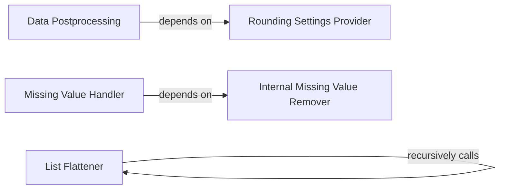

## Details

This subsystem, primarily encapsulated within `pingouin.utils` (located in `utils.py`), forms the backbone for all data-related operations. It ensures data integrity, consistency, and proper formatting (primarily Pandas DataFrames) before statistical analyses are performed.

### Data Postprocessing
Responsible for the final formatting and structural adjustments of Pandas DataFrames. This includes applying specific rounding settings to ensure data is presented consistently and accurately, typically before being returned to the user or passed to subsequent analytical steps.

**Related Classes/Methods**:

- <a href="https://github.com/raphaelvallat/pingouin/blob/main/src/pingouin/utils.py#L86-L144" target="_blank" rel="noopener noreferrer">`pingouin.utils._postprocess_dataframe`:86-144</a>

### Rounding Settings Provider
A utility function that determines and provides the appropriate rounding parameters. It likely considers data characteristics or user-defined preferences to inform the rounding logic used by `Data Postprocessing`.

**Related Classes/Methods**:

- <a href="https://github.com/raphaelvallat/pingouin/blob/main/src/pingouin/utils.py#L147-L158" target="_blank" rel="noopener noreferrer">`pingouin.utils._get_round_setting_for`:147-158</a>

### Missing Value Handler
Serves as the primary public interface for handling and removing missing values (NaN) from data structures. It ensures data cleanliness, which is critical for accurate statistical computations.

**Related Classes/Methods**:

- <a href="https://github.com/raphaelvallat/pingouin/blob/main/src/pingouin/utils.py#L185-L265" target="_blank" rel="noopener noreferrer">`pingouin.utils.remove_na`:185-265</a>

### Internal Missing Value Remover
An internal helper function that encapsulates the core logic for the actual removal of missing values. It likely operates on individual data series or columns, providing the granular functionality for `Missing Value Handler`.

**Related Classes/Methods**:

- <a href="https://github.com/raphaelvallat/pingouin/blob/main/src/pingouin/utils.py#L166-L182" target="_blank" rel="noopener noreferrer">`pingouin.utils._remove_na_single`:166-182</a>

### List Flattener
A general-purpose utility function designed to convert nested list structures into a single, flat list. This is a common data transformation utility that can be used across various parts of the library where data might be structured in nested lists.

**Related Classes/Methods**:

- <a href="https://github.com/raphaelvallat/pingouin/blob/main/src/pingouin/utils.py#L273-L319" target="_blank" rel="noopener noreferrer">`pingouin.utils._flatten_list`:273-319</a>

### [FAQ](https://github.com/CodeBoarding/GeneratedOnBoardings/tree/main?tab=readme-ov-file#faq)