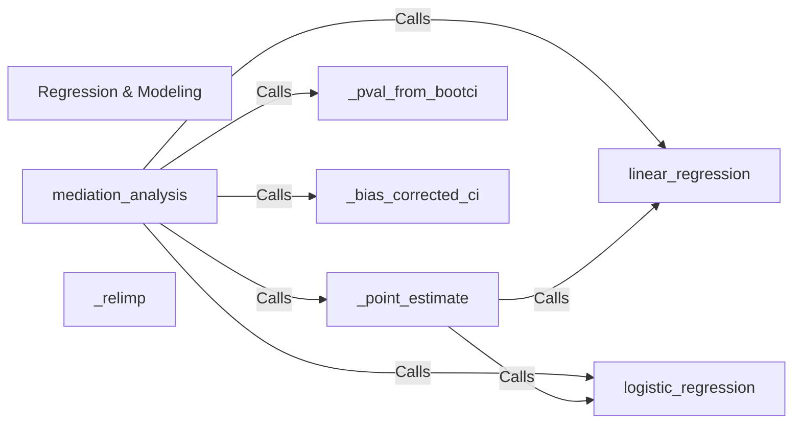

## Details

The `pingouin.regression` subsystem provides a comprehensive suite for statistical regression analysis. The `Regression & Modeling` component serves as the primary entry point, orchestrating calls to specialized regression algorithms such as `linear_regression` and `logistic_regression`. For complex analyses like `mediation_analysis`, the system leverages these core regression models and integrates utility components like `_point_estimate`, `_pval_from_bootci`, and `_bias_corrected_ci` to derive robust statistical inferences. `_point_estimate` directly interacts with the regression models to extract necessary coefficients, while `_pval_from_bootci` and `_bias_corrected_ci` process bootstrap results to provide refined statistical measures. The `_relimp` component operates independently to assess predictor importance within models. This modular design ensures clear separation of concerns, with core regression models handling computations and utility components refining or interpreting their outputs.

### Regression & Modeling [[Expand]](./Regression_Modeling.md)
The overarching component that provides the public API for all regression-related functionalities. It acts as the entry point for users to access linear, logistic, and mediation analyses, orchestrating the underlying helper functions and algorithms.

**Related Classes/Methods**:

- <a href="https://github.com/raphaelvallat/pingouin/blob/main/src/pingouin/regression.py" target="_blank" rel="noopener noreferrer">`pingouin.regression`</a>

### linear_regression
Implements the core algorithm for fitting ordinary least squares (OLS) linear regression models. It computes coefficients, R-squared, p-values, and other relevant statistics for continuous outcome variables.

**Related Classes/Methods**:

- <a href="https://github.com/raphaelvallat/pingouin/blob/main/src/pingouin/regression.py" target="_blank" rel="noopener noreferrer">`pingouin.regression:linear_regression`</a>

### logistic_regression
Implements the core algorithm for fitting logistic regression models, suitable for binary or ordinal categorical outcome variables. It calculates coefficients, odds ratios, and statistical significance.

**Related Classes/Methods**:

- <a href="https://github.com/raphaelvallat/pingouin/blob/main/src/pingouin/regression.py" target="_blank" rel="noopener noreferrer">`pingouin.regression:logistic_regression`</a>

### mediation_analysis
Manages the complex workflow for mediation analysis, which involves multiple regression steps to determine direct, indirect, and total effects of an independent variable on a dependent variable through a mediator. It integrates results from basic regression models and applies bootstrapping for robust inference.

**Related Classes/Methods**:

- <a href="https://github.com/raphaelvallat/pingouin/blob/main/src/pingouin/regression.py" target="_blank" rel="noopener noreferrer">`pingouin.regression:mediation_analysis`</a>

### _point_estimate
A utility component responsible for extracting standardized point estimates (e.g., regression coefficients) from the results of various regression models, ensuring consistency in output across different regression types. It directly calls regression models to obtain necessary coefficients.

**Related Classes/Methods**:

- <a href="https://github.com/raphaelvallat/pingouin/blob/main/src/pingouin/regression.py" target="_blank" rel="noopener noreferrer">`pingouin.regression:_point_estimate`</a>

### _relimp
Calculates the relative importance of predictors within a regression model, providing insights into the unique contribution of each independent variable to the model's explanatory power.

**Related Classes/Methods**:

- <a href="https://github.com/raphaelvallat/pingouin/blob/main/src/pingouin/regression.py" target="_blank" rel="noopener noreferrer">`pingouin.regression:_relimp`</a>

### _pval_from_bootci
Computes p-values based on bootstrap confidence intervals, offering a non-parametric approach to statistical inference, particularly useful when assumptions for traditional parametric tests are not met.

**Related Classes/Methods**:

- <a href="https://github.com/raphaelvallat/pingouin/blob/main/src/pingouin/regression.py" target="_blank" rel="noopener noreferrer">`pingouin.regression:_pval_from_bootci`</a>

### _bias_corrected_ci
Calculates bias-corrected confidence intervals, a refinement often used in bootstrapping to improve the accuracy and reliability of interval estimates, especially in complex models like mediation. It processes bootstrap distributions and sample points to derive confidence intervals.

**Related Classes/Methods**:

- <a href="https://github.com/raphaelvallat/pingouin/blob/main/src/pingouin/regression.py" target="_blank" rel="noopener noreferrer">`pingouin.regression:_bias_corrected_ci`</a>

### [FAQ](https://github.com/CodeBoarding/GeneratedOnBoardings/tree/main?tab=readme-ov-file#faq)