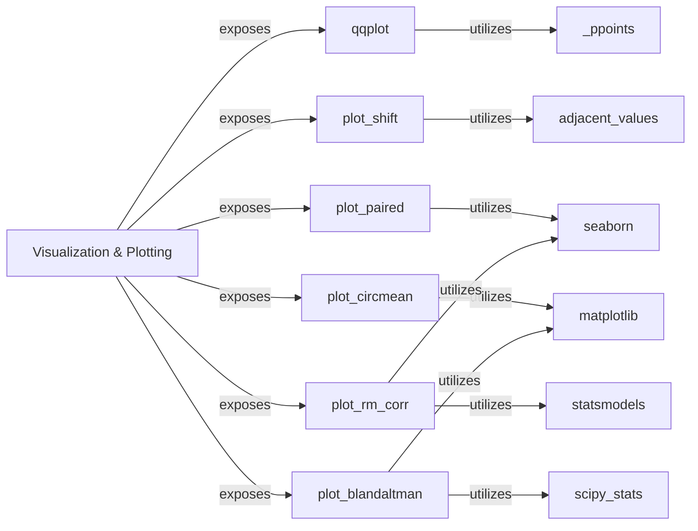

## Details

The `pingouin.plotting` subsystem serves as the primary visualization interface within the Pingouin library, offering a suite of specialized statistical plots. It acts as a facade, exposing various plotting functions that encapsulate the logic for generating specific types of visualizations. Each plotting function (`qqplot`, `plot_shift`, `plot_paired`, `plot_circmean`, `plot_rm_corr`, `plot_blandaltman`) is a self-contained component responsible for its specific plot type, handling data preparation, statistical calculations, and rendering using underlying libraries like Matplotlib and Seaborn. The `Visualization & Plotting` component orchestrates access to these individual plotting functionalities, providing a unified entry point for users.

### Visualization & Plotting [[Expand]](./Visualization_Plotting.md)
The overarching component providing a comprehensive set of utilities for generating various statistical plots within the `pingouin` library. It serves as the entry point for users to access visualization functionalities.

**Related Classes/Methods**:

- <a href="https://github.com/raphaelvallat/pingouin/blob/main/src/pingouin/plotting.py#L219-L407" target="_blank" rel="noopener noreferrer">`pingouin.plotting.qqplot`:219-407</a>
- <a href="https://github.com/raphaelvallat/pingouin/blob/main/src/pingouin/plotting.py#L665-L898" target="_blank" rel="noopener noreferrer">`pingouin.plotting.plot_shift`:665-898</a>
- <a href="https://github.com/raphaelvallat/pingouin/blob/main/src/pingouin/plotting.py#L410-L662" target="_blank" rel="noopener noreferrer">`pingouin.plotting.plot_paired`:410-662</a>
- <a href="https://github.com/raphaelvallat/pingouin/blob/main/src/pingouin/plotting.py#L1033-L1160" target="_blank" rel="noopener noreferrer">`pingouin.plotting.plot_circmean`:1033-1160</a>
- <a href="https://github.com/raphaelvallat/pingouin/blob/main/src/pingouin/plotting.py#L901-L1030" target="_blank" rel="noopener noreferrer">`pingouin.plotting.plot_rm_corr`:901-1030</a>
- <a href="https://github.com/raphaelvallat/pingouin/blob/main/src/pingouin/plotting.py#L29-L193" target="_blank" rel="noopener noreferrer">`pingouin.plotting.plot_blandaltman`:29-193</a>

### qqplot
Generates Quantile-Quantile (Q-Q) plots to assess if a dataset's distribution matches a theoretical distribution, a fundamental tool for normality testing and distribution comparison. It relies on `scipy.stats.probplot` for core calculations and `matplotlib.pyplot` for rendering.

**Related Classes/Methods**:

- <a href="https://github.com/raphaelvallat/pingouin/blob/main/src/pingouin/plotting.py#L196-L216" target="_blank" rel="noopener noreferrer">`pingouin.plotting._ppoints`:196-216</a>

### plot_shift
Creates plots to visualize shifts or changes in data distributions, useful for comparing groups or pre-post measurements, often employed in effect size visualization. It utilizes `seaborn.pointplot` and `seaborn.boxplot` for visualization.

**Related Classes/Methods**:

- <a href="https://github.com/raphaelvallat/pingouin/blob/main/src/pingouin/plotting.py#L809-L815" target="_blank" rel="noopener noreferrer">`pingouin.plotting.adjacent_values`:809-815</a>

### plot_paired
Visualizes paired observations, typically displaying individual data points and connecting them to show trends or differences, crucial for repeated measures designs. It leverages `seaborn.lineplot` and `seaborn.scatterplot` for individual data points and lines, and `seaborn.boxplot` for summary statistics.

**Related Classes/Methods**:

- <a href="https://github.com/raphaelvallat/pingouin/blob/main/src/pingouin/plotting.py#L410-L662" target="_blank" rel="noopener noreferrer">`pingouin.plotting.plot_paired`:410-662</a>

### plot_circmean
Plots circular data, specifically the circular mean and potentially its confidence intervals or measures of dispersion, catering to specialized statistical domains. It uses `matplotlib.patches.Circle` and `matplotlib.axes.Axes.arrow` for drawing the circular plot and mean vector.

**Related Classes/Methods**:

- <a href="https://github.com/raphaelvallat/pingouin/blob/main/src/pingouin/plotting.py#L1033-L1160" target="_blank" rel="noopener noreferrer">`pingouin.plotting.plot_circmean`:1033-1160</a>

### plot_rm_corr
Generates plots to visualize repeated measures correlations, often showing individual subject trends alongside the overall correlation, vital for longitudinal studies. It integrates with `statsmodels.formula.api.ols` for statistical modeling and `seaborn.FacetGrid`, `seaborn.regplot`, and `seaborn.scatterplot` for visualization.

**Related Classes/Methods**:

- <a href="https://github.com/raphaelvallat/pingouin/blob/main/src/pingouin/plotting.py#L901-L1030" target="_blank" rel="noopener noreferrer">`pingouin.plotting.plot_rm_corr`:901-1030</a>

### plot_blandaltman
Generates Bland-Altman plots to assess the agreement between two different measurements or methods. It calculates mean differences and limits of agreement, and visualizes them with scatter plots and horizontal lines.

**Related Classes/Methods**:

- <a href="https://github.com/raphaelvallat/pingouin/blob/main/src/pingouin/plotting.py#L29-L193" target="_blank" rel="noopener noreferrer">`pingouin.plotting.plot_blandaltman`:29-193</a>

### [FAQ](https://github.com/CodeBoarding/GeneratedOnBoardings/tree/main?tab=readme-ov-file#faq)