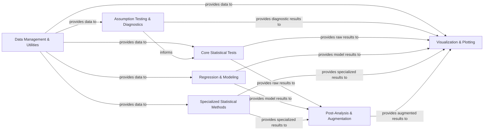

## Details

The `pingouin` library is structured around a clear data flow, starting with `Data Management & Utilities` which prepares and validates data, primarily as Pandas DataFrames. This processed data then flows into `Assumption Testing & Diagnostics` for validating statistical assumptions, and directly into `Core Statistical Tests`, `Regression & Modeling`, and `Specialized Statistical Methods` for various analytical computations. The results from these core analytical components are then passed to `Post-Analysis & Augmentation` for further processing like effect size calculation, multiple comparison corrections, and power analysis. Finally, all analytical outputs can be channeled to `Visualization & Plotting` for graphical representation, completing the analytical pipeline. This modular design ensures a logical progression from data preparation to insightful visualization, with clear boundaries for each functional area.

### Data Management & Utilities [[Expand]](./Data_Management_Utilities.md)
This foundational component is responsible for all data-related operations, including loading datasets, preprocessing, validation, and providing general utility functions. It ensures that data is in the correct and consistent format (primarily Pandas DataFrames) for subsequent statistical analyses.

**Related Classes/Methods**:

- `utils`

### Assumption Testing & Diagnostics
This component provides a suite of functions to test for statistical assumptions (e.g., normality, sphericity) and perform other diagnostic checks. These tests are crucial for validating the applicability of various statistical methods and informing the choice between parametric and non-parametric approaches.

**Related Classes/Methods**:

- <a href="https://github.com/raphaelvallat/pingouin/blob/main/src/pingouin/distribution.py" target="_blank" rel="noopener noreferrer">`distribution`</a>

### Core Statistical Tests [[Expand]](./Core_Statistical_Tests.md)
This is the central component for hypothesis testing, encompassing a wide array of fundamental statistical tests. It includes implementations for parametric tests (ANOVA, t-tests), non-parametric alternatives, various correlation analyses, contingency table analyses, and pairwise comparisons.

**Related Classes/Methods**:

- <a href="https://github.com/raphaelvallat/pingouin/blob/main/src/pingouin/pairwise.py" target="_blank" rel="noopener noreferrer">`parametric`</a>
- <a href="https://github.com/raphaelvallat/pingouin/blob/main/src/pingouin/nonparametric.py" target="_blank" rel="noopener noreferrer">`nonparametric`</a>
- <a href="https://github.com/raphaelvallat/pingouin/blob/main/src/pingouin/correlation.py" target="_blank" rel="noopener noreferrer">`correlation`</a>
- <a href="https://github.com/raphaelvallat/pingouin/blob/main/src/pingouin/contingency.py" target="_blank" rel="noopener noreferrer">`contingency`</a>
- <a href="https://github.com/raphaelvallat/pingouin/blob/main/src/pingouin/pairwise.py" target="_blank" rel="noopener noreferrer">`pairwise`</a>
- <a href="https://github.com/raphaelvallat/pingouin/blob/main/src/pingouin/bayesian.py" target="_blank" rel="noopener noreferrer">`bayesian`</a>
- <a href="https://github.com/raphaelvallat/pingouin/blob/main/src/pingouin/equivalence.py" target="_blank" rel="noopener noreferrer">`equivalence`</a>
- <a href="https://github.com/raphaelvallat/pingouin/blob/main/src/pingouin/multivariate.py" target="_blank" rel="noopener noreferrer">`multivariate`</a>
- <a href="https://github.com/raphaelvallat/pingouin/blob/main/src/pingouin/reliability.py" target="_blank" rel="noopener noreferrer">`reliability`</a>

### Regression & Modeling [[Expand]](./Regression_Modeling.md)
Dedicated to statistical modeling, this component provides functionalities for linear and logistic regression, as well as more specialized analyses such as mediation. It handles the fitting and analysis of predictive models.

**Related Classes/Methods**:

- <a href="https://github.com/raphaelvallat/pingouin/blob/main/src/pingouin/regression.py#L17-L512" target="_blank" rel="noopener noreferrer">`regression`:17-512</a>

### Specialized Statistical Methods
This component houses functions for niche statistical analyses that require unique methodologies, such as circular statistics for directional data. It caters to specific analytical needs not covered by the broader core tests.

**Related Classes/Methods**:

- <a href="https://github.com/raphaelvallat/pingouin/blob/main/src/pingouin/circular.py" target="_blank" rel="noopener noreferrer">`circular`</a>

### Post-Analysis & Augmentation
This component enhances the interpretation and robustness of statistical findings. It includes tools for calculating effect sizes, applying multiple comparison corrections to control error rates, and performing power analyses to determine optimal sample sizes or statistical power.

**Related Classes/Methods**:

- <a href="https://github.com/raphaelvallat/pingouin/blob/main/src/pingouin/effsize.py#L489-L649" target="_blank" rel="noopener noreferrer">`effsize`:489-649</a>
- <a href="https://github.com/raphaelvallat/pingouin/blob/main/src/pingouin/multicomp.py#L350-L498" target="_blank" rel="noopener noreferrer">`multicomp`:350-498</a>
- <a href="https://github.com/raphaelvallat/pingouin/blob/main/src/pingouin/contingency.py" target="_blank" rel="noopener noreferrer">`power`</a>

### Visualization & Plotting [[Expand]](./Visualization_Plotting.md)
This component provides utilities for generating common statistical plots. It enables users to visualize data distributions, relationships between variables, and the results of statistical tests, facilitating data exploration and communication of findings.

**Related Classes/Methods**:

- <a href="https://github.com/raphaelvallat/pingouin/blob/main/src/pingouin/plotting.py" target="_blank" rel="noopener noreferrer">`plotting`</a>

### [FAQ](https://github.com/CodeBoarding/GeneratedOnBoardings/tree/main?tab=readme-ov-file#faq)