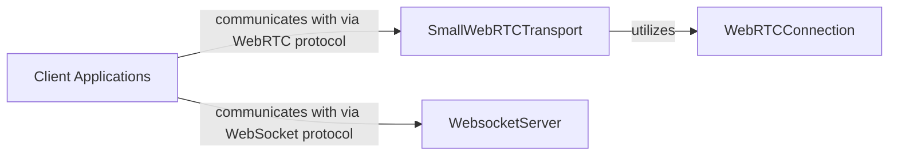

## Details

The Pipecat system interacts with external Client Applications through two primary network transports: SmallWebRTCTransport for real-time media and data via WebRTC, and WebsocketServer for general WebSocket-based communication. The SmallWebRTCTransport component leverages the WebRTCConnection component to manage individual WebRTC peer connections, handling the low-level WebRTC protocol details. This architecture allows for flexible integration with various client types while providing robust real-time communication capabilities.

### Client Applications [[Expand]](./Client_Applications.md)
External user interfaces (web, mobile, custom clients) that interact with the Pipecat system, primarily through WebRTC or WebSocket connections. They are responsible for user input (e.g., audio, text) and output (e.g., synthesized speech, text).

**Related Classes/Methods**: _None_

### SmallWebRTCTransport
Acts as the server-side endpoint for WebRTC connections. It manages peer connections, media tracks (audio/video), and data channels, facilitating the bidirectional flow of real-time media and application messages between the Pipecat pipeline and external WebRTC clients.

**Related Classes/Methods**:

- <a href="https://github.com/pipecat-ai/pipecat/blob/main/src/pipecat/transports/network/small_webrtc.py#L195-L490" target="_blank" rel="noopener noreferrer">`SmallWebRTCClient`:195-490</a>

### WebsocketServer
Acts as the server-side endpoint for WebSocket connections. It manages client connections, handles incoming WebSocket messages, and routes outgoing messages to the appropriate external WebSocket clients, integrating them into the Pipecat pipeline.

**Related Classes/Methods**:

- <a href="https://github.com/pipecat-ai/pipecat/blob/main/src/pipecat/transports/network/websocket_server.py#L80-L240" target="_blank" rel="noopener noreferrer">`WebsocketServerInputTransport`:80-240</a>
- <a href="https://github.com/pipecat-ai/pipecat/blob/main/src/pipecat/transports/network/websocket_server.py#L243-L404" target="_blank" rel="noopener noreferrer">`WebsocketServerOutputTransport`:243-404</a>

### WebRTCConnection
Represents an individual WebRTC peer connection. It encapsulates the underlying WebRTC protocol details, including session negotiation (SDP offer/answer), ICE candidate exchange, and the management of media streams (audio/video tracks) for a single client.

**Related Classes/Methods**:

- <a href="https://github.com/pipecat-ai/pipecat/blob/main/src/pipecat/transports/network/webrtc_connection.py#L163-L559" target="_blank" rel="noopener noreferrer">`SmallWebRTCConnection`:163-559</a>

### [FAQ](https://github.com/CodeBoarding/GeneratedOnBoardings/tree/main?tab=readme-ov-file#faq)