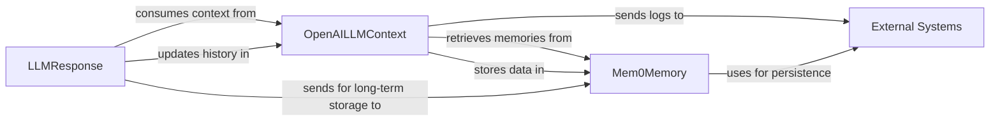

## Details

The `pipecat` subsystem orchestrates conversational AI interactions by managing LLM context, processing responses, and handling memory persistence. The `OpenAILLMContext` component serves as the central hub for constructing and managing conversational prompts, integrating multimodal inputs, and preparing data for storage. It interacts with `Mem0Memory` to retrieve and store conversational history, enabling personalized and coherent LLM responses. `LLMResponse` processes the output from the LLM, consuming context from `OpenAILLMContext` and subsequently updating the conversational history within it. `LLMResponse` also facilitates sending relevant information to `Mem0Memory` for long-term storage. Both `OpenAILLMContext` and `Mem0Memory` rely on `External Systems` for underlying persistent storage and logging mechanisms, ensuring data integrity and operational visibility. This architecture ensures a fluid and context-aware conversational flow, with robust memory management and external system integration.

### OpenAILLMContext
This component is the primary manager of the active conversational window. It dynamically constructs and formats prompts for Large Language Models (LLMs) by aggregating recent messages and integrating multimodal elements (e.g., image frames). It also handles logging conversational turns and preparing data for short-term and long-term storage.

**Related Classes/Methods**:

- <a href="https://github.com/pipecat-ai/pipecat/blob/main/src/pipecat/processors/aggregators/openai_llm_context.py#L59-L348" target="_blank" rel="noopener noreferrer">`pipecat.processors.aggregators.openai_llm_context.OpenAILLMContext`:59-348</a>

### Mem0Memory
Provides advanced memory capabilities, focusing on retrieval and storage of conversational history beyond the immediate context window. It enriches the current dialogue context by providing relevant past interactions, user preferences, or factual information, enabling more personalized and coherent LLM responses. It manages the persistence and retrieval mechanisms for these memories.

**Related Classes/Methods**:

- <a href="https://github.com/pipecat-ai/pipecat/blob/main/src/pipecat/services/mem0/memory.py#L36-L259" target="_blank" rel="noopener noreferrer">`pipecat.services.mem0.memory.Mem0Memory`:36-259</a>

### LLMResponse
Represents the output generated by the LLM. This component consumes the context provided by `OpenAILLMContext` and contributes to updating the conversational history within `OpenAILLMContext`. It also facilitates sending relevant information for long-term storage to `Mem0Memory`.

**Related Classes/Methods**:

- <a href="https://github.com/pipecat-ai/pipecat/blob/main/src/pipecat/processors/aggregators/llm_response.py#L270-L370" target="_blank" rel="noopener noreferrer">`pipecat.processors.aggregators.llm_response.LLMContextResponseAggregator`:270-370</a>

### External Systems
This abstract component represents external infrastructure and services used for persistent memory storage (e.g., databases, vector stores) and logging. It provides the underlying mechanisms for `Mem0Memory` to store and retrieve data, and for `OpenAILLMContext` to log operational information.

**Related Classes/Methods**: _None_

### [FAQ](https://github.com/CodeBoarding/GeneratedOnBoardings/tree/main?tab=readme-ov-file#faq)