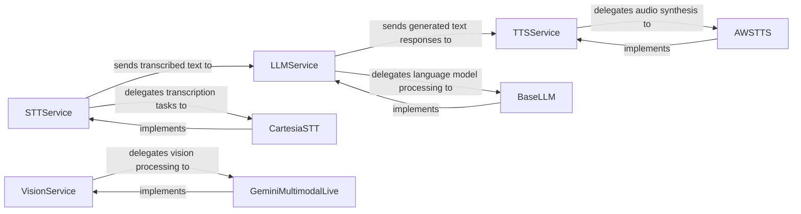

## Details

The `pipecat.services` subsystem provides a set of abstract interfaces for various AI services (STT, LLM, TTS, Vision) and their concrete implementations. The core flow involves audio input being processed by an `STTService` (e.g., `CartesiaSTT`) for transcription. The transcribed text is then sent to an `LLMService` (e.g., `BaseLLM`) for language model processing and response generation. The generated text responses are subsequently passed to a `TTSService` (e.g., `AWSTTS`) for audio synthesis. Additionally, a `VisionService` (e.g., `GeminiMultimodalLive`) handles multimodal input, specifically for vision tasks. Each concrete service implements its respective abstract interface, ensuring a modular and extensible architecture.

### STTService
Defines the common interface for Speech-to-Text (STT) operations. It manages audio input streams and delegates the actual transcription tasks to concrete STT implementations.

**Related Classes/Methods**:

- <a href="https://github.com/pipecat-ai/pipecat/blob/main/src/pipecat/services/stt_service.py#L30-L188" target="_blank" rel="noopener noreferrer">`pipecat.services.stt_service.STTService`:30-188</a>

### LLMService
Defines the common interface for Large Language Model (LLM) interactions. It manages conversation context, handles function calls, and processes text input to generate responses.

**Related Classes/Methods**:

- <a href="https://github.com/pipecat-ai/pipecat/blob/main/src/pipecat/services/llm_service.py#L136-L622" target="_blank" rel="noopener noreferrer">`pipecat.services.llm_service.LLMService`:136-622</a>

### TTSService
Defines the common interface for Text-to-Speech (TTS) operations. It manages text input and delegates audio synthesis tasks to concrete TTS implementations.

**Related Classes/Methods**:

- <a href="https://github.com/pipecat-ai/pipecat/blob/main/src/pipecat/services/tts_service.py#L47-L442" target="_blank" rel="noopener noreferrer">`pipecat.services.tts_service.TTSService`:47-442</a>

### VisionService
Defines the common interface for multimodal AI services focused on vision tasks. It processes visual input and generates relevant outputs.

**Related Classes/Methods**:

- <a href="https://github.com/pipecat-ai/pipecat/blob/main/src/pipecat/services/vision_service.py#L22-L73" target="_blank" rel="noopener noreferrer">`pipecat.services.vision_service.VisionService`:22-73</a>

### CartesiaSTT
A concrete adapter for a specific Speech-to-Text (STT) provider (Cartesia). It implements the STTService interface to perform actual audio transcription.

**Related Classes/Methods**:

- <a href="https://github.com/pipecat-ai/pipecat/blob/main/src/pipecat/services/cartesia/stt.py#L127-L356" target="_blank" rel="noopener noreferrer">`pipecat.services.cartesia.stt.CartesiaSTTService`:127-356</a>
- <a href="https://github.com/pipecat-ai/pipecat/blob/main/src/pipecat/services/stt_service.py#L30-L188" target="_blank" rel="noopener noreferrer">`pipecat.services.stt_service.STTService`:30-188</a>

### BaseLLM
A concrete adapter for OpenAI-compatible Large Language Models. It implements the LLMService interface to handle text generation and conversational logic.

**Related Classes/Methods**:

- <a href="https://github.com/pipecat-ai/pipecat/blob/main/src/pipecat/services/openai/base_llm.py#L46-L404" target="_blank" rel="noopener noreferrer">`pipecat.services.openai.base_llm.BaseOpenAILLMService`:46-404</a>
- <a href="https://github.com/pipecat-ai/pipecat/blob/main/src/pipecat/services/llm_service.py#L136-L622" target="_blank" rel="noopener noreferrer">`pipecat.services.llm_service.LLMService`:136-622</a>

### AWSTTS
A concrete adapter for Amazon Web Services (AWS) Text-to-Speech. It implements the TTSService interface to convert text into synthesized speech.

**Related Classes/Methods**:

- <a href="https://github.com/pipecat-ai/pipecat/blob/main/src/pipecat/services/aws/tts.py#L125-L330" target="_blank" rel="noopener noreferrer">`pipecat.services.aws.tts.AWSPollyTTSService`:125-330</a>
- <a href="https://github.com/pipecat-ai/pipecat/blob/main/src/pipecat/services/tts_service.py#L47-L442" target="_blank" rel="noopener noreferrer">`pipecat.services.tts_service.TTSService`:47-442</a>

### GeminiMultimodalLive
A concrete adapter for the Gemini multimodal AI service, specifically for live vision tasks. It implements the VisionService interface to process visual input.

**Related Classes/Methods**:

- <a href="https://github.com/pipecat-ai/pipecat/blob/main/src/pipecat/services/gemini_multimodal_live/gemini.py#L182-L289" target="_blank" rel="noopener noreferrer">`pipecat.services.gemini_multimodal_live.gemini.GeminiMultimodalLiveContext`:182-289</a>
- <a href="https://github.com/pipecat-ai/pipecat/blob/main/src/pipecat/services/vision_service.py#L22-L73" target="_blank" rel="noopener noreferrer">`pipecat.services.vision_service.VisionService`:22-73</a>

### [FAQ](https://github.com/CodeBoarding/GeneratedOnBoardings/tree/main?tab=readme-ov-file#faq)