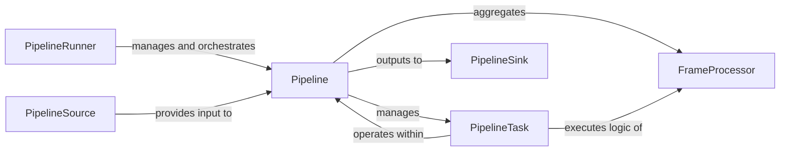

## Details

The `pipecat` pipeline subsystem is designed for building modular and extensible conversational AI applications. At its highest level, the `PipelineRunner` orchestrates the execution of a `Pipeline`, which defines the overall data flow. The `Pipeline` aggregates various `FrameProcessor` components, each responsible for a specific data processing task (e.g., STT, LLM, TTS). These `FrameProcessor`s define the contract for how data frames are processed, while `PipelineTask` instances are the asynchronous units that execute this processing logic. Data enters the system through a `PipelineSource` and is delivered to external consumers via a `PipelineSink`, ensuring a clear and manageable flow of information.

### PipelineRunner
The top-level orchestrator. It initiates, manages, and gracefully terminates the execution of a conversational AI pipeline. It handles system signals and overall runtime management.

**Related Classes/Methods**:

- <a href="https://github.com/pipecat-ai/pipecat/blob/main/src/pipecat/pipeline/runner.py#L26-L124" target="_blank" rel="noopener noreferrer">`pipecat.pipeline.runner.PipelineRunner`:26-124</a>

### Pipeline
Defines the structure and flow of the conversational AI pipeline. It acts as a container for various processing stages (`FrameProcessor` instances) and manages their interconnections, setup, and cleanup. It's the blueprint of the data flow.

**Related Classes/Methods**:

- <a href="https://github.com/pipecat-ai/pipecat/blob/main/src/pipecat/pipeline/pipeline.py#L87-L181" target="_blank" rel="noopener noreferrer">`pipecat.pipeline.pipeline.Pipeline`:87-181</a>

### PipelineTask
Represents an atomic, asynchronous processing unit within the pipeline. It handles the actual consumption, processing, and propagation of data frames, managing its own internal queues and lifecycle (including idle detection and heartbeat monitoring). It executes the logic defined by a `FrameProcessor`.

**Related Classes/Methods**:

- <a href="https://github.com/pipecat-ai/pipecat/blob/main/src/pipecat/pipeline/task.py#L168-L834" target="_blank" rel="noopener noreferrer">`pipecat.pipeline.task.PipelineTask`:168-834</a>

### FrameProcessor
An abstract base class or interface for any component that processes data frames within the pipeline. It defines the contract for individual processing stages, allowing for modular and pluggable AI/ML functionalities (e.g., STT, LLM, TTS modules).

**Related Classes/Methods**:

- `pipecat.pipeline.frame.FrameProcessor`:137-300

### PipelineSource
Represents the entry point for data frames into the overall pipeline. It's responsible for ingesting external data (e.g., audio input) into the processing flow.

**Related Classes/Methods**:

- <a href="https://github.com/pipecat-ai/pipecat/blob/main/src/pipecat/pipeline/pipeline.py#L21-L51" target="_blank" rel="noopener noreferrer">`pipecat.pipeline.pipeline.PipelineSource`:21-51</a>

### PipelineSink
Represents the exit point for processed data frames from the overall pipeline. It's responsible for outputting processed data (e.g., audio output) to external consumers.

**Related Classes/Methods**:

- <a href="https://github.com/pipecat-ai/pipecat/blob/main/src/pipecat/pipeline/pipeline.py#L54-L84" target="_blank" rel="noopener noreferrer">`pipecat.pipeline.pipeline.PipelineSink`:54-84</a>

### [FAQ](https://github.com/CodeBoarding/GeneratedOnBoardings/tree/main?tab=readme-ov-file#faq)