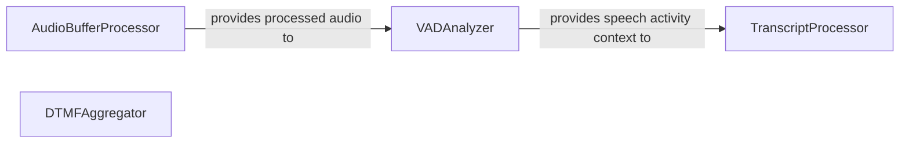

## Details

This subsystem is designed to efficiently process diverse inputs derived from an audio stream, primarily focusing on speech and DTMF signals. The AudioBufferProcessor forms the foundation by managing raw audio data. This processed audio is then channeled to the VADAnalyzer for voice activity detection, a critical step that provides contextual information. The TranscriptProcessor leverages this context to accurately aggregate textual transcriptions, while the DTMFAggregator independently handles DTMF tones. This architecture ensures parallel and specialized processing of different audio-derived data types, optimizing for responsive and accurate conversational AI interactions.

### AudioBufferProcessor
Manages the buffering, recording, and initial processing of raw audio data, serving as the entry point for audio streams into the system.

**Related Classes/Methods**:

- <a href="https://github.com/pipecat-ai/pipecat/blob/main/src/pipecat/processors/audio/audio_buffer_processor.py" target="_blank" rel="noopener noreferrer">`pipecat.processors.audio.audio_buffer_processor`</a>

### VADAnalyzer
Analyzes processed audio frames to detect human voice activity (VAD) and compute volume, providing crucial signals for subsequent speech-related processing.

**Related Classes/Methods**:

- <a href="https://github.com/pipecat-ai/pipecat/blob/main/src/pipecat/audio/vad/vad_analyzer.py" target="_blank" rel="noopener noreferrer">`pipecat.audio.vad.vad_analyzer`</a>

### TranscriptProcessor
Aggregates and processes textual transcription frames, distinguishing between speakers, and preparing aggregated text for further use. It operates on data derived from speech-to-text (STT) outputs.

**Related Classes/Methods**:

- <a href="https://github.com/pipecat-ai/pipecat/blob/main/src/pipecat/processors/transcript_processor.py" target="_blank" rel="noopener noreferrer">`pipecat.processors.transcript_processor`</a>

### DTMFAggregator
Specializes in aggregating DTMF (Dual-Tone Multi-Frequency) signals, managing their detection and handling interruptions, providing a pathway for non-speech input.

**Related Classes/Methods**:

- <a href="https://github.com/pipecat-ai/pipecat/blob/main/src/pipecat/processors/aggregators/dtmf_aggregator.py" target="_blank" rel="noopener noreferrer">`pipecat.processors.aggregators.dtmf_aggregator`</a>

### [FAQ](https://github.com/CodeBoarding/GeneratedOnBoardings/tree/main?tab=readme-ov-file#faq)