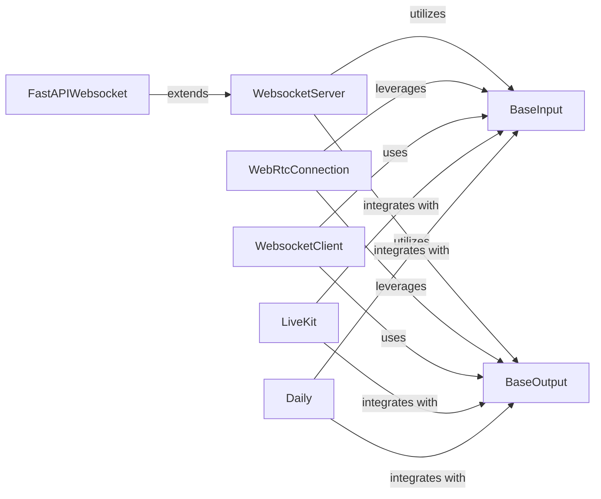

## Details

The `pipecat.transports` subsystem serves as the primary interface for external communication, abstracting various real-time communication protocols into a unified input/output mechanism. At its core, `BaseInput` and `BaseOutput` define the fundamental contracts for handling data flow within the system. Concrete implementations like `WebsocketServer` and `WebRtcConnection` manage standard network protocols, while `FastAPIWebsocket` provides a specialized server for FastAPI integration. Additionally, `WebsocketClient` enables outbound WebSocket connections. The subsystem also includes dedicated integrations with third-party communication platforms such as `LiveKit` and `Daily`, which adapt their respective protocols to conform to the `BaseInput` and `BaseOutput` interfaces, ensuring seamless data exchange with the core Pipecat engine. This modular design allows for flexible extension to support new communication channels while maintaining a consistent internal data processing pipeline.

### BaseInput
An abstract base class that defines the interface for handling all incoming media and data frames. It includes functionalities for Voice Activity Detection (VAD) and turn analysis, ensuring that raw input is processed into meaningful segments for the core engine.

**Related Classes/Methods**:

- <a href="https://github.com/pipecat-ai/pipecat/blob/main/src/pipecat/transports/base_input.py#L56-L513" target="_blank" rel="noopener noreferrer">`pipecat.transports.base_input.BaseInput`:56-513</a>

### BaseOutput
An abstract base class that defines the interface for managing all outgoing media and data frames. It handles the transmission of processed data from the core engine back to the client, including mechanisms for managing interruptions.

**Related Classes/Methods**:

- <a href="https://github.com/pipecat-ai/pipecat/blob/main/src/pipecat/transports/base_output.py#L55-L863" target="_blank" rel="noopener noreferrer">`pipecat.transports.base_output.BaseOutput`:55-863</a>

### WebsocketServer
Manages server-side WebSocket connections, enabling real-time, full-duplex communication with clients. It acts as a primary entry and exit point for data streams over WebSocket protocol.

**Related Classes/Methods**:

- <a href="https://github.com/pipecat-ai/pipecat/blob/main/src/pipecat/transports/network/websocket_server.py" target="_blank" rel="noopener noreferrer">`pipecat.transports.network.websocket_server.WebsocketServer`</a>

### WebRtcConnection
Handles WebRTC peer-to-peer connections, including Session Description Protocol (SDP) negotiation and the management of media tracks. This component is crucial for low-latency, direct media streaming.

**Related Classes/Methods**:

- <a href="https://github.com/pipecat-ai/pipecat/blob/main/src/pipecat/transports/network/webrtc_connection.py" target="_blank" rel="noopener noreferrer">`pipecat.transports.network.webrtc_connection.WebRtcConnection`</a>

### FastAPIWebsocket
Provides a specialized WebSocket transport implementation tailored for integration with FastAPI applications. It leverages the underlying `WebsocketServer` functionalities to expose WebSocket endpoints within a FastAPI context.

**Related Classes/Methods**:

### WebsocketClient
Manages client-side WebSocket connections, allowing the Pipecat system to initiate and maintain real-time communication with external WebSocket servers.

**Related Classes/Methods**:

### LiveKit
Integrates the Pipecat system with the LiveKit real-time communication platform. This component acts as an adapter, translating LiveKit's communication protocols into the internal `BaseInput` and `BaseOutput` formats.

**Related Classes/Methods**:

### Daily
Integrates the Pipecat system with the Daily.co real-time communication platform, including telephony capabilities. Similar to `LiveKit`, it adapts Daily.co's communication to the internal input/output interfaces.

**Related Classes/Methods**:

### [FAQ](https://github.com/CodeBoarding/GeneratedOnBoardings/tree/main?tab=readme-ov-file#faq)