```mermaid
graph LR
    Client_Applications["Client Applications"]
    Transport_Layer["Transport Layer"]
    Pipecat_Core_Engine["Pipecat Core Engine"]
    Pipeline_Processing_Modules["Pipeline Processing Modules"]
    External_AI_Service_Adapters["External AI Service Adapters"]
    Context_Memory_Management["Context & Memory Management"]
    Application_Runner["Application Runner"]
    Client_Applications -- "sends data to" --> Transport_Layer
    Transport_Layer -- "feeds frames to" --> Pipecat_Core_Engine
    Pipecat_Core_Engine -- "routes frames to" --> Pipeline_Processing_Modules
    Pipeline_Processing_Modules -- "sends data to" --> External_AI_Service_Adapters
    External_AI_Service_Adapters -- "interacts with" --> Context_Memory_Management
    Context_Memory_Management -- "provides context to" --> External_AI_Service_Adapters
    External_AI_Service_Adapters -- "returns data to" --> Pipeline_Processing_Modules
    Pipeline_Processing_Modules -- "returns frames to" --> Pipecat_Core_Engine
    Pipecat_Core_Engine -- "feeds frames to" --> Transport_Layer
    Transport_Layer -- "sends data to" --> Client_Applications
    Application_Runner -- "configures and launches" --> Pipecat_Core_Engine
    click Client_Applications href "https://github.com/CodeBoarding/GeneratedOnBoardings/blob/main/pipecat/Client_Applications.md" "Details"
    click Transport_Layer href "https://github.com/CodeBoarding/GeneratedOnBoardings/blob/main/pipecat/Transport_Layer.md" "Details"
    click Pipecat_Core_Engine href "https://github.com/CodeBoarding/GeneratedOnBoardings/blob/main/pipecat/Pipecat_Core_Engine.md" "Details"
    click Pipeline_Processing_Modules href "https://github.com/CodeBoarding/GeneratedOnBoardings/blob/main/pipecat/Pipeline_Processing_Modules.md" "Details"
    click External_AI_Service_Adapters href "https://github.com/CodeBoarding/GeneratedOnBoardings/blob/main/pipecat/External_AI_Service_Adapters.md" "Details"
    click Context_Memory_Management href "https://github.com/CodeBoarding/GeneratedOnBoardings/blob/main/pipecat/Context_Memory_Management.md" "Details"
```

## Details

The Pipecat system is designed around a modular, pipeline-driven architecture for conversational AI. Client Applications initiate interactions, sending data to the Transport Layer, which handles real-time communication and protocol translation. The Transport Layer feeds these data frames into the Pipecat Core Engine, the central orchestrator responsible for defining and executing the AI pipeline. Within this pipeline, data flows through various Pipeline Processing Modules for transformations, filtering, and specialized audio handling. These modules interact with External AI Service Adapters, which integrate with diverse AI providers (STT, LLM, TTS, Multimodal) to perform core AI tasks. Conversational state and historical data are managed by the Context & Memory Management component, which provides essential context to the External AI Service Adapters. Processed data and AI responses are then returned through the Pipeline Processing Modules to the Pipecat Core Engine, which routes them back to the Transport Layer for delivery to the Client Applications. The entire system is configured and launched by the Application Runner, ensuring a cohesive and efficient conversational AI experience.

### Client Applications [[Expand]](./Client_Applications.md)
External user interfaces (web, mobile, custom clients) that interact with the Pipecat system, primarily through WebRTC or WebSocket connections.

**Related Classes/Methods**:

- <a href="https://github.com/pipecat-ai/pipecat/blob/main/src/pipecat/transports/network/small_webrtc.py#L746-L842" target="_blank" rel="noopener noreferrer">`pipecat.transports.network.small_webrtc.SmallWebRTCTransport`:746-842</a>
- <a href="https://github.com/pipecat-ai/pipecat/blob/main/src/pipecat/transports/network/websocket_server.py" target="_blank" rel="noopener noreferrer">`pipecat.transports.network.websocket_server.WebsocketServer`</a>

### Transport Layer [[Expand]](./Transport_Layer.md)
Manages bidirectional, real-time communication between clients and the core engine, handling protocol conversions and data frame transmission.

**Related Classes/Methods**:

- <a href="https://github.com/pipecat-ai/pipecat/blob/main/src/pipecat/transports/base_input.py#L56-L513" target="_blank" rel="noopener noreferrer">`pipecat.transports.base_input.BaseInput`:56-513</a>
- <a href="https://github.com/pipecat-ai/pipecat/blob/main/src/pipecat/transports/base_output.py#L55-L863" target="_blank" rel="noopener noreferrer">`pipecat.transports.base_output.BaseOutput`:55-863</a>
- <a href="https://github.com/pipecat-ai/pipecat/blob/main/src/pipecat/transports/network/websocket_server.py" target="_blank" rel="noopener noreferrer">`pipecat.transports.network.websocket_server.WebsocketServer`</a>
- <a href="https://github.com/pipecat-ai/pipecat/blob/main/src/pipecat/transports/network/webrtc_connection.py" target="_blank" rel="noopener noreferrer">`pipecat.transports.network.webrtc_connection.WebRtcConnection`</a>

### Pipecat Core Engine [[Expand]](./Pipecat_Core_Engine.md)
The central orchestrator defining and executing the conversational AI pipeline, routing data frames between various processing modules and services.

**Related Classes/Methods**:

- <a href="https://github.com/pipecat-ai/pipecat/blob/main/src/pipecat/pipeline/runner.py#L26-L124" target="_blank" rel="noopener noreferrer">`pipecat.pipeline.runner.PipelineRunner`:26-124</a>
- <a href="https://github.com/pipecat-ai/pipecat/blob/main/src/pipecat/pipeline/pipeline.py#L87-L181" target="_blank" rel="noopener noreferrer">`pipecat.pipeline.pipeline.Pipeline`:87-181</a>
- <a href="https://github.com/pipecat-ai/pipecat/blob/main/src/pipecat/pipeline/task.py#L168-L834" target="_blank" rel="noopener noreferrer">`pipecat.pipeline.task.PipelineTask`:168-834</a>

### Pipeline Processing Modules [[Expand]](./Pipeline_Processing_Modules.md)
Internal components performing data transformations, filtering, aggregation, and specialized audio processing within the pipeline.

**Related Classes/Methods**:

- <a href="https://github.com/pipecat-ai/pipecat/blob/main/src/pipecat/audio/vad/vad_analyzer.py#L61-L232" target="_blank" rel="noopener noreferrer">`pipecat.audio.vad.vad_analyzer.VADAnalyzer`:61-232</a>
- <a href="https://github.com/pipecat-ai/pipecat/blob/main/src/pipecat/processors/transcript_processor.py#L222-L325" target="_blank" rel="noopener noreferrer">`pipecat.processors.transcript_processor.TranscriptProcessor`:222-325</a>
- <a href="https://github.com/pipecat-ai/pipecat/blob/main/src/pipecat/processors/audio/audio_buffer_processor.py#L33-L331" target="_blank" rel="noopener noreferrer">`pipecat.processors.audio.audio_buffer_processor.AudioBufferProcessor`:33-331</a>
- <a href="https://github.com/pipecat-ai/pipecat/blob/main/src/pipecat/processors/aggregators/dtmf_aggregator.py#L31-L164" target="_blank" rel="noopener noreferrer">`pipecat.processors.aggregators.dtmf_aggregator.DTMFAggregator`:31-164</a>

### External AI Service Adapters [[Expand]](./External_AI_Service_Adapters.md)
Pluggable modules integrating with various external AI providers (STT, LLM, TTS, Multimodal) to perform core AI tasks.

**Related Classes/Methods**:

- <a href="https://github.com/pipecat-ai/pipecat/blob/main/src/pipecat/services/stt_service.py#L30-L188" target="_blank" rel="noopener noreferrer">`pipecat.services.stt_service.STTService`:30-188</a>
- <a href="https://github.com/pipecat-ai/pipecat/blob/main/src/pipecat/services/llm_service.py#L136-L622" target="_blank" rel="noopener noreferrer">`pipecat.services.llm_service.LLMService`:136-622</a>
- <a href="https://github.com/pipecat-ai/pipecat/blob/main/src/pipecat/services/tts_service.py#L47-L442" target="_blank" rel="noopener noreferrer">`pipecat.services.tts_service.TTSService`:47-442</a>
- <a href="https://github.com/pipecat-ai/pipecat/blob/main/src/pipecat/services/vision_service.py#L22-L73" target="_blank" rel="noopener noreferrer">`pipecat.services.vision_service.VisionService`:22-73</a>

### Context & Memory Management [[Expand]](./Context_Memory_Management.md)
Modules responsible for maintaining conversational context and managing short/long-term memory for LLM interactions.

**Related Classes/Methods**:

- <a href="https://github.com/pipecat-ai/pipecat/blob/main/src/pipecat/processors/aggregators/openai_llm_context.py#L59-L348" target="_blank" rel="noopener noreferrer">`pipecat.processors.aggregators.openai_llm_context.OpenAILLMContext`:59-348</a>
- <a href="https://github.com/pipecat-ai/pipecat/blob/main/src/pipecat/services/mem0/memory.py#L36-L259" target="_blank" rel="noopener noreferrer">`pipecat.services.mem0.memory.Mem0Memory`:36-259</a>

### Application Runner
Configures and launches the Pipecat Core Engine and its associated components, managing the overall application lifecycle.

**Related Classes/Methods**:

- <a href="https://github.com/pipecat-ai/pipecat/blob/main/src/pipecat/runner/run.py#L438-L539" target="_blank" rel="noopener noreferrer">`pipecat.runner.run.main`:438-539</a>
- <a href="https://github.com/pipecat-ai/pipecat/blob/main/src/pipecat/runner/run.py" target="_blank" rel="noopener noreferrer">`pipecat.runner.run.run_pipeline`</a>

### [FAQ](https://github.com/CodeBoarding/GeneratedOnBoardings/tree/main?tab=readme-ov-file#faq)