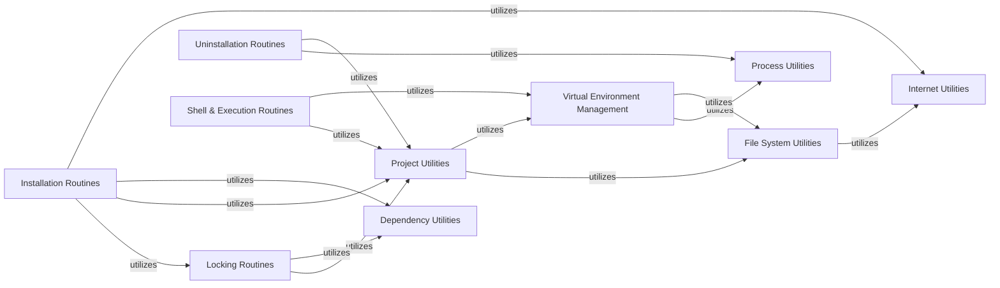

## Component Details

This section provides a detailed overview of the `Core Operations & Utilities` subsystem within `pipenv`, focusing on its structure, flow, and purpose. It identifies the central components, their responsibilities, and how they interact to deliver `pipenv`'s primary functionalities.

### Installation Routines
Orchestrates the entire dependency installation workflow. It handles initial project validation, adding new packages to the Pipfile, and managing the lockfile, ensuring a consistent and reproducible environment. This component is the primary entry point for the `pipenv install` command.

**Related Classes/Methods**:

- <a href="https://github.com/pypa/pipenv/blob/master/pipenv/routines/install.py#L0-L0" target="_blank" rel="noopener noreferrer">`pipenv/routines/install.py` (0:0)</a>

### Locking Routines
Responsible for resolving and "locking" the exact versions of all project dependencies into the `Pipfile.lock` file. This ensures deterministic builds across different environments by recording the complete dependency graph.

**Related Classes/Methods**:

- <a href="https://github.com/pypa/pipenv/blob/master/pipenv/routines/lock.py#L0-L0" target="_blank" rel="noopener noreferrer">`pipenv/routines/lock.py` (0:0)</a>

### Uninstallation Routines
Manages the removal of packages from the project's virtual environment and updates the Pipfile and Pipfile.lock accordingly. It handles both specific package uninstallation and bulk removal (e.g., all dev packages).

**Related Classes/Methods**:

- <a href="https://github.com/pypa/pipenv/blob/master/pipenv/routines/uninstall.py#L0-L0" target="_blank" rel="noopener noreferrer">`pipenv/routines/uninstall.py` (0:0)</a>

### Shell & Execution Routines
Provides functionalities to spawn a shell within the project's virtual environment or execute arbitrary commands. This facilitates direct interaction with the isolated environment and running project-defined scripts.

**Related Classes/Methods**:

- <a href="https://github.com/pypa/pipenv/blob/master/pipenv/routines/shell.py#L0-L0" target="_blank" rel="noopener noreferrer">`pipenv/routines/shell.py` (0:0)</a>

### Project Utilities
Contains helper functions related to the overall `pipenv` project. This includes ensuring the virtual environment exists, locating project files (Pipfile, Pipfile.lock), managing project-specific configurations, and directly manipulating the content of Pipfile and lockfile. It acts as a central state manager for the project.

**Related Classes/Methods**:

- <a href="https://github.com/pypa/pipenv/blob/master/pipenv/utils/project.py#L0-L0" target="_blank" rel="noopener noreferrer">`pipenv/utils/project.py` (0:0)</a>

### Virtual Environment Management
Manages the creation, activation, and removal of virtual environments, which are fundamental to isolating project dependencies. It ensures that `pipenv` operates within a dedicated and clean Python environment.

**Related Classes/Methods**:

- <a href="https://github.com/pypa/pipenv/blob/master/pipenv/utils/virtualenv.py#L0-L0" target="_blank" rel="noopener noreferrer">`pipenv/utils/virtualenv.py` (0:0)</a>
- <a href="https://github.com/pypa/pipenv/blob/master/pipenv/environment.py#L0-L0" target="_blank" rel="noopener noreferrer">`pipenv/environment.py` (0:0)</a>
- <a href="https://github.com/pypa/pipenv/blob/master/pipenv/environments.py#L0-L0" target="_blank" rel="noopener noreferrer">`pipenv/environments.py` (0:0)</a>

### Dependency Utilities
A comprehensive set of utility functions for parsing, manipulating, and normalizing dependency information (e.g., package names, versions, URLs, markers). It acts as a crucial intermediary for handling dependency data across various operations like installation, locking, and uninstallation.

**Related Classes/Methods**:

- <a href="https://github.com/pypa/pipenv/blob/master/pipenv/utils/dependencies.py#L0-L0" target="_blank" rel="noopener noreferrer">`pipenv/utils/dependencies.py` (0:0)</a>
- <a href="https://github.com/pypa/pipenv/blob/master/pipenv/utils/markers.py#L0-L0" target="_blank" rel="noopener noreferrer">`pipenv/utils/markers.py` (0:0)</a>
- <a href="https://github.com/pypa/pipenv/blob/master/pipenv/utils/requirements.py#L0-L0" target="_blank" rel="noopener noreferrer">`pipenv/utils/requirements.py` (0:0)</a>
- <a href="https://github.com/pypa/pipenv/blob/master/pipenv/utils/requirementslib.py#L0-L0" target="_blank" rel="noopener noreferrer">`pipenv/utils/requirementslib.py` (0:0)</a>

### Process Utilities
Provides a standardized and robust way to execute external commands and subprocesses. This component is essential for `pipenv` to interact with underlying system tools like `pip`, `python`, and shell commands.

**Related Classes/Methods**:

- <a href="https://github.com/pypa/pipenv/blob/master/pipenv/utils/processes.py#L0-L0" target="_blank" rel="noopener noreferrer">`pipenv/utils/processes.py` (0:0)</a>

### File System Utilities
Offers common file system operations, including creating temporary directories, handling file paths, and managing file URLs. This component abstracts away low-level file system interactions, ensuring cross-platform compatibility and robustness.

**Related Classes/Methods**:

- <a href="https://github.com/pypa/pipenv/blob/master/pipenv/utils/fileutils.py#L0-L0" target="_blank" rel="noopener noreferrer">`pipenv/utils/fileutils.py` (0:0)</a>

### Internet Utilities
Handles network-related tasks, such as downloading files, validating URLs, and managing HTTP sessions. This is crucial for fetching packages from remote sources like PyPI and interacting with package indexes.

**Related Classes/Methods**:

- <a href="https://github.com/pypa/pipenv/blob/master/pipenv/utils/internet.py#L0-L0" target="_blank" rel="noopener noreferrer">`pipenv/utils/internet.py` (0:0)</a>

### [FAQ](https://github.com/CodeBoarding/GeneratedOnBoardings/tree/main?tab=readme-ov-file#faq)