```mermaid
graph LR
    pipenv_resolver["pipenv.resolver"]
    pipenv_project_Project["pipenv.project.Project"]
    pipenv_patched_pip__internal_req["pipenv.patched.pip._internal.req"]
    pipenv_patched_pip__internal_resolution["pipenv.patched.pip._internal.resolution"]
    pipenv_patched_pip__internal_index["pipenv.patched.pip._internal.index"]
    pipenv_patched_pip__internal_operations["pipenv.patched.pip._internal.operations"]
    pipenv_patched_pip__internal_network["pipenv.patched.pip._internal.network"]
    pipenv_patched_pip__internal_metadata["pipenv.patched.pip._internal.metadata"]
    pipenv_patched_pip__internal_commands["pipenv.patched.pip._internal.commands"]
    pipenv_utils_resolver["pipenv.utils.resolver"]
    pipenv_resolver -- "uses" --> pipenv_project_Project
    pipenv_resolver -- "orchestrates" --> pipenv_patched_pip__internal_resolution
    pipenv_resolver -- "utilizes" --> pipenv_utils_resolver
    pipenv_project_Project -- "provides requirements to" --> pipenv_resolver
    pipenv_project_Project -- "receives lock data from" --> pipenv_utils_resolver
    pipenv_patched_pip__internal_req -- "provides input to" --> pipenv_patched_pip__internal_resolution
    pipenv_patched_pip__internal_req -- "processed by" --> pipenv_patched_pip__internal_operations
    pipenv_patched_pip__internal_resolution -- "queries" --> pipenv_patched_pip__internal_index
    pipenv_patched_pip__internal_resolution -- "operates on" --> pipenv_patched_pip__internal_req
    pipenv_patched_pip__internal_resolution -- "provides result to" --> pipenv_patched_pip__internal_commands
    pipenv_patched_pip__internal_index -- "provides data to" --> pipenv_patched_pip__internal_resolution
    pipenv_patched_pip__internal_index -- "uses" --> pipenv_patched_pip__internal_network
    pipenv_patched_pip__internal_operations -- "executes actions based on" --> pipenv_patched_pip__internal_req
    pipenv_patched_pip__internal_operations -- "relies on" --> pipenv_patched_pip__internal_network
    pipenv_patched_pip__internal_operations -- "interacts with" --> pipenv_patched_pip__internal_metadata
    pipenv_patched_pip__internal_network -- "supports" --> pipenv_patched_pip__internal_index
    pipenv_patched_pip__internal_network -- "supports" --> pipenv_patched_pip__internal_operations
    pipenv_patched_pip__internal_metadata -- "provides information to" --> pipenv_patched_pip__internal_resolution
    pipenv_patched_pip__internal_metadata -- "informs" --> pipenv_patched_pip__internal_operations
    pipenv_patched_pip__internal_commands -- "initiates" --> pipenv_patched_pip__internal_resolution
    pipenv_patched_pip__internal_commands -- "utilizes" --> pipenv_patched_pip__internal_operations
    pipenv_utils_resolver -- "customizes" --> pipenv_patched_pip__internal_resolution
    pipenv_utils_resolver -- "interacts with" --> pipenv_project_Project
```

## Component Details

This subsystem is the core of `pipenv`'s ability to manage project dependencies. It orchestrates the process of reading declared dependencies, resolving them into a consistent set of packages, and then performing the necessary installation, update, or uninstallation actions. It achieves this by heavily leveraging and patching `pip`'s internal modules, adapting them to `pipenv`'s specific workflow, such as the use of `Pipfile.lock` for reproducible builds.

### pipenv.resolver
This is the high-level orchestrator for pipenv's dependency resolution and package management. It initiates the resolution process, coordinates with other components, and handles the overall flow from Pipfile requirements to a locked dependency graph.

**Related Classes/Methods**:

- <a href="https://github.com/pypa/pipenv/blob/master/pipenv/resolver.py#L1-L1" target="_blank" rel="noopener noreferrer">`pipenv.resolver` (1:1)</a>

### pipenv.project.Project
Represents the current pipenv project, providing a centralized interface to project-specific data, including Pipfile contents, Pipfile.lock data, and defined package sources. It's crucial for defining the desired state of the project's dependencies.

**Related Classes/Methods**:

- <a href="https://github.com/pypa/pipenv/blob/master/pipenv/project.py#L141-L1508" target="_blank" rel="noopener noreferrer">`pipenv.project.Project` (141:1508)</a>

### pipenv.patched.pip._internal.req
Responsible for parsing and representing package requirements from various sources (e.g., Pipfile, command-line arguments). It converts these into pip's internal requirement objects, handling different types like direct URLs, editable installs, and version specifiers.

**Related Classes/Methods**:

- `pipenv.patched.pip._internal.req` (1:1)

### pipenv.patched.pip._internal.resolution
This is the core dependency resolution engine, containing the algorithms (including resolvelib-based approaches) to resolve a set of package requirements into a consistent and installable dependency graph. It determines the exact versions of all packages needed.

**Related Classes/Methods**:

- `pipenv.patched.pip._internal.resolution` (1:1)

### pipenv.patched.pip._internal.index
Manages interactions with external package indexes (like PyPI) and local package sources. Its primary role is to find and collect available package candidates that satisfy the requirements during the resolution phase.

**Related Classes/Methods**:

- `pipenv.patched.pip._internal.index` (1:1)

### pipenv.patched.pip._internal.operations
Handles the low-level operations involved in package management, such as preparing source distributions, building wheels, and the actual installation or uninstallation of packages on the system.

**Related Classes/Methods**:

- `pipenv.patched.pip._internal.operations` (1:1)

### pipenv.patched.pip._internal.network
Provides the foundational capabilities for all network-related operations within the patched pip internals. This includes managing HTTP sessions, handling caching, and dealing with authentication for downloading packages and interacting with package indexes.

**Related Classes/Methods**:

- `pipenv.patched.pip._internal.network` (1:1)

### pipenv.patched.pip._internal.metadata
Responsible for reading, parsing, and managing metadata associated with both installed and candidate packages. This metadata includes crucial information such as package dependencies, versions, and entry points, which are vital for correct resolution and installation.

**Related Classes/Methods**:

- `pipenv.patched.pip._internal.metadata` (1:1)

### pipenv.patched.pip._internal.commands
This module serves as pipenv's direct interface to pip's command implementations (e.g., install, uninstall, freeze, list). While pipenv has its own CLI, it delegates core package management actions to these underlying pip commands, acting as a wrapper or orchestrator for the actual execution.

**Related Classes/Methods**:

- `pipenv.patched.pip._internal.commands` (1:1)

### pipenv.utils.resolver
This component provides utility functions specifically designed to customize and enhance pipenv's resolution process beyond the standard pip behavior. This includes logic for handling Pipfile.lock interactions, environment markers, and other pipenv-specific nuances that influence dependency resolution.

**Related Classes/Methods**:

- <a href="https://github.com/pypa/pipenv/blob/master/pipenv/utils/resolver.py#L1-L1" target="_blank" rel="noopener noreferrer">`pipenv.utils.resolver` (1:1)</a>

### [FAQ](https://github.com/CodeBoarding/GeneratedOnBoardings/tree/main?tab=readme-ov-file#faq)