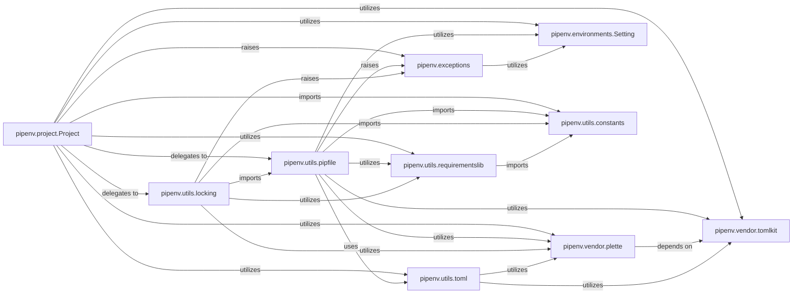

## Component Details

Component Overview: Project State & Configuration Management

### pipenv.project.Project
The central orchestrator for managing the overall project state. It handles the loading, saving, and validation of `Pipfile` and `Pipfile.lock`, and acts as the primary interface for other parts of Pipenv to interact with project configuration. It determines project paths, virtual environment locations, and manages package sources.

**Related Classes/Methods**:

- <a href="https://github.com/pypa/pipenv/blob/master/pipenv/project.py#L141-L1508" target="_blank" rel="noopener noreferrer">`pipenv.project.Project` (141:1508)</a>
- <a href="https://github.com/pypa/pipenv/blob/master/pipenv/utils/pipfile.py#L0-L0" target="_blank" rel="noopener noreferrer">`pipenv.utils.pipfile` (0:0)</a>
- <a href="https://github.com/pypa/pipenv/blob/master/pipenv/utils/locking.py#L0-L0" target="_blank" rel="noopener noreferrer">`pipenv.utils.locking` (0:0)</a>
- <a href="https://github.com/pypa/pipenv/blob/master/pipenv/environments.py#L101-L413" target="_blank" rel="noopener noreferrer">`pipenv.environments.Setting` (101:413)</a>
- <a href="https://github.com/pypa/pipenv/blob/master/pipenv/exceptions.py#L0-L0" target="_blank" rel="noopener noreferrer">`pipenv.exceptions` (0:0)</a>
- `pipenv.vendor.plette` (0:0)
- `pipenv.vendor.tomlkit` (0:0)
- <a href="https://github.com/pypa/pipenv/blob/master/pipenv/utils/toml.py#L0-L0" target="_blank" rel="noopener noreferrer">`pipenv.utils.toml` (0:0)</a>
- <a href="https://github.com/pypa/pipenv/blob/master/pipenv/utils/requirementslib.py#L0-L0" target="_blank" rel="noopener noreferrer">`pipenv.utils.requirementslib` (0:0)</a>
- <a href="https://github.com/pypa/pipenv/blob/master/pipenv/utils/constants.py#L0-L0" target="_blank" rel="noopener noreferrer">`pipenv.utils.constants` (0:0)</a>

### pipenv.utils.pipfile
This module is specifically dedicated to handling the `Pipfile`. It provides functions and classes (like `ProjectFile` and `PipfileLoader`) for reading, parsing, and manipulating the `Pipfile`'s content, translating it into structured data. It also includes logic for finding the `Pipfile` in the project hierarchy and ensuring its initial creation.

**Related Classes/Methods**:

- <a href="https://github.com/pypa/pipenv/blob/master/pipenv/utils/pipfile.py#L0-L0" target="_blank" rel="noopener noreferrer">`pipenv.utils.pipfile` (0:0)</a>
- `pipenv.vendor.plette` (0:0)
- `pipenv.vendor.tomlkit` (0:0)
- <a href="https://github.com/pypa/pipenv/blob/master/pipenv/utils/requirementslib.py#L0-L0" target="_blank" rel="noopener noreferrer">`pipenv.utils.requirementslib` (0:0)</a>
- <a href="https://github.com/pypa/pipenv/blob/master/pipenv/exceptions.py#L0-L0" target="_blank" rel="noopener noreferrer">`pipenv.exceptions` (0:0)</a>
- <a href="https://github.com/pypa/pipenv/blob/master/pipenv/environments.py#L101-L413" target="_blank" rel="noopener noreferrer">`pipenv.environments.Setting` (101:413)</a>
- <a href="https://github.com/pypa/pipenv/blob/master/pipenv/utils/constants.py#L0-L0" target="_blank" rel="noopener noreferrer">`pipenv.utils.constants` (0:0)</a>
- <a href="https://github.com/pypa/pipenv/blob/master/pipenv/utils/toml.py#L0-L0" target="_blank" rel="noopener noreferrer">`pipenv.utils.toml` (0:0)</a>

### pipenv.utils.locking
This module focuses on the `Pipfile.lock`. It manages the generation, reading, and validation of the lockfile, which ensures deterministic builds by pinning exact dependency versions and hashes. It also provides the `atomic_open_for_write` context manager for safe file writing.

**Related Classes/Methods**:

- <a href="https://github.com/pypa/pipenv/blob/master/pipenv/utils/locking.py#L0-L0" target="_blank" rel="noopener noreferrer">`pipenv.utils.locking` (0:0)</a>
- `pipenv.vendor.plette` (0:0)
- <a href="https://github.com/pypa/pipenv/blob/master/pipenv/utils/requirementslib.py#L0-L0" target="_blank" rel="noopener noreferrer">`pipenv.utils.requirementslib` (0:0)</a>
- <a href="https://github.com/pypa/pipenv/blob/master/pipenv/exceptions.py#L0-L0" target="_blank" rel="noopener noreferrer">`pipenv.exceptions` (0:0)</a>
- <a href="https://github.com/pypa/pipenv/blob/master/pipenv/utils/pipfile.py#L0-L0" target="_blank" rel="noopener noreferrer">`pipenv.utils.pipfile` (0:0)</a>
- <a href="https://github.com/pypa/pipenv/blob/master/pipenv/utils/constants.py#L0-L0" target="_blank" rel="noopener noreferrer">`pipenv.utils.constants` (0:0)</a>

### pipenv.vendor.tomlkit
A vendored third-party library that provides the fundamental capabilities for parsing, manipulating, and serializing TOML (Tom's Obvious, Minimal Language) formatted files. Both `Pipfile` and `Pipfile.lock` are TOML-based, making this library essential for low-level file interaction.

**Related Classes/Methods**:

- `pipenv.vendor.tomlkit` (0:0)

### pipenv.vendor.plette
A vendored third-party library that offers high-level data models and serialization/deserialization logic specifically tailored for `Pipfile` and `Pipfile.lock` structures. It abstracts away much of the direct TOML manipulation, providing a more Pythonic way to interact with these configuration files.

**Related Classes/Methods**:

- `pipenv.vendor.plette` (0:0)
- `pipenv.vendor.tomlkit` (0:0)

### pipenv.environments.Setting
This class provides a centralized mechanism to control various settings of Pipenv via environment variables. It influences how project files are located, how virtual environments are managed, and various operational parameters like timeouts and verbosity.

**Related Classes/Methods**:

- <a href="https://github.com/pypa/pipenv/blob/master/pipenv/environments.py#L101-L413" target="_blank" rel="noopener noreferrer">`pipenv.environments.Setting` (101:413)</a>

### pipenv.exceptions
This module defines custom exception classes used throughout Pipenv. It provides a structured way to handle and report errors that occur during file operations, parsing, and validation within the project state and configuration management process, ensuring consistent and informative user feedback.

**Related Classes/Methods**:

- <a href="https://github.com/pypa/pipenv/blob/master/pipenv/exceptions.py#L0-L0" target="_blank" rel="noopener noreferrer">`pipenv.exceptions` (0:0)</a>
- <a href="https://github.com/pypa/pipenv/blob/master/pipenv/environments.py#L101-L413" target="_blank" rel="noopener noreferrer">`pipenv.environments.Setting` (101:413)</a>

### pipenv.utils.constants
This module serves as a central repository for various constants used across the Pipenv codebase. This includes lists of supported Version Control Systems (VCS), URL schemes, relevant project file names, and boolean truthy/falsy values, promoting consistency and reducing hardcoded values.

**Related Classes/Methods**:

- <a href="https://github.com/pypa/pipenv/blob/master/pipenv/utils/constants.py#L0-L0" target="_blank" rel="noopener noreferrer">`pipenv.utils.constants` (0:0)</a>

### pipenv.utils.toml
A utility module that provides Pipenv-specific wrappers and extensions around the `tomlkit` library. Its responsibilities include cleaning up TOML output (e.g., adding newlines between sections) and converting `tomlkit` objects into standard Python dictionaries or lists, facilitating data manipulation within Pipenv.

**Related Classes/Methods**:

- <a href="https://github.com/pypa/pipenv/blob/master/pipenv/utils/toml.py#L0-L0" target="_blank" rel="noopener noreferrer">`pipenv.utils.toml` (0:0)</a>
- `pipenv.vendor.tomlkit` (0:0)
- `pipenv.vendor.plette` (0:0)

### pipenv.utils.requirementslib
This module is crucial for parsing, normalizing, and representing package requirements, which form the core content of both `Pipfile` and `Pipfile.lock`. It handles complex aspects such as identifying VCS dependencies, editable installs, and working with package specifiers.

**Related Classes/Methods**:

- <a href="https://github.com/pypa/pipenv/blob/master/pipenv/utils/requirementslib.py#L0-L0" target="_blank" rel="noopener noreferrer">`pipenv.utils.requirementslib` (0:0)</a>
- <a href="https://github.com/pypa/pipenv/blob/master/pipenv/utils/constants.py#L0-L0" target="_blank" rel="noopener noreferrer">`pipenv.utils.constants` (0:0)</a>

### [FAQ](https://github.com/CodeBoarding/GeneratedOnBoardings/tree/main?tab=readme-ov-file#faq)