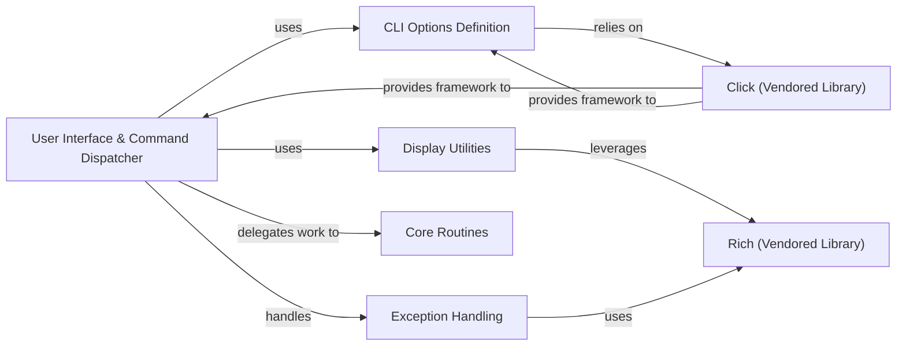

## Component Details

The `User Interface & Command Dispatcher` subsystem in `pipenv` is the central hub for user interaction, command processing, and feedback. It orchestrates the flow from command-line input to the execution of core functionalities and the presentation of results.

### User Interface & Command Dispatcher
This is the primary entry point for `pipenv`. It is responsible for parsing command-line arguments, validating them, and dispatching the appropriate commands to the core routines. It also manages the overall user experience by displaying progress, status, and error messages.

**Related Classes/Methods**:

- <a href="https://github.com/pypa/pipenv/blob/master/pipenv/__main__.py#L1-L1" target="_blank" rel="noopener noreferrer">`pipenv.__main__` (1:1)</a>
- <a href="https://github.com/pypa/pipenv/blob/master/pipenv/cli/command.py#L1-L1" target="_blank" rel="noopener noreferrer">`pipenv.cli.command` (1:1)</a>

### CLI Options Definition
This component defines the various command-line options, arguments, and subcommands available in `pipenv`. It leverages the `Click` library to structure the command-line interface, ensuring proper parsing and validation of user input.

**Related Classes/Methods**:

- <a href="https://github.com/pypa/pipenv/blob/master/pipenv/cli/options.py#L1-L1" target="_blank" rel="noopener noreferrer">`pipenv.cli.options` (1:1)</a>

### Click (Vendored Library)
A vendored copy of the `Click` library, which provides the foundational framework for building command-line interfaces. It handles argument parsing, command registration, and basic CLI utilities, forming the backbone of `pipenv`'s command-line interaction.

**Related Classes/Methods**:

- `pipenv.vendor.click` (1:1)

### Display Utilities
This module provides a set of utility functions for rendering rich and informative output to the console. It handles formatting messages, displaying progress bars, spinners, and other visual cues to enhance the user experience during long-running operations.

**Related Classes/Methods**:

- <a href="https://github.com/pypa/pipenv/blob/master/pipenv/utils/display.py#L1-L1" target="_blank" rel="noopener noreferrer">`pipenv.utils.display` (1:1)</a>

### Rich (Vendored Library)
A vendored copy of the `rich` library, which is extensively used by `Display Utilities` to produce highly formatted and interactive console output. This includes syntax highlighting, tables, progress bars, and styled text, significantly improving the readability and aesthetics of `pipenv`'s output.

**Related Classes/Methods**:

- `pipenv.vendor.rich` (1:1)

### Exception Handling
This component defines custom exception types specific to `pipenv`'s operations. It provides a structured way to signal errors and ensures that these errors are caught and presented to the user in a clear, actionable, and user-friendly manner by the `User Interface & Command Dispatcher`.

**Related Classes/Methods**:

- <a href="https://github.com/pypa/pipenv/blob/master/pipenv/exceptions.py#L1-L1" target="_blank" rel="noopener noreferrer">`pipenv.exceptions` (1:1)</a>

### Core Routines
This component encapsulates the primary business logic and operations of `pipenv`, such as installing, locking, syncing, and uninstalling packages. The `User Interface & Command Dispatcher` delegates specific tasks to these routines for execution.

**Related Classes/Methods**:

- `pipenv.routines` (1:1)

### [FAQ](https://github.com/CodeBoarding/GeneratedOnBoardings/tree/main?tab=readme-ov-file#faq)