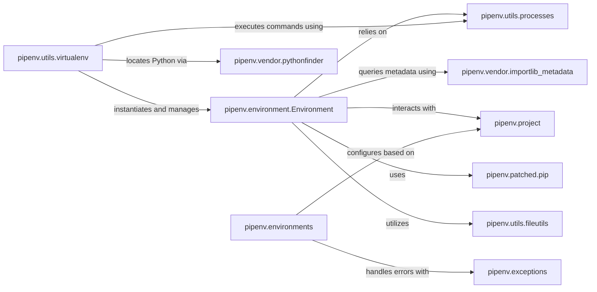

## Component Details

These ten components are fundamental to the Virtual Environment & Python Management subsystem within pipenv, collectively covering the entire lifecycle and interaction model of Python environments. They form a cohesive unit, with pipenv.environment.Environment acting as the central orchestrator, relying on the other components for specific functionalities like discovery, execution, package management, and configuration.

### pipenv.environment.Environment
This is the central class that encapsulates the state and operations of the active Python environment (typically a virtual environment). It manages environment paths, Python version information, and provides methods for discovering and querying installed packages. It also offers a context manager for activating the environment.

**Related Classes/Methods**:

- <a href="https://github.com/pypa/pipenv/blob/master/pipenv/environment.py#L47-L828" target="_blank" rel="noopener noreferrer">`pipenv.environment.Environment` (47:828)</a>

### pipenv.utils.virtualenv
This module provides core utility functions for the lifecycle management of virtual environments, including their creation, activation, and cleanup. It orchestrates the setup of the isolated Python environment.

**Related Classes/Methods**:

- <a href="https://github.com/pypa/pipenv/blob/master/pipenv/utils/virtualenv.py#L0-L0" target="_blank" rel="noopener noreferrer">`pipenv.utils.virtualenv` (0:0)</a>

### pipenv.vendor.pythonfinder
A vendored library responsible for robustly locating Python installations across the system. It employs various strategies (e.g., PATH, registry) to find suitable Python executables for virtual environment creation and management.

**Related Classes/Methods**:

- `pipenv.vendor.pythonfinder` (0:0)

### pipenv.utils.processes
This module handles the execution of external system commands and subprocesses. It is critical for `pipenv` to interact with the underlying operating system, Python interpreters, and package managers like `pip`.

**Related Classes/Methods**:

- <a href="https://github.com/pypa/pipenv/blob/master/pipenv/utils/processes.py#L0-L0" target="_blank" rel="noopener noreferrer">`pipenv.utils.processes` (0:0)</a>

### pipenv.patched.pip
This is Pipenv's vendored and potentially modified version of the `pip` package. It is directly used for performing package installation, uninstallation, and dependency resolution within the managed virtual environment, ensuring consistent behavior.

**Related Classes/Methods**:

- `pipenv.patched.pip` (0:0)

### pipenv.exceptions
This module defines custom exception classes specific to `pipenv`'s operations. It provides a structured way to handle errors related to virtual environment creation, activation, and other environment-specific issues, improving error reporting and recovery.

**Related Classes/Methods**:

- <a href="https://github.com/pypa/pipenv/blob/master/pipenv/exceptions.py#L0-L0" target="_blank" rel="noopener noreferrer">`pipenv.exceptions` (0:0)</a>

### pipenv.environments
This module manages environment-specific settings and configurations for Pipenv. It initializes various boolean flags and paths based on environment variables and default values, influencing how Pipenv interacts with the system and virtual environments.

**Related Classes/Methods**:

- <a href="https://github.com/pypa/pipenv/blob/master/pipenv/environments.py#L0-L0" target="_blank" rel="noopener noreferrer">`pipenv.environments` (0:0)</a>

### pipenv.project
This component manages project-specific information, including the `Pipfile` and `Pipfile.lock`. It provides the context for the virtual environment, such as sources for packages and project-specific settings, which are crucial for dependency management.

**Related Classes/Methods**:

- <a href="https://github.com/pypa/pipenv/blob/master/pipenv/project.py#L0-L0" target="_blank" rel="noopener noreferrer">`pipenv.project` (0:0)</a>

### pipenv.vendor.importlib_metadata
A vendored library used for accessing metadata about installed Python packages. It allows `pipenv` to inspect the contents of the virtual environment, retrieve package versions, and understand dependencies.

**Related Classes/Methods**:

- `pipenv.vendor.importlib_metadata` (0:0)

### pipenv.utils.fileutils
This module provides essential utility functions for file system operations, such as normalizing paths, creating temporary directories, and checking file existence. These are fundamental for managing the directories and files associated with virtual environments.

**Related Classes/Methods**:

- <a href="https://github.com/pypa/pipenv/blob/master/pipenv/utils/fileutils.py#L0-L0" target="_blank" rel="noopener noreferrer">`pipenv.utils.fileutils` (0:0)</a>

### [FAQ](https://github.com/CodeBoarding/GeneratedOnBoardings/tree/main?tab=readme-ov-file#faq)