```mermaid
graph LR
    User_Interface_Command_Dispatcher["User Interface & Command Dispatcher"]
    Project_State_Configuration_Management["Project State & Configuration Management"]
    Virtual_Environment_Python_Management["Virtual Environment & Python Management"]
    Dependency_Resolution_Package_Engine["Dependency Resolution & Package Engine"]
    Core_Operations_Utilities["Core Operations & Utilities"]
    User_Interface_Command_Dispatcher -- "delegates execution to" --> Core_Operations_Utilities
    Project_State_Configuration_Management -- "provides feedback to" --> User_Interface_Command_Dispatcher
    Project_State_Configuration_Management -- "provides configuration to" --> Dependency_Resolution_Package_Engine
    Project_State_Configuration_Management -- "provides configuration to" --> Core_Operations_Utilities
    Virtual_Environment_Python_Management -- "provides environment context to" --> Dependency_Resolution_Package_Engine
    Virtual_Environment_Python_Management -- "provides environment context to" --> Core_Operations_Utilities
    User_Interface_Command_Dispatcher -- "invokes" --> Core_Operations_Utilities
    Core_Operations_Utilities -- "orchestrates" --> Dependency_Resolution_Package_Engine
    click User_Interface_Command_Dispatcher href "https://github.com/CodeBoarding/GeneratedOnBoardings/blob/main//pipenv/User_Interface_Command_Dispatcher.md" "Details"
    click Project_State_Configuration_Management href "https://github.com/CodeBoarding/GeneratedOnBoardings/blob/main//pipenv/Project_State_Configuration_Management.md" "Details"
    click Virtual_Environment_Python_Management href "https://github.com/CodeBoarding/GeneratedOnBoardings/blob/main//pipenv/Virtual_Environment_Python_Management.md" "Details"
    click Dependency_Resolution_Package_Engine href "https://github.com/CodeBoarding/GeneratedOnBoardings/blob/main//pipenv/Dependency_Resolution_Package_Engine.md" "Details"
    click Core_Operations_Utilities href "https://github.com/CodeBoarding/GeneratedOnBoardings/blob/main//pipenv/Core_Operations_Utilities.md" "Details"
```

## Component Details

The `pipenv` architecture can be effectively distilled into five fundamental components, each with distinct responsibilities and clear interaction patterns. This consolidation prioritizes the core functionalities and data flows, abstracting away lower-level utilities where they serve as common dependencies for higher-level operations.

### User Interface & Command Dispatcher
This is the primary interface for `pipenv`, handling command-line argument parsing, dispatching commands to the appropriate routines, and presenting all user-facing output, including progress, status, and error messages. It acts as the central orchestrator of user-initiated actions and the primary feedback mechanism.

**Related Classes/Methods**:

- <a href="https://github.com/pypa/pipenv/blob/master/pipenv/cli/command.py#L0-L0" target="_blank" rel="noopener noreferrer">`pipenv.cli.command` (0:0)</a>
- <a href="https://github.com/pypa/pipenv/blob/master/pipenv/__main__.py#L0-L0" target="_blank" rel="noopener noreferrer">`pipenv.__main__` (0:0)</a>
- `pipenv.vendor.rich` (0:0)
- <a href="https://github.com/pypa/pipenv/blob/master/pipenv/exceptions.py#L0-L0" target="_blank" rel="noopener noreferrer">`pipenv.exceptions` (0:0)</a>

### Project State & Configuration Management
Manages the `Pipfile` and `Pipfile.lock` files, providing robust mechanisms for reading, writing, and validating project-specific dependencies and configurations. It leverages TOML parsing libraries to ensure data integrity and consistency.

**Related Classes/Methods**:

- <a href="https://github.com/pypa/pipenv/blob/master/pipenv/project.py#L0-L0" target="_blank" rel="noopener noreferrer">`pipenv.project` (0:0)</a>
- <a href="https://github.com/pypa/pipenv/blob/master/pipenv/utils/pipfile.py#L0-L0" target="_blank" rel="noopener noreferrer">`pipenv.utils.pipfile` (0:0)</a>
- <a href="https://github.com/pypa/pipenv/blob/master/pipenv/utils/locking.py#L0-L0" target="_blank" rel="noopener noreferrer">`pipenv.utils.locking` (0:0)</a>
- `pipenv.vendor.tomlkit` (0:0)
- `pipenv.vendor.plette` (0:0)

### Virtual Environment & Python Management
Handles the creation, activation, and discovery of Python virtual environments and interpreters. It provides the necessary context for `pipenv` to operate in an isolated and consistent environment, ensuring project dependencies do not conflict with system-wide installations.

**Related Classes/Methods**:

- <a href="https://github.com/pypa/pipenv/blob/master/pipenv/environment.py#L0-L0" target="_blank" rel="noopener noreferrer">`pipenv.environment` (0:0)</a>
- <a href="https://github.com/pypa/pipenv/blob/master/pipenv/utils/virtualenv.py#L0-L0" target="_blank" rel="noopener noreferrer">`pipenv.utils.virtualenv` (0:0)</a>
- `pipenv.vendor.pythonfinder` (0:0)

### Dependency Resolution & Package Engine
The central processing unit for resolving package dependencies and performing actual package installations, updates, and uninstallations. It incorporates a heavily patched version of `pip`'s internals to achieve `pipenv`'s specific dependency management logic, ensuring a consistent and reproducible dependency graph.

**Related Classes/Methods**:

- <a href="https://github.com/pypa/pipenv/blob/master/pipenv/resolver.py#L0-L0" target="_blank" rel="noopener noreferrer">`pipenv.resolver` (0:0)</a>
- `pipenv.patched.pip._internal` (0:0)

### Core Operations & Utilities
Encapsulates the high-level routines for `pipenv`'s main commands (e.g., `install`, `lock`, `shell`, `uninstall`) and provides a suite of foundational utilities for common tasks such as robust subprocess execution, file system operations, network requests, and detailed dependency parsing.

**Related Classes/Methods**:

- <a href="https://github.com/pypa/pipenv/blob/master/pipenv/routines/install.py#L0-L0" target="_blank" rel="noopener noreferrer">`pipenv.routines.install` (0:0)</a>
- <a href="https://github.com/pypa/pipenv/blob/master/pipenv/routines/lock.py#L0-L0" target="_blank" rel="noopener noreferrer">`pipenv.routines.lock` (0:0)</a>
- <a href="https://github.com/pypa/pipenv/blob/master/pipenv/routines/shell.py#L0-L0" target="_blank" rel="noopener noreferrer">`pipenv.routines.shell` (0:0)</a>
- <a href="https://github.com/pypa/pipenv/blob/master/pipenv/routines/uninstall.py#L0-L0" target="_blank" rel="noopener noreferrer">`pipenv.routines.uninstall` (0:0)</a>
- <a href="https://github.com/pypa/pipenv/blob/master/pipenv/utils/processes.py#L0-L0" target="_blank" rel="noopener noreferrer">`pipenv.utils.processes` (0:0)</a>
- <a href="https://github.com/pypa/pipenv/blob/master/pipenv/utils/fileutils.py#L0-L0" target="_blank" rel="noopener noreferrer">`pipenv.utils.fileutils` (0:0)</a>
- <a href="https://github.com/pypa/pipenv/blob/master/pipenv/utils/internet.py#L0-L0" target="_blank" rel="noopener noreferrer">`pipenv.utils.internet` (0:0)</a>
- <a href="https://github.com/pypa/pipenv/blob/master/pipenv/utils/dependencies.py#L0-L0" target="_blank" rel="noopener noreferrer">`pipenv.utils.dependencies` (0:0)</a>

### [FAQ](https://github.com/CodeBoarding/GeneratedOnBoardings/tree/main?tab=readme-ov-file#faq)