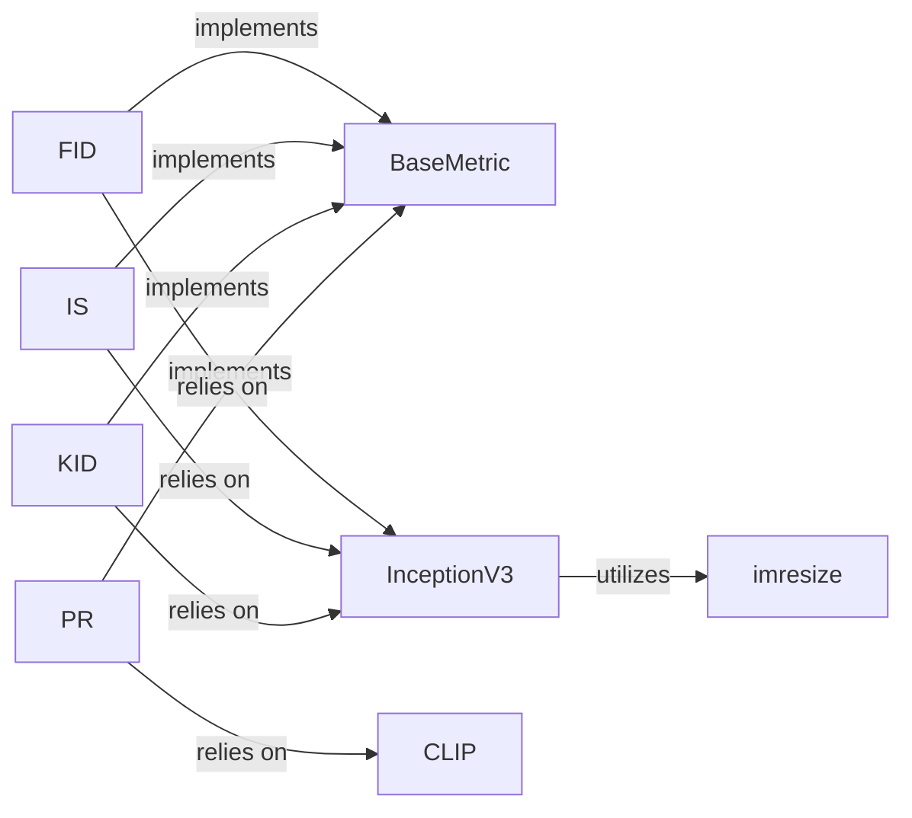

## Details

The `Distribution-Based Metrics` subsystem in `piq` is designed to evaluate image quality by comparing statistical distributions of features extracted from image sets. It primarily relies on a set of specialized `Feature Extractors` and adheres to the `Core Metric API` defined by `piq.base.BaseMetric`.

### BaseMetric
Serves as the abstract base class, defining a consistent interface (`forward`, `compute_metric`) for all metrics within `piq`. Distribution-based metrics inherit from this to ensure a unified API and integration into PyTorch computation graphs.

**Related Classes/Methods**:

- <a href="https://github.com/photosynthesis-team/piq/blob/master/piq/base.py" target="_blank" rel="noopener noreferrer">`piq.base.BaseMetric`</a>

### FID
Computes the Frechet Inception Distance, a primary distribution-based metric. It quantifies the similarity between two sets of images by comparing the statistics of their feature representations.

**Related Classes/Methods**:

- <a href="https://github.com/photosynthesis-team/piq/blob/master/piq/fid.py#L134-L173" target="_blank" rel="noopener noreferrer">`piq.fid.FID`:134-173</a>

### IS
Computes the Inception Score, a primary distribution-based metric. It evaluates the quality and diversity of generated images based on features extracted from a pre-trained Inception model.

**Related Classes/Methods**:

- <a href="https://github.com/photosynthesis-team/piq/blob/master/piq/isc.py#L66-L114" target="_blank" rel="noopener noreferrer">`piq.isc.IS`:66-114</a>

### KID
Computes the Kernel Inception Distance, a primary distribution-based metric. Similar to FID, it measures the distance between feature distributions but uses a polynomial kernel for improved robustness.

**Related Classes/Methods**:

- <a href="https://github.com/photosynthesis-team/piq/blob/master/piq/kid.py#L131-L229" target="_blank" rel="noopener noreferrer">`piq.kid.KID`:131-229</a>

### PR
Computes Precision and Recall, primary distribution-based metrics that evaluate the diversity and quality of generated images relative to a real dataset. It relies on advanced feature extractors like CLIP.

**Related Classes/Methods**:

- <a href="https://github.com/photosynthesis-team/piq/blob/master/piq/pr.py#L55-L122" target="_blank" rel="noopener noreferrer">`piq.pr.PR`:55-122</a>

### InceptionV3
A dedicated feature extractor responsible for generating image embeddings using a pre-trained InceptionV3 model. It is crucial for `FID`, `IS`, and `KID` to obtain the necessary feature representations for metric calculation. Handles image preprocessing, including resizing.

**Related Classes/Methods**:

- <a href="https://github.com/photosynthesis-team/piq/blob/master/piq/feature_extractors/fid_inception.py#L27-L195" target="_blank" rel="noopener noreferrer">`piq.feature_extractors.fid_inception.InceptionV3`:27-195</a>

### CLIP
A feature extractor that leverages the CLIP model to extract rich, semantically meaningful features from images. It is primarily used by the `PR` metric to provide robust feature representations.

**Related Classes/Methods**:

- <a href="https://github.com/photosynthesis-team/piq/blob/master/piq/feature_extractors/clip.py#L399-L538" target="_blank" rel="noopener noreferrer">`piq.feature_extractors.clip.CLIP`:399-538</a>

### imresize
A utility function providing flexible image resizing capabilities. It is crucial for preprocessing images to a consistent input size required by feature extractors like `InceptionV3`, ensuring compatibility and correct feature extraction.

**Related Classes/Methods**:

- <a href="https://github.com/photosynthesis-team/piq/blob/master/piq/functional/resize.py#L365-L426" target="_blank" rel="noopener noreferrer">`piq.functional.resize.imresize`:365-426</a>

### [FAQ](https://github.com/CodeBoarding/GeneratedOnBoardings/tree/main?tab=readme-ov-file#faq)