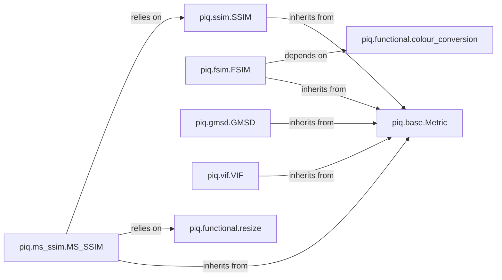

## Details

The `piq` library is structured around a set of image quality metrics, each implemented as a distinct component. The core design leverages an abstract `Metric` base class, providing a consistent interface for all metrics. Individual metric implementations, such as SSIM, MS-SSIM, FSIM, GMSD, and VIF, inherit from this base, encapsulating their specific computational logic. These metrics often rely on shared utility functions for image processing tasks like resizing and color space conversions, which are centralized in the `piq.functional` module. This modular design promotes reusability and extensibility, allowing new metrics to be easily integrated while maintaining a unified API.

### piq.base.Metric
The abstract base class that serves as the Core Metric API. It provides a unified interface and common structure for all image quality metrics, ensuring consistency across the library. It defines the `forward` method and delegates computation to `compute_metric`.

**Related Classes/Methods**:

- <a href="https://github.com/photosynthesis-team/piq/blob/master/piq/base.py" target="_blank" rel="noopener noreferrer">`piq.base.Metric:forward`</a>
- <a href="https://github.com/photosynthesis-team/piq/blob/master/piq/base.py" target="_blank" rel="noopener noreferrer">`piq.base.Metric:compute_metric`</a>

### piq.ssim.SSIM
A class-based implementation for computing the Structural Similarity Index (SSIM). It encapsulates the specific logic and parameters required for SSIM calculation and provides a PyTorch `nn.Module` compatible interface. The core computation is handled by the `ssim` function.

**Related Classes/Methods**:

- <a href="https://github.com/photosynthesis-team/piq/blob/master/piq/ssim.py#L20-L76" target="_blank" rel="noopener noreferrer">`piq.ssim.ssim`:20-76</a>

### piq.ms_ssim.MS_SSIM
A class-based implementation for calculating the Multi-Scale Structural Similarity Index (MS-SSIM). It extends the SSIM concept to multiple scales, encapsulating its unique logic and parameters, and provides a PyTorch `nn.Module` compatible interface. The `multi_scale_ssim` function performs the core calculation, and `MultiScaleSSIMLoss` provides a loss function wrapper.

**Related Classes/Methods**:

- <a href="https://github.com/photosynthesis-team/piq/blob/master/piq/ms_ssim.py#L20-L87" target="_blank" rel="noopener noreferrer">`piq.ms_ssim.multi_scale_ssim`:20-87</a>
- <a href="https://github.com/photosynthesis-team/piq/blob/master/piq/ms_ssim.py#L90-L193" target="_blank" rel="noopener noreferrer">`piq.ms_ssim.MultiScaleSSIMLoss`:90-193</a>

### piq.fsim.FSIM
A class-based implementation for determining the Feature Similarity Index (FSIM). It encapsulates the logic for extracting and comparing image features, providing a PyTorch `nn.Module` compatible interface. The `fsim` function is responsible for the main computation.

**Related Classes/Methods**:

- <a href="https://github.com/photosynthesis-team/piq/blob/master/piq/fsim.py" target="_blank" rel="noopener noreferrer">`piq.fsim.fsim`</a>

### piq.gmsd.GMSD
A class-based implementation for Gradient Magnitude Similarity Deviation (GMSD). It calculates image quality based on the similarity of gradient magnitudes, providing a PyTorch `nn.Module` compatible interface. The `gmsd` function performs the core calculation.

**Related Classes/Methods**:

- <a href="https://github.com/photosynthesis-team/piq/blob/master/piq/gmsd.py#L21-L62" target="_blank" rel="noopener noreferrer">`piq.gmsd.gmsd`:21-62</a>

### piq.vif.VIF
A class-based implementation for Visual Information Fidelity (VIF). This metric assesses image quality based on information theory principles, providing a PyTorch `nn.Module` compatible interface. The `vif_p` function performs the pixel-domain VIF computation, and `VIFLoss` provides a loss function wrapper.

**Related Classes/Methods**:

- <a href="https://github.com/photosynthesis-team/piq/blob/master/piq/vif.py#L17-L113" target="_blank" rel="noopener noreferrer">`piq.vif.vif_p`:17-113</a>
- <a href="https://github.com/photosynthesis-team/piq/blob/master/piq/vif.py#L116-L164" target="_blank" rel="noopener noreferrer">`piq.vif.VIFLoss`:116-164</a>

### piq.functional.resize
A utility module providing essential image resizing and resampling functionalities. It offers generic operations for scaling and resampling images, crucial for multi-scale metrics. Key functions include `resize_1d` and various `_contribution` functions for different interpolation kernels.

**Related Classes/Methods**:

- <a href="https://github.com/photosynthesis-team/piq/blob/master/piq/functional/resize.py#L270-L338" target="_blank" rel="noopener noreferrer">`piq.functional.resize.resize_1d`:270-338</a>
- <a href="https://github.com/photosynthesis-team/piq/blob/master/piq/functional/resize.py#L45-L60" target="_blank" rel="noopener noreferrer">`piq.functional.resize.cubic_contribution`:45-60</a>
- <a href="https://github.com/photosynthesis-team/piq/blob/master/piq/functional/resize.py#L102-L133" target="_blank" rel="noopener noreferrer">`piq.functional.resize.reflect_padding`:102-133</a>

### piq.functional.colour_conversion
A utility module dedicated to handling conversions between different color spaces (e.g., RGB to LAB, YIQ). It ensures that metrics can operate in the optimal color space for their calculations.

**Related Classes/Methods**:

- <a href="https://github.com/photosynthesis-team/piq/blob/master/piq/functional/colour_conversion.py#L6-L19" target="_blank" rel="noopener noreferrer">`piq.functional.colour_conversion.rgb2lmn`:6-19</a>
- <a href="https://github.com/photosynthesis-team/piq/blob/master/piq/functional/colour_conversion.py#L22-L41" target="_blank" rel="noopener noreferrer">`piq.functional.colour_conversion.rgb2xyz`:22-41</a>
- <a href="https://github.com/photosynthesis-team/piq/blob/master/piq/functional/colour_conversion.py#L44-L86" target="_blank" rel="noopener noreferrer">`piq.functional.colour_conversion.xyz2lab`:44-86</a>
- <a href="https://github.com/photosynthesis-team/piq/blob/master/piq/functional/colour_conversion.py#L89-L99" target="_blank" rel="noopener noreferrer">`piq.functional.colour_conversion.rgb2lab`:89-99</a>
- <a href="https://github.com/photosynthesis-team/piq/blob/master/piq/functional/colour_conversion.py#L102-L116" target="_blank" rel="noopener noreferrer">`piq.functional.colour_conversion.rgb2yiq`:102-116</a>
- <a href="https://github.com/photosynthesis-team/piq/blob/master/piq/functional/colour_conversion.py#L119-L136" target="_blank" rel="noopener noreferrer">`piq.functional.colour_conversion.rgb2lhm`:119-136</a>

### [FAQ](https://github.com/CodeBoarding/GeneratedOnBoardings/tree/main?tab=readme-ov-file#faq)