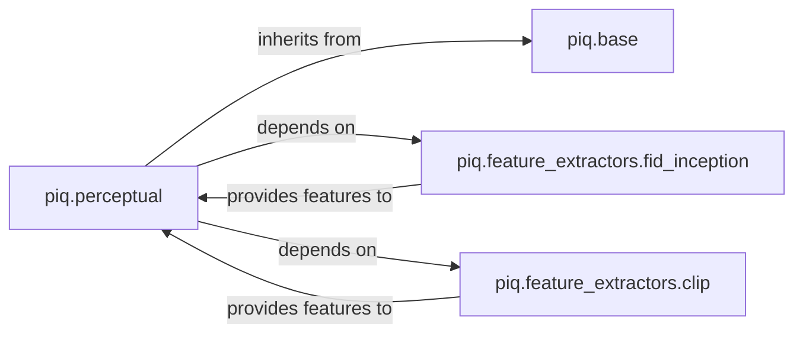

## Details

The `Perceptual Loss Functions` subsystem is a specialized part of the `piq` library, focusing on image quality assessment using high-level features rather than pixel-level differences. It is designed to integrate seamlessly into PyTorch training pipelines as loss functions.

### piq.perceptual
Implements various perceptual loss functions (e.g., PerceptualLoss, LPIPS, DISTS) that quantify image quality based on high-level features. These are designed as nn.Module instances for seamless integration into PyTorch computation graphs as loss functions.

**Related Classes/Methods**:

- <a href="https://github.com/photosynthesis-team/piq/blob/master/piq/perceptual.py" target="_blank" rel="noopener noreferrer">`piq.perceptual`</a>

### piq.base
Defines the abstract base class (Metric or BaseMetric) that standardizes the structure and interface for all image quality metrics and loss functions in piq. This includes methods like forward and compute_metric, promoting a unified approach.

**Related Classes/Methods**:

- <a href="https://github.com/photosynthesis-team/piq/blob/master/piq/base.py" target="_blank" rel="noopener noreferrer">`piq.base`</a>

### piq.feature_extractors.fid_inception
Provides a dedicated mechanism for extracting high-level features from images using a pre-trained InceptionV3 model. Crucial for metrics that rely on statistical properties of feature distributions, such as Fréchet Inception Distance (FID), and for certain perceptual losses.

**Related Classes/Methods**:

- <a href="https://github.com/photosynthesis-team/piq/blob/master/piq/feature_extractors/fid_inception.py" target="_blank" rel="noopener noreferrer">`piq.feature_extractors.fid_inception`</a>

### piq.feature_extractors.clip
Offers robust feature extraction capabilities by leveraging the CLIP (Contrastive Language-Image Pre-training) model to generate image embeddings. Enables perceptual metrics that benefit from CLIP's rich semantic understanding.

**Related Classes/Methods**:

- <a href="https://github.com/photosynthesis-team/piq/blob/master/piq/feature_extractors/clip.py" target="_blank" rel="noopener noreferrer">`piq.feature_extractors.clip`</a>

### [FAQ](https://github.com/CodeBoarding/GeneratedOnBoardings/tree/main?tab=readme-ov-file#faq)