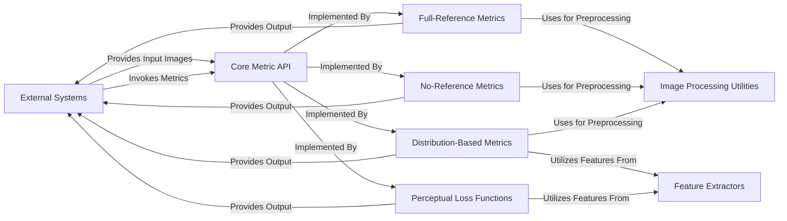

## Details

The `piq` library is designed to provide a comprehensive suite of image quality metrics. Its architecture is centered around a flexible `Core Metric API` that defines the common interface for all metrics. This API is implemented by various specialized metric components, including `Full-Reference Metrics`, `No-Reference Metrics`, `Distribution-Based Metrics`, and `Perceptual Loss Functions`, each addressing different evaluation paradigms. The system interacts with `External Systems` that provide input images and consume the computed quality scores. To support its diverse metric calculations, `piq` leverages `Feature Extractors` for high-level image representations and `Image Processing Utilities` for fundamental image manipulations. This modular design ensures extensibility and reusability across different image quality assessment tasks.

### External Systems
Represents external sources of image data (e.g., datasets, applications) and frameworks that utilize `piq` for evaluation or training. This component is external to the `piq` library and interacts with it by providing input images and consuming metric outputs.

**Related Classes/Methods**: _None_

### Core Metric API
The foundational interface defining common methods and abstract classes for all image quality metrics, ensuring a consistent interaction model. This component establishes the contract for how metrics are implemented and used.

**Related Classes/Methods**:

- <a href="https://github.com/photosynthesis-team/piq/blob/master/piq/base.py" target="_blank" rel="noopener noreferrer">`piq/base.py`</a>

### Full-Reference Metrics [[Expand]](./Full_Reference_Metrics.md)
A collection of metrics (e.g., SSIM, MS-SSIM, FSIM) that require both a reference and a distorted image for comparison. These metrics inherit from the `Core Metric API`.

**Related Classes/Methods**:

- <a href="https://github.com/photosynthesis-team/piq/blob/master/piq/base.py" target="_blank" rel="noopener noreferrer">`piq.base`</a>
- <a href="https://github.com/photosynthesis-team/piq/blob/master/piq/functional/resize.py" target="_blank" rel="noopener noreferrer">`piq.functional.resize`</a>
- <a href="https://github.com/photosynthesis-team/piq/blob/master/piq/functional/colour_conversion.py" target="_blank" rel="noopener noreferrer">`piq.functional.colour_conversion`</a>

### No-Reference Metrics
Metrics (e.g., BRISQUE, Total Variation) that assess image quality without the need for an original reference image. These metrics also adhere to the `Core Metric API`.

**Related Classes/Methods**:

- <a href="https://github.com/photosynthesis-team/piq/blob/master/piq/base.py" target="_blank" rel="noopener noreferrer">`piq.base`</a>
- <a href="https://github.com/photosynthesis-team/piq/blob/master/piq/functional/resize.py" target="_blank" rel="noopener noreferrer">`piq.functional.resize`</a>
- <a href="https://github.com/photosynthesis-team/piq/blob/master/piq/functional/colour_conversion.py" target="_blank" rel="noopener noreferrer">`piq.functional.colour_conversion`</a>

### Distribution-Based Metrics [[Expand]](./Distribution_Based_Metrics.md)
Metrics (e.g., FID, IS, KID, PR) that evaluate image quality by comparing statistical distributions of features extracted from image sets. These metrics rely on `Feature Extractors` and the `Core Metric API`.

**Related Classes/Methods**:

- <a href="https://github.com/photosynthesis-team/piq/blob/master/piq/base.py" target="_blank" rel="noopener noreferrer">`piq.base`</a>
- <a href="https://github.com/photosynthesis-team/piq/blob/master/piq/feature_extractors/fid_inception.py" target="_blank" rel="noopener noreferrer">`piq.feature_extractors.fid_inception`</a>
- <a href="https://github.com/photosynthesis-team/piq/blob/master/piq/feature_extractors/clip.py" target="_blank" rel="noopener noreferrer">`piq.feature_extractors.clip`</a>
- <a href="https://github.com/photosynthesis-team/piq/blob/master/piq/functional/resize.py" target="_blank" rel="noopener noreferrer">`piq.functional.resize`</a>
- <a href="https://github.com/photosynthesis-team/piq/blob/master/piq/functional/colour_conversion.py" target="_blank" rel="noopener noreferrer">`piq.functional.colour_conversion`</a>

### Perceptual Loss Functions [[Expand]](./Perceptual_Loss_Functions.md)
Metrics (e.g., PerceptualLoss) designed to be used as loss functions within neural network training, leveraging features from pre-trained models. These also utilize `Feature Extractors` and the `Core Metric API`.

**Related Classes/Methods**:

- <a href="https://github.com/photosynthesis-team/piq/blob/master/piq/base.py" target="_blank" rel="noopener noreferrer">`piq.base`</a>
- <a href="https://github.com/photosynthesis-team/piq/blob/master/piq/feature_extractors/fid_inception.py" target="_blank" rel="noopener noreferrer">`piq.feature_extractors.fid_inception`</a>
- <a href="https://github.com/photosynthesis-team/piq/blob/master/piq/feature_extractors/clip.py" target="_blank" rel="noopener noreferrer">`piq.feature_extractors.clip`</a>

### Feature Extractors
Dedicated modules for extracting high-level features from images using pre-trained deep learning models (e.g., InceptionV3, CLIP). These are crucial for distribution-based and perceptual loss metrics.

**Related Classes/Methods**:

- <a href="https://github.com/photosynthesis-team/piq/blob/master/piq/feature_extractors/fid_inception.py" target="_blank" rel="noopener noreferrer">`piq/feature_extractors/fid_inception.py`</a>
- <a href="https://github.com/photosynthesis-team/piq/blob/master/piq/feature_extractors/clip.py" target="_blank" rel="noopener noreferrer">`piq/feature_extractors/clip.py`</a>

### Image Processing Utilities
A collection of low-level, functional utilities for common image manipulation tasks, including resizing and color space conversions, used by various metrics for preprocessing.

**Related Classes/Methods**:

- <a href="https://github.com/photosynthesis-team/piq/blob/master/piq/functional/resize.py" target="_blank" rel="noopener noreferrer">`piq/functional/resize.py`</a>
- <a href="https://github.com/photosynthesis-team/piq/blob/master/piq/functional/colour_conversion.py" target="_blank" rel="noopener noreferrer">`piq/functional/colour_conversion.py`</a>

### [FAQ](https://github.com/CodeBoarding/GeneratedOnBoardings/tree/main?tab=readme-ov-file#faq)