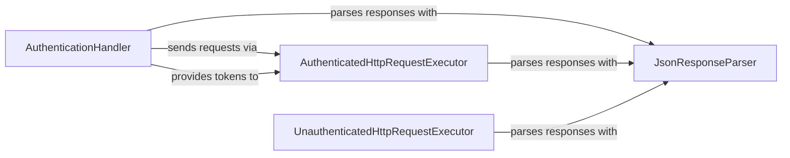

## Details

The Authentication & Core Request Handler subsystem is responsible for the foundational aspects of interacting with the Pixiv API. This includes managing user authentication (OAuth2 token handling, refreshing), and the low-level mechanics of constructing, sending, and processing HTTP requests, both for authenticated and unauthenticated endpoints, as well as parsing the raw JSON responses.

### AuthenticationHandler
Manages the OAuth2 authentication flow, including initiating login, sending authentication requests, processing responses to obtain and refresh access tokens, and maintaining the authenticated session state.

**Related Classes/Methods**:

- <a href="https://github.com/upbit/pixivpy/blob/master/pixivpy3/api.py#L118-L195" target="_blank" rel="noopener noreferrer">`pixivpy3.api.auth`:118-195</a>

### AuthenticatedHttpRequestExecutor
Executes low-level HTTP requests that require an authenticated session. It handles the mechanics of attaching authentication tokens, sending requests, and receiving raw responses for protected API endpoints.

**Related Classes/Methods**:

- <a href="https://github.com/upbit/pixivpy/blob/master/pixivpy3/api.py#L56-L105" target="_blank" rel="noopener noreferrer">`pixivpy3.api.requests_call`:56-105</a>

### UnauthenticatedHttpRequestExecutor
Executes low-level HTTP requests for public API endpoints that do not require user authentication. It handles the basic mechanics of sending requests and receiving raw responses.

**Related Classes/Methods**:

- <a href="https://github.com/upbit/pixivpy/blob/master/pixivpy3/aapi.py#L73-L95" target="_blank" rel="noopener noreferrer">`pixivpy3.aapi.no_auth_requests_call`:73-95</a>

### JsonResponseParser
A utility component dedicated to parsing JSON formatted strings received from API responses into Python objects (e.g., dictionaries or Pydantic models).

**Related Classes/Methods**:

- <a href="https://github.com/upbit/pixivpy/blob/master/pixivpy3/api.py#L46-L49" target="_blank" rel="noopener noreferrer">`pixivpy3.api.parse_json`:46-49</a>

### [FAQ](https://github.com/CodeBoarding/GeneratedOnBoardings/tree/main?tab=readme-ov-file#faq)