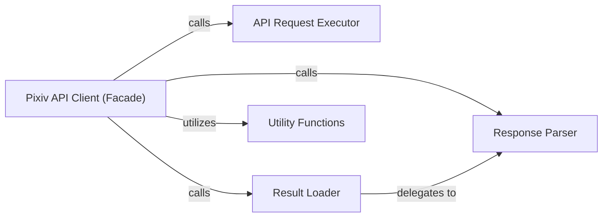

## Details

The subsystem under analysis is primarily encapsulated within the `pixivpy3.aapi` module, with `AppPixivAPI` serving as its central component. This module forms the core of the Pixiv API client functionality.

### Pixiv API Client (Facade) [[Expand]](./Pixiv_API_Client_Facade_.md)
The primary high-level interface of the `pixivpy` library, implementing the Facade pattern. It provides user-friendly methods for various Pixiv API functionalities, abstracting direct endpoint interaction and orchestrating the entire API call process. This component is central as it's the user's direct interaction point with the library.

**Related Classes/Methods**:

- <a href="https://github.com/upbit/pixivpy/blob/master/pixivpy3/aapi.py#L62-L929" target="_blank" rel="noopener noreferrer">`pixivpy3.aapi.AppPixivAPI`:62-929</a>

### API Request Executor
Responsible for handling low-level network communication. It executes HTTP requests to the Pixiv API and receives raw responses, abstracting the underlying `requests` and `cloudscraper` libraries. This component is fundamental for any API client, managing the actual data transfer.

**Related Classes/Methods**:

- <a href="https://github.com/upbit/pixivpy/blob/master/pixivpy3/aapi.py#L73-L95" target="_blank" rel="noopener noreferrer">`pixivpy3.aapi.no_auth_requests_call`:73-95</a>

### Result Loader
Performs initial loading and common processing of API results, suchs as handling pagination or basic error checks, before detailed parsing. It acts as an intermediary step in the response processing pipeline.

**Related Classes/Methods**:

- <a href="https://github.com/upbit/pixivpy/blob/master/pixivpy3/aapi.py#L104-L111" target="_blank" rel="noopener noreferrer">`pixivpy3.aapi._load_result`:104-111</a>

### Response Parser
Transforms raw JSON API responses into structured Python data, typically Pydantic models, ensuring data consistency and ease of consumption. This component is crucial for the "Data-Driven Structure" of the library.

**Related Classes/Methods**:

- <a href="https://github.com/upbit/pixivpy/blob/master/pixivpy3/aapi.py#L97-L102" target="_blank" rel="noopener noreferrer">`pixivpy3.aapi.parse_result`:97-102</a>

### Utility Functions
Provides various helper functionalities used across the subsystem, including query string parsing, date/boolean formatting, and data model loading. While not directly involved in API calls, these functions support the core components' operations.

**Related Classes/Methods**:

- <a href="https://github.com/upbit/pixivpy/blob/master/pixivpy3/aapi.py#L138-L154" target="_blank" rel="noopener noreferrer">`pixivpy3.aapi.parse_qs`:138-154</a>
- <a href="https://github.com/upbit/pixivpy/blob/master/pixivpy3/aapi.py#L129-L135" target="_blank" rel="noopener noreferrer">`pixivpy3.aapi._format_date`:129-135</a>
- <a href="https://github.com/upbit/pixivpy/blob/master/pixivpy3/aapi.py#L121-L127" target="_blank" rel="noopener noreferrer">`pixivpy3.aapi.format_bool`:121-127</a>
- <a href="https://github.com/upbit/pixivpy/blob/master/pixivpy3/aapi.py#L113-L119" target="_blank" rel="noopener noreferrer">`pixivpy3.aapi._load_model`:113-119</a>

### [FAQ](https://github.com/CodeBoarding/GeneratedOnBoardings/tree/main?tab=readme-ov-file#faq)