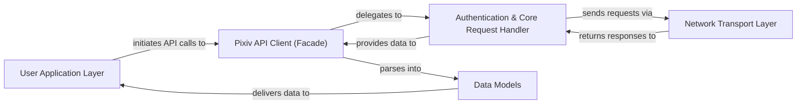

## Details

The `pixivpy` library implements a layered architecture, primarily functioning as an API client wrapper. At its core, the `Pixiv API Client (Facade)` provides a simplified interface for users, abstracting the complexities of direct API interaction. This facade relies on the `Authentication & Core Request Handler` for managing authentication flows and preparing/processing low-level HTTP requests. All network communication is handled by the `Network Transport Layer`, which leverages external libraries to send and receive raw data from the Pixiv API. Crucially, `Data Models` (built with Pydantic) ensure type-safe and structured representation of API responses, facilitating easy consumption by the `User Application Layer`. This design promotes clear separation of concerns, making the library robust and maintainable, and its data flow highly predictable for diagrammatic representation.

### User Application Layer
Represents the external code or application that consumes the `pixivpy` library. It initiates API calls and processes the structured data returned.

**Related Classes/Methods**:

- <a href="https://github.com/upbit/pixivpy/blob/master/demo.py" target="_blank" rel="noopener noreferrer">`demo.py`</a>

### Pixiv API Client (Facade) [[Expand]](./Pixiv_API_Client_Facade_.md)
The primary high-level interface of the `pixivpy` library. It provides user-friendly methods for various Pixiv API functionalities, abstracting direct endpoint interaction and initial response parsing.

**Related Classes/Methods**:

- <a href="https://github.com/upbit/pixivpy/blob/master/pixivpy3/aapi.py#L62-L929" target="_blank" rel="noopener noreferrer">`pixivpy3.aapi.AppPixivAPI`:62-929</a>
- <a href="https://github.com/upbit/pixivpy/blob/master/pixivpy3/aapi.py" target="_blank" rel="noopener noreferrer">`pixivpy3.aapi.AppPixivAPI:parse_result`</a>
- <a href="https://github.com/upbit/pixivpy/blob/master/pixivpy3/aapi.py" target="_blank" rel="noopener noreferrer">`pixivpy3.aapi.AppPixivAPI:_load_result`</a>

### Authentication & Core Request Handler [[Expand]](./Authentication_Core_Request_Handler.md)
Responsible for managing user authentication (e.g., OAuth2 tokens), handling token refreshing, and constructing/processing low-level HTTP requests before and after network transmission.

**Related Classes/Methods**:

- <a href="https://github.com/upbit/pixivpy/blob/master/pixivpy3/api.py#L118-L195" target="_blank" rel="noopener noreferrer">`pixivpy3.api.auth`:118-195</a>
- <a href="https://github.com/upbit/pixivpy/blob/master/pixivpy3/api.py#L56-L105" target="_blank" rel="noopener noreferrer">`pixivpy3.api.requests_call`:56-105</a>
- <a href="https://github.com/upbit/pixivpy/blob/master/pixivpy3/api.py#L46-L49" target="_blank" rel="noopener noreferrer">`pixivpy3.api.parse_json`:46-49</a>
- <a href="https://github.com/upbit/pixivpy/blob/master/pixivpy3/aapi.py#L73-L95" target="_blank" rel="noopener noreferrer">`pixivpy3.aapi.no_auth_requests_call`:73-95</a>

### Data Models
A collection of Pydantic models that define the schema and structure of data objects exchanged with the Pixiv API, ensuring data consistency and type safety for consumption.

**Related Classes/Methods**:

- <a href="https://github.com/upbit/pixivpy/blob/master/pixivpy3/models.py" target="_blank" rel="noopener noreferrer">`pixivpy3.models`</a>

### Network Transport Layer
The foundational layer responsible for the actual HTTP communication. It leverages external libraries like `requests` and `cloudscraper` to establish connections, send requests, and receive raw responses.

**Related Classes/Methods**:

- <a href="https://github.com/upbit/pixivpy/blob/master/pixivpy3/api.py#L56-L105" target="_blank" rel="noopener noreferrer">`pixivpy3.api.requests_call`:56-105</a>
- <a href="https://github.com/upbit/pixivpy/blob/master/pixivpy3/aapi.py#L73-L95" target="_blank" rel="noopener noreferrer">`pixivpy3.aapi.no_auth_requests_call`:73-95</a>

### [FAQ](https://github.com/CodeBoarding/GeneratedOnBoardings/tree/main?tab=readme-ov-file#faq)