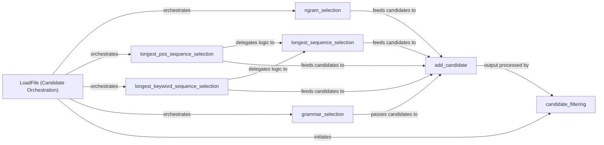

## Details

The pke project's candidate generation subsystem is primarily managed by the LoadFile class. This class orchestrates various strategies for identifying keyphrase candidates, including n-gram extraction, identification of longest POS or keyword sequences, and grammar-based selection. All these methods contribute candidates to an internal collection via the add_candidate utility. Subsequently, the candidate_filtering mechanism refines this set of candidates, ensuring only relevant keyphrases are retained for further processing.

### LoadFile (Candidate Orchestration)
The central orchestrator component that manages the overall process of identifying raw keyphrase candidates from the preprocessed document and applying initial filtering. It coordinates various candidate extraction strategies and holds the collection of candidates.

**Related Classes/Methods**:

- <a href="https://github.com/boudinfl/pke/blob/master/pke/base.py#L21-L451" target="_blank" rel="noopener noreferrer">`pke.base.LoadFile`:21-451</a>

### ngram_selection
Identifies keyphrase candidates based on contiguous sequences of words (n-grams).

**Related Classes/Methods**:

- <a href="https://github.com/boudinfl/pke/blob/master/pke/base.py#L237-L264" target="_blank" rel="noopener noreferrer">`pke.base.LoadFile.ngram_selection`:237-264</a>

### longest_pos_sequence_selection
Selects candidates by identifying the longest sequences of specific parts-of-speech (POS tags).

**Related Classes/Methods**:

- <a href="https://github.com/boudinfl/pke/blob/master/pke/base.py#L266-L268" target="_blank" rel="noopener noreferrer">`pke.base.LoadFile.longest_pos_sequence_selection`:266-268</a>

### longest_keyword_sequence_selection
Selects candidates by identifying the longest sequences of pre-identified keywords.

**Related Classes/Methods**:

- <a href="https://github.com/boudinfl/pke/blob/master/pke/base.py#L270-L272" target="_blank" rel="noopener noreferrer">`pke.base.LoadFile.longest_keyword_sequence_selection`:270-272</a>

### grammar_selection
Selects candidates based on predefined grammatical rules or patterns.

**Related Classes/Methods**:

- <a href="https://github.com/boudinfl/pke/blob/master/pke/base.py#L316-L367" target="_blank" rel="noopener noreferrer">`pke.base.LoadFile.grammar_selection`:316-367</a>

### add_candidate
A central utility responsible for adding newly identified keyphrase candidates to an internal collection, ensuring consistency and avoiding duplicates.

**Related Classes/Methods**:

- <a href="https://github.com/boudinfl/pke/blob/master/pke/base.py#L208-L235" target="_blank" rel="noopener noreferrer">`pke.base.LoadFile.add_candidate`:208-235</a>

### candidate_filtering
Refines the set of generated candidates by applying various filtering rules (e.g., removing non-alphanumeric candidates, stopwords, etc.).

**Related Classes/Methods**:

- <a href="https://github.com/boudinfl/pke/blob/master/pke/base.py#L383-L451" target="_blank" rel="noopener noreferrer">`pke.base.LoadFile.candidate_filtering`:383-451</a>

### longest_sequence_selection
Abstracts common sequence finding logic used by longest_pos_sequence_selection and longest_keyword_sequence_selection.

**Related Classes/Methods**:

- <a href="https://github.com/boudinfl/pke/blob/master/pke/base.py#L274-L314" target="_blank" rel="noopener noreferrer">`pke.base.LoadFile.longest_sequence_selection`:274-314</a>

### [FAQ](https://github.com/CodeBoarding/GeneratedOnBoardings/tree/main?tab=readme-ov-file#faq)