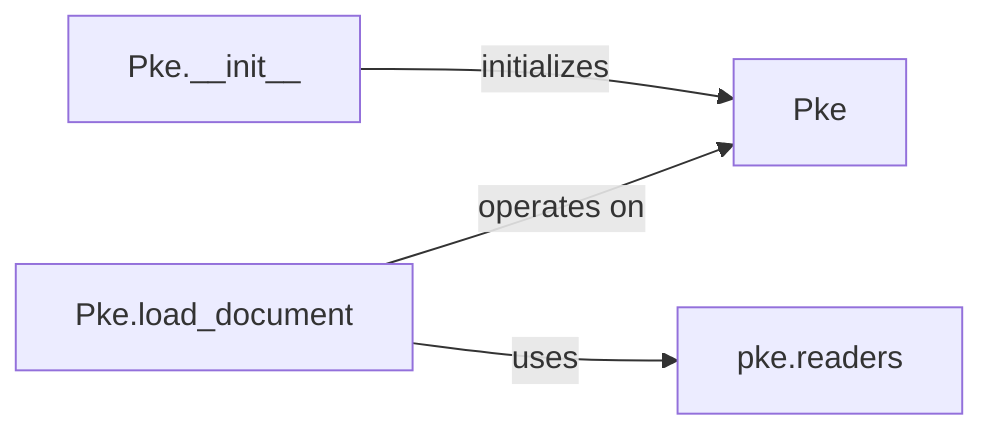

## Details

The `Document Ingestion & Preprocessing` subsystem is responsible for loading raw text and performing initial linguistic analysis. It aligns with the `Input/Document Readers` and `Text Preprocessing Unit` patterns expected in an ML/NLP Library/Toolkit.

### Pke
This is the central orchestrator and document container for the subsystem. It holds the document's content and manages its linguistic annotations throughout the keyphrase extraction pipeline. It acts as the primary interface for loading and initiating preprocessing.

**Related Classes/Methods**:

- <a href="https://github.com/boudinfl/pke/blob/master/pke/base.py" target="_blank" rel="noopener noreferrer">`pke.base.Pke`</a>

### Pke.__init__
The constructor for the `Pke` class. Its responsibility is to initialize the document object, setting up internal data structures required for storing the document's text and preparing for subsequent linguistic annotations.

**Related Classes/Methods**:

- <a href="https://github.com/boudinfl/pke/blob/master/pke/base.py" target="_blank" rel="noopener noreferrer">`pke.base.Pke:__init__`</a>

### Pke.load_document
This method is responsible for ingesting raw text into the `Pke` object. It handles the actual loading of the document content and likely triggers initial parsing or setup. This method serves as the primary entry point for document input.

**Related Classes/Methods**:

- <a href="https://github.com/boudinfl/pke/blob/master/pke/base.py" target="_blank" rel="noopener noreferrer">`pke.base.Pke:load_document`</a>

### pke.readers
This module contains various reader implementations (e.g., for different file formats like plain text, XML, PDF). It provides the concrete mechanisms for reading diverse input sources, which `Pke.load_document` would utilize.

**Related Classes/Methods**:

- <a href="https://github.com/boudinfl/pke/blob/master/pke/readers.py" target="_blank" rel="noopener noreferrer">`pke.readers`</a>

### [FAQ](https://github.com/CodeBoarding/GeneratedOnBoardings/tree/main?tab=readme-ov-file#faq)