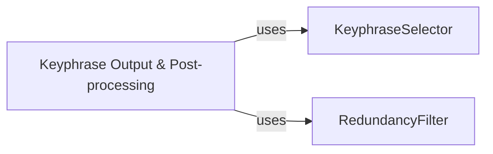

## Details

The `Keyphrase Output & Post-processing` subsystem is crucial for refining the raw output of keyphrase extraction models into a usable and high-quality set of keyphrases. It embodies the final stages of the NLP pipeline, ensuring that the extracted keyphrases are not only relevant but also non-redundant and properly formatted.

### Keyphrase Output & Post-processing [[Expand]](./Keyphrase_Output_Post_processing.md)
This component acts as the orchestrator and facade for the final steps of keyphrase extraction. It takes the weighted keyphrase candidates and applies selection and post-processing (like redundancy removal) to produce the final set of keyphrases. It ensures the overall flow and coordination of the output phase.

**Related Classes/Methods**:

- <a href="https://github.com/boudinfl/pke/blob/master/pke/base.py#L159-L206" target="_blank" rel="noopener noreferrer">`pke.base.get_n_best`:159-206</a>

### KeyphraseSelector
This component is responsible for selecting the top 'n' keyphrases from a larger set of candidates based on their assigned weights. It embodies the core ranking logic, determining which candidates are most relevant according to the preceding weighting algorithms.

**Related Classes/Methods**:

- <a href="https://github.com/boudinfl/pke/blob/master/pke/base.py#L159-L206" target="_blank" rel="noopener noreferrer">`pke.base.get_n_best`:159-206</a>
- <a href="https://github.com/boudinfl/pke/blob/master/pke/unsupervised/statistical/yake.py#L403-L464" target="_blank" rel="noopener noreferrer">`pke.unsupervised.statistical.yake.get_n_best`:403-464</a>

### RedundancyFilter
This component is responsible for identifying and removing redundant keyphrases from the selected list. It ensures diversity in the final output by preventing highly similar keyphrases from being included, thereby improving the quality and conciseness of the extracted information.

**Related Classes/Methods**:

- <a href="https://github.com/boudinfl/pke/blob/master/pke/base.py#L129-L157" target="_blank" rel="noopener noreferrer">`pke.base.is_redundant`:129-157</a>

### [FAQ](https://github.com/CodeBoarding/GeneratedOnBoardings/tree/main?tab=readme-ov-file#faq)