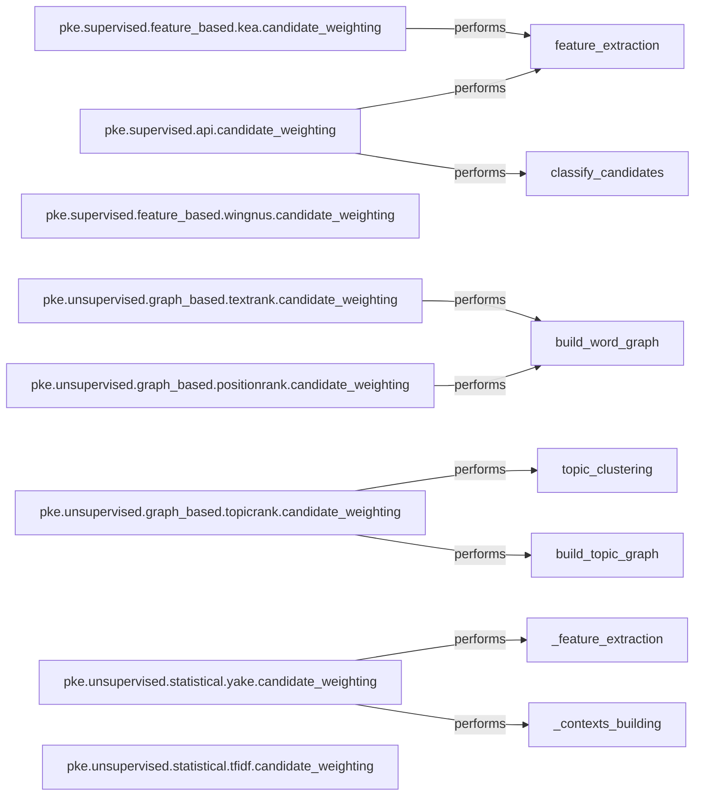

## Details

The `pke` library's keyphrase extraction subsystem is structured around a set of specialized `candidate_weighting` components, each implementing a distinct algorithm for either supervised or unsupervised keyphrase extraction. These components serve as the primary entry points for their respective algorithms, orchestrating internal processes such as feature extraction, graph construction, topic clustering, or context building. This modular design allows for easy extension and comparison of different keyphrase extraction methodologies, with each component encapsulating its specific weighting logic and necessary preparatory steps. The architecture emphasizes a clear functional decomposition, where each `candidate_weighting` component is responsible for the complete execution of its algorithm, from data preparation to final candidate scoring.

### pke.supervised.api.candidate_weighting
The main entry point and orchestrator for supervised keyphrase weighting algorithms, providing a unified interface for supervised models. It performs feature extraction and then classifies candidates as keyphrases or not.

**Related Classes/Methods**:

- <a href="https://github.com/boudinfl/pke/blob/master/pke/supervised/api.py#L68-L74" target="_blank" rel="noopener noreferrer">`pke.supervised.api.candidate_weighting`:68-74</a>
- <a href="https://github.com/boudinfl/pke/blob/master/pke/supervised/api.py#L36-L38" target="_blank" rel="noopener noreferrer">`pke.supervised.api.feature_extraction`:36-38</a>
- <a href="https://github.com/boudinfl/pke/blob/master/pke/supervised/api.py#L40-L66" target="_blank" rel="noopener noreferrer">`pke.supervised.api.classify_candidates`:40-66</a>

### pke.supervised.feature_based.kea.candidate_weighting
Implements the KEA (Keyphrase Extraction Algorithm) for supervised, feature-based keyphrase weighting, specifically handling feature extraction for TF-IDF and first occurrence.

**Related Classes/Methods**:

- <a href="https://github.com/boudinfl/pke/blob/master/pke/supervised/feature_based/kea.py#L140-L152" target="_blank" rel="noopener noreferrer">`pke.supervised.feature_based.kea.candidate_weighting`:140-152</a>
- <a href="https://github.com/boudinfl/pke/blob/master/pke/supervised/feature_based/kea.py#L95-L138" target="_blank" rel="noopener noreferrer">`pke.supervised.feature_based.kea.feature_extraction`:95-138</a>

### pke.supervised.feature_based.wingnus.candidate_weighting
Implements the Wingnus algorithm for supervised, feature-based keyphrase weighting.

**Related Classes/Methods**:

- <a href="https://github.com/boudinfl/pke/blob/master/pke/supervised/feature_based/wingnus.py#L231-L243" target="_blank" rel="noopener noreferrer">`pke.supervised.feature_based.wingnus.candidate_weighting`:231-243</a>

### pke.unsupervised.graph_based.positionrank.candidate_weighting
Implements the PositionRank algorithm, an unsupervised graph-based method that leverages word positions for ranking. It involves building a word graph where nodes are words and edges represent co-occurrence within a window.

**Related Classes/Methods**:

- <a href="https://github.com/boudinfl/pke/blob/master/pke/unsupervised/graph_based/positionrank.py#L146-L182" target="_blank" rel="noopener noreferrer">`pke.unsupervised.graph_based.positionrank.candidate_weighting`:146-182</a>
- <a href="https://github.com/boudinfl/pke/blob/master/pke/unsupervised/graph_based/positionrank.py#L101-L144" target="_blank" rel="noopener noreferrer">`pke.unsupervised.graph_based.positionrank.build_word_graph`:101-144</a>

### pke.unsupervised.graph_based.textrank.candidate_weighting
Implements the classic TextRank algorithm, an unsupervised graph-based method widely used for keyphrase extraction. A key step is building a word graph based on co-occurrence relations and syntactic filters.

**Related Classes/Methods**:

- <a href="https://github.com/boudinfl/pke/blob/master/pke/unsupervised/graph_based/textrank.py#L130-L185" target="_blank" rel="noopener noreferrer">`pke.unsupervised.graph_based.textrank.candidate_weighting`:130-185</a>
- <a href="https://github.com/boudinfl/pke/blob/master/pke/unsupervised/graph_based/textrank.py#L88-L128" target="_blank" rel="noopener noreferrer">`pke.unsupervised.graph_based.textrank.build_word_graph`:88-128</a>

### pke.unsupervised.graph_based.topicrank.candidate_weighting
Implements the TopicRank algorithm, an unsupervised graph-based method that incorporates topic modeling. This involves clustering candidates into topics and then building a topic graph.

**Related Classes/Methods**:

- <a href="https://github.com/boudinfl/pke/blob/master/pke/unsupervised/graph_based/topicrank.py#L193-L244" target="_blank" rel="noopener noreferrer">`pke.unsupervised.graph_based.topicrank.candidate_weighting`:193-244</a>
- <a href="https://github.com/boudinfl/pke/blob/master/pke/unsupervised/graph_based/topicrank.py#L126-L156" target="_blank" rel="noopener noreferrer">`pke.unsupervised.graph_based.topicrank.topic_clustering`:126-156</a>
- <a href="https://github.com/boudinfl/pke/blob/master/pke/unsupervised/graph_based/topicrank.py#L173-L191" target="_blank" rel="noopener noreferrer">`pke.unsupervised.graph_based.topicrank.build_topic_graph`:173-191</a>

### pke.unsupervised.statistical.yake.candidate_weighting
Implements the YAKE (Yet Another Keyword Extractor) algorithm, a statistical unsupervised method. It performs feature extraction for individual words and builds contexts for relatedness computation.

**Related Classes/Methods**:

- <a href="https://github.com/boudinfl/pke/blob/master/pke/unsupervised/statistical/yake.py#L307-L374" target="_blank" rel="noopener noreferrer">`pke.unsupervised.statistical.yake.candidate_weighting`:307-374</a>
- <a href="https://github.com/boudinfl/pke/blob/master/pke/unsupervised/statistical/yake.py#L188-L305" target="_blank" rel="noopener noreferrer">`pke.unsupervised.statistical.yake._feature_extraction`:188-305</a>
- <a href="https://github.com/boudinfl/pke/blob/master/pke/unsupervised/statistical/yake.py#L142-L186" target="_blank" rel="noopener noreferrer">`pke.unsupervised.statistical.yake._contexts_building`:142-186</a>

### pke.unsupervised.statistical.tfidf.candidate_weighting
Implements the TF-IDF (Term Frequency-Inverse Document Frequency) algorithm, a statistical unsupervised method for weighting terms.

**Related Classes/Methods**:

- <a href="https://github.com/boudinfl/pke/blob/master/pke/unsupervised/statistical/tfidf.py#L63-L90" target="_blank" rel="noopener noreferrer">`pke.unsupervised.statistical.tfidf.candidate_weighting`:63-90</a>

### [FAQ](https://github.com/CodeBoarding/GeneratedOnBoardings/tree/main?tab=readme-ov-file#faq)