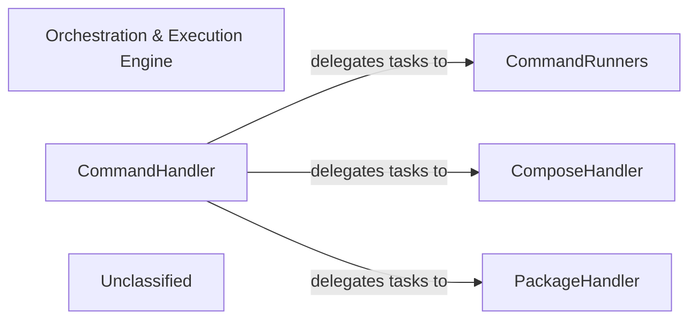

## Details

The `poco` project's core architecture revolves around an `Orchestration & Execution Engine` that manages command-driven workflows. The `CommandHandler` acts as the central orchestrator, interpreting user commands and delegating their execution to specialized components. `CommandRunners` provide the low-level execution capabilities for various command types, including script execution, Docker, Kubernetes, and Helm operations. The `ComposeHandler` specifically manages interactions with Docker Compose for multi-container application orchestration, while the `PackageHandler` is responsible for project package lifecycle management, including packing and unpacking project environments. This modular design facilitates integration with external tools and supports flexible command execution across different containerization technologies.

### Orchestration & Execution Engine [[Expand]](./Orchestration_Execution_Engine.md)
The overarching conceptual component that encapsulates the entire execution logic. It is responsible for orchestrating workflows and providing the mechanisms to execute project-defined commands and scripts, integrating seamlessly with external tools like Docker and Docker Compose. This component embodies the "Orchestration/Workflow Engine" pattern.

**Related Classes/Methods**:

- <a href="https://github.com/shiwaforce/poco/blob/masterpoco/services/command_handler.py#L13-L181" target="_blank" rel="noopener noreferrer">`poco.services.command_handler.CommandHandler`:13-181</a>
- <a href="https://github.com/shiwaforce/poco/blob/masterpoco/services/command_runners.py#L45-L121" target="_blank" rel="noopener noreferrer">`poco.services.command_runners.ScriptPlanRunner`:45-121</a>
- <a href="https://github.com/shiwaforce/poco/blob/masterpoco/services/command_runners.py#L190-L243" target="_blank" rel="noopener noreferrer">`poco.services.command_runners.DockerPlanRunner`:190-243</a>
- <a href="https://github.com/shiwaforce/poco/blob/masterpoco/services/command_runners.py#L124-L146" target="_blank" rel="noopener noreferrer">`poco.services.command_runners.KubernetesRunner`:124-146</a>
- <a href="https://github.com/shiwaforce/poco/blob/masterpoco/services/command_runners.py#L149-L187" target="_blank" rel="noopener noreferrer">`poco.services.command_runners.HelmRunner`:149-187</a>
- <a href="https://github.com/shiwaforce/poco/blob/masterpoco/services/compose_handler.py#L10-L115" target="_blank" rel="noopener noreferrer">`poco.services.compose_handler.ComposeHandler`:10-115</a>
- <a href="https://github.com/shiwaforce/poco/blob/masterpoco/services/package_handler.py#L11-L109" target="_blank" rel="noopener noreferrer">`poco.services.package_handler.PackageHandler`:11-109</a>

### CommandHandler
Acts as the primary orchestrator for command execution within the engine. It receives parsed commands, determines the necessary steps, and delegates to specialized handlers or runners. This component embodies the "Command-Driven Workflow" and "Orchestration/Workflow Engine" patterns, central to a CLI tool's operation.

**Related Classes/Methods**:

- <a href="https://github.com/shiwaforce/poco/blob/masterpoco/services/command_handler.py#L13-L181" target="_blank" rel="noopener noreferrer">`poco.services.command_handler.CommandHandler`:13-181</a>

### CommandRunners
Provides the actual execution mechanisms for various types of commands. This involves running shell commands, executing Docker commands directly, or interacting with other low-level system utilities. It represents the "Execution Engine" aspect, crucial for a CLI tool that executes external processes.

**Related Classes/Methods**:

- <a href="https://github.com/shiwaforce/poco/blob/masterpoco/services/command_runners.py#L45-L121" target="_blank" rel="noopener noreferrer">`poco.services.command_runners.ScriptPlanRunner`:45-121</a>
- <a href="https://github.com/shiwaforce/poco/blob/masterpoco/services/command_runners.py#L190-L243" target="_blank" rel="noopener noreferrer">`poco.services.command_runners.DockerPlanRunner`:190-243</a>
- <a href="https://github.com/shiwaforce/poco/blob/masterpoco/services/command_runners.py#L124-L146" target="_blank" rel="noopener noreferrer">`poco.services.command_runners.KubernetesRunner`:124-146</a>
- <a href="https://github.com/shiwaforce/poco/blob/masterpoco/services/command_runners.py" target="_blank" rel="noopener noreferrer">`poco.services.helm_runner.HelmRunner`</a>

### ComposeHandler
Manages interactions with Docker Compose. This includes operations like starting, stopping, building, and managing multi-container applications defined by `docker-compose.yml` files. It acts as an "Orchestration Adapter" for Docker Compose, reflecting the "Modularity of Integrations" and "External Tool Integration" biases.

**Related Classes/Methods**:

- <a href="https://github.com/shiwaforce/poco/blob/masterpoco/services/compose_handler.py#L10-L115" target="_blank" rel="noopener noreferrer">`poco.services.compose_handler.ComposeHandler`:10-115</a>

### PackageHandler
Handles project package management, which may involve fetching, installing, updating, or configuring project dependencies and artifacts. This aligns with "Project Lifecycle Manager" and "Catalog/Repository Manager" expected components, supporting the "Lifecycle Management" bias.

**Related Classes/Methods**:

- <a href="https://github.com/shiwaforce/poco/blob/masterpoco/services/package_handler.py#L11-L109" target="_blank" rel="noopener noreferrer">`poco.services.package_handler.PackageHandler`:11-109</a>

### Unclassified
Component for all unclassified files and utility functions (Utility functions/External Libraries/Dependencies)

**Related Classes/Methods**: _None_

### [FAQ](https://github.com/CodeBoarding/GeneratedOnBoardings/tree/main?tab=readme-ov-file#faq)