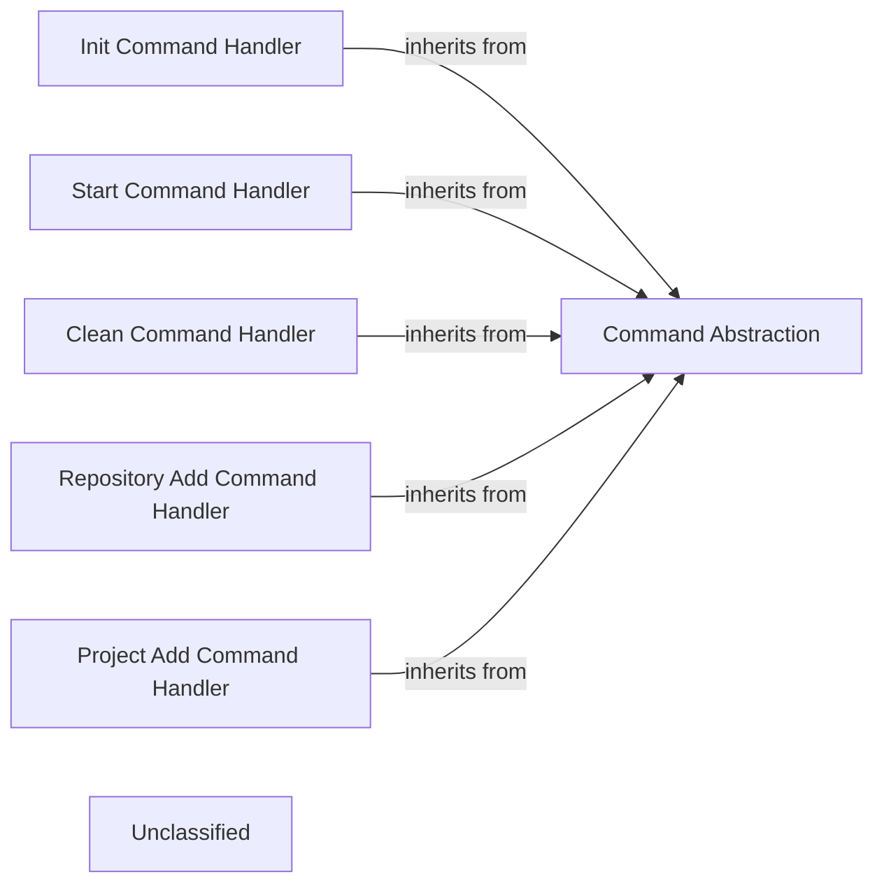

## Details

The `poco` command subsystem is built around a robust Command pattern, with `Command Abstraction` serving as the central abstract base class for all commands. This abstraction ensures a consistent interface and lifecycle for command execution, encompassing preparation, dependency resolution, and execution phases. Concrete command handlers like `Init Command Handler`, `Start Command Handler`, `Clean Command Handler`, `Repository Add Command Handler`, and `Project Add Command Handler` extend this base, each encapsulating specific project management functionalities. These handlers interact with various services (e.g., `StateUtils`, `ConfigHandler`, `CatalogHandler`) to perform their operations, managing project states, configurations, and catalog entries. The design promotes extensibility, allowing new commands to be easily integrated while maintaining a clear separation of concerns.

### Command Abstraction
Defines the common interface and foundational logic for all project lifecycle commands, ensuring a consistent structure and execution flow. This component embodies the Command pattern, allowing for extensible command handling.

**Related Classes/Methods**:

- <a href="https://github.com/shiwaforce/poco/blob/masterpoco/commands/abstract_command.py#L5-L29" target="_blank" rel="noopener noreferrer">`AbstractCommand`:5-29</a>

### Init Command Handler
Implements the logic for initializing a new project, setting up its basic structure and configuration.

**Related Classes/Methods**:

- <a href="https://github.com/shiwaforce/poco/blob/masterpoco/commands/project_init.py#L4-L7" target="_blank" rel="noopener noreferrer">`Init`:4-7</a>

### Start Command Handler
Manages the process of starting project services, environments, or applications as defined in the project configuration.

**Related Classes/Methods**:

- <a href="https://github.com/shiwaforce/poco/blob/masterpoco/commands/restart.py#L4-L12" target="_blank" rel="noopener noreferrer">`Start`:4-12</a>

### Clean Command Handler
Provides functionality to clean up project-related artifacts, such as temporary files, build outputs, or stopped containers.

**Related Classes/Methods**:

- <a href="https://github.com/shiwaforce/poco/blob/masterpoco/commands/clean.py#L8-L74" target="_blank" rel="noopener noreferrer">`Clean`:8-74</a>

### Repository Add Command Handler
Handles the integration of external code repositories (e.g., Git, SVN) into the project's managed structure.

**Related Classes/Methods**:

- <a href="https://github.com/shiwaforce/poco/blob/masterpoco/commands/repo_add.py#L7-L36" target="_blank" rel="noopener noreferrer">`RepoAdd`:7-36</a>

### Project Add Command Handler
Manages the process of adding new sub-projects or modules to an existing multi-project setup.

**Related Classes/Methods**:

- <a href="https://github.com/shiwaforce/poco/blob/masterpoco/commands/project_add.py#L10-L58" target="_blank" rel="noopener noreferrer">`ProjectAdd`:10-58</a>

### Unclassified
Component for all unclassified files and utility functions (Utility functions/External Libraries/Dependencies)

**Related Classes/Methods**: _None_

### [FAQ](https://github.com/CodeBoarding/GeneratedOnBoardings/tree/main?tab=readme-ov-file#faq)