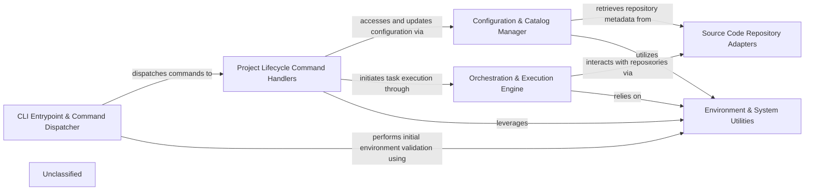

## Details

The `poco` project is structured around a command-line interface (CLI) that dispatches user commands to a set of specialized handlers. At its core, the `CLI Entrypoint & Command Dispatcher` component processes user input and routes it to the appropriate `Project Lifecycle Command Handlers`. These handlers, in turn, interact with the `Configuration & Catalog Manager` to access project settings and repository definitions. For source code management operations, the `Source Code Repository Adapters` provide a unified interface to various SCM systems. The `Orchestration & Execution Engine` is responsible for executing project-defined tasks, often leveraging external tools. All these components rely on the `Environment & System Utilities` for fundamental system interactions and environment checks. This modular design ensures clear separation of concerns and facilitates maintainability and extensibility.

### CLI Entrypoint & Command Dispatcher
The primary interface for `poco`, handling user input, command parsing, and dispatching to specific command handlers.

**Related Classes/Methods**:

- <a href="https://github.com/shiwaforce/poco/blob/masterpoco/poco.py" target="_blank" rel="noopener noreferrer">`poco.Poco`</a>
- <a href="https://github.com/shiwaforce/poco/blob/masterpoco/poco.py#L229-L240" target="_blank" rel="noopener noreferrer">`poco.main`:229-240</a>

### Project Lifecycle Command Handlers [[Expand]](./Project_Lifecycle_Command_Handlers.md)
A collection of modules, each implementing the logic for a specific `poco` command (e.g., `init`, `start`, `clean`, `repo_add`).

**Related Classes/Methods**:

- <a href="https://github.com/shiwaforce/poco/blob/masterpoco/commands/abstract_command.py#L5-L29" target="_blank" rel="noopener noreferrer">`poco.commands.abstract_command.AbstractCommand`:5-29</a>
- <a href="https://github.com/shiwaforce/poco/blob/masterpoco/commands/init.py" target="_blank" rel="noopener noreferrer">`poco.commands.init.InitCommand`</a>
- <a href="https://github.com/shiwaforce/poco/blob/masterpoco/commands/start.py" target="_blank" rel="noopener noreferrer">`poco.commands.start.StartCommand`</a>
- <a href="https://github.com/shiwaforce/poco/blob/masterpoco/commands/clean.py" target="_blank" rel="noopener noreferrer">`poco.commands.clean.CleanCommand`</a>
- <a href="https://github.com/shiwaforce/poco/blob/masterpoco/commands/repo_add.py" target="_blank" rel="noopener noreferrer">`poco.commands.repo_add.RepoAddCommand`</a>
- <a href="https://github.com/shiwaforce/poco/blob/masterpoco/commands/project_add.py" target="_blank" rel="noopener noreferrer">`poco.commands.project_add.ProjectAddCommand`</a>

### Configuration & Catalog Manager
Manages all global and project-specific configurations, including repository definitions and project catalogs. Handles reading, writing, and validating configuration data.

**Related Classes/Methods**:

- <a href="https://github.com/shiwaforce/poco/blob/masterpoco/services/config_handler.py#L9-L151" target="_blank" rel="noopener noreferrer">`poco.services.config_handler.ConfigHandler`:9-151</a>
- <a href="https://github.com/shiwaforce/poco/blob/masterpoco/services/catalog_handler.py#L14-L218" target="_blank" rel="noopener noreferrer">`poco.services.catalog_handler.CatalogHandler`:14-218</a>
- <a href="https://github.com/shiwaforce/poco/blob/masterpoco/services/state.py#L4-L74" target="_blank" rel="noopener noreferrer">`poco.services.state.StateHolder`:4-74</a>

### Source Code Repository Adapters
Provides a unified abstraction layer for interacting with various Source Code Management (SCM) systems (Git, GitLab, Bitbucket, SVN, local file systems).

**Related Classes/Methods**:

- <a href="https://github.com/shiwaforce/poco/blob/masterpoco/services/abstract_repository.py#L14-L89" target="_blank" rel="noopener noreferrer">`poco.services.abstract_repository.AbstractRepository`:14-89</a>
- <a href="https://github.com/shiwaforce/poco/blob/masterpoco/services/git_repository.py#L12-L146" target="_blank" rel="noopener noreferrer">`poco.services.git_repository.GitRepository`:12-146</a>
- <a href="https://github.com/shiwaforce/poco/blob/masterpoco/services/gitlab_repository.py#L9-L42" target="_blank" rel="noopener noreferrer">`poco.services.gitlab_repository.GitlabRepository`:9-42</a>
- <a href="https://github.com/shiwaforce/poco/blob/masterpoco/services/bitbucket_repository.py#L11-L69" target="_blank" rel="noopener noreferrer">`poco.services.bitbucket_repository.BitbucketRepository`:11-69</a>
- <a href="https://github.com/shiwaforce/poco/blob/masterpoco/services/svn_repository.py#L9-L21" target="_blank" rel="noopener noreferrer">`poco.services.svn_repository.SvnRepository`:9-21</a>
- <a href="https://github.com/shiwaforce/poco/blob/masterpoco/services/file_repository.py#L6-L11" target="_blank" rel="noopener noreferrer">`poco.services.file_repository.FileRepository`:6-11</a>

### Orchestration & Execution Engine [[Expand]](./Orchestration_Execution_Engine.md)
The core component for executing project-defined commands and scripts, integrating with external tools like Docker, Docker Compose, Kubernetes, and Helm.

**Related Classes/Methods**:

- <a href="https://github.com/shiwaforce/poco/blob/masterpoco/services/command_handler.py#L13-L181" target="_blank" rel="noopener noreferrer">`poco.services.command_handler.CommandHandler`:13-181</a>
- <a href="https://github.com/shiwaforce/poco/blob/masterpoco/services/command_runners.py" target="_blank" rel="noopener noreferrer">`poco.services.command_runners.CommandRunners`</a>
- <a href="https://github.com/shiwaforce/poco/blob/masterpoco/services/compose_handler.py#L10-L115" target="_blank" rel="noopener noreferrer">`poco.services.compose_handler.ComposeHandler`:10-115</a>
- <a href="https://github.com/shiwaforce/poco/blob/masterpoco/services/package_handler.py#L11-L109" target="_blank" rel="noopener noreferrer">`poco.services.package_handler.PackageHandler`:11-109</a>

### Environment & System Utilities
A collection of foundational utility functions for interacting with the operating system, checking external tool installations, and performing file system operations.

**Related Classes/Methods**:

- <a href="https://github.com/shiwaforce/poco/blob/masterpoco/services/environment_utils.py#L12-L103" target="_blank" rel="noopener noreferrer">`poco.services.environment_utils.EnvironmentUtils`:12-103</a>
- <a href="https://github.com/shiwaforce/poco/blob/masterpoco/services/file_utils.py#L10-L143" target="_blank" rel="noopener noreferrer">`poco.services.file_utils.FileUtils`:10-143</a>
- <a href="https://github.com/shiwaforce/poco/blob/masterpoco/services/project_utils.py#L10-L81" target="_blank" rel="noopener noreferrer">`poco.services.project_utils.ProjectUtils`:10-81</a>

### Unclassified
Component for all unclassified files and utility functions (Utility functions/External Libraries/Dependencies)

**Related Classes/Methods**: _None_

### [FAQ](https://github.com/CodeBoarding/GeneratedOnBoardings/tree/main?tab=readme-ov-file#faq)