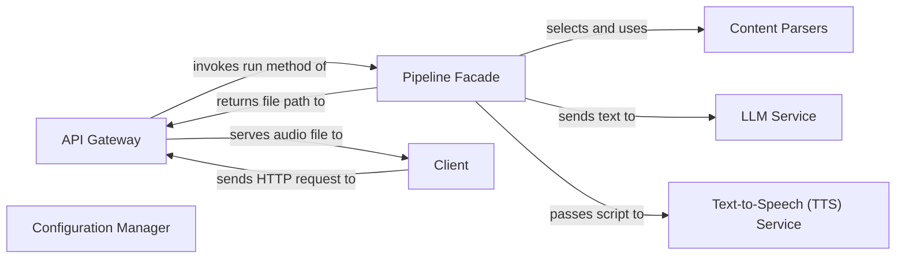

## Details

This is an analysis of the abstract components and their relationships in the PodcastFy project.

### API Gateway [[Expand]](./API_Gateway.md)
Exposes the service via a RESTful API using FastAPI. It defines endpoints for podcast generation, handles request validation with Pydantic models, and serves the final audio file.

**Related Classes/Methods**:

- `podcastfy.api.fast_app`

### Pipeline Facade
The central orchestrator (`PodcastFy`) that simplifies the complex podcast generation process. It coordinates the sequence of operations: content retrieval, parsing, script generation, and audio synthesis.

**Related Classes/Methods**:

- `podcastfy.main`

### Content Parsers
A set of strategies responsible for extracting textual content from various sources (e.g., web pages, PDF documents). It uses libraries like `BeautifulSoup` and `PyMuPDF`.

**Related Classes/Methods**:

- `podcastfy.parsers`

### LLM Service
An abstraction layer that interacts with different Large Language Models (e.g., OpenAI, Google Gemini) via `litellm`. It's responsible for transforming the parsed text into a podcast script.

**Related Classes/Methods**:

- `podcastfy.llm_service`

### Text-to-Speech (TTS) Service
A component dedicated to converting the generated script into audio. It acts as a facade for different TTS engines (e.g., ElevenLabs, Edge-TTS) and handles post-processing tasks like concatenating audio segments and adding background music, utilizing functionality from `podcastfy.audio_processor`.

**Related Classes/Methods**:

- `podcastfy.tts_service`

### Configuration Manager
Manages application-wide settings, including API keys, model names, and voice preferences. It ensures that components are initialized with the correct parameters.

**Related Classes/Methods**:

- `podcastfy.config`

### Client
Represents any external user or system that consumes the podcast generation service through the API endpoints. As an external entity, it does not have source code within this project.

**Related Classes/Methods**: _None_

### [FAQ](https://github.com/CodeBoarding/GeneratedOnBoardings/tree/main?tab=readme-ov-file#faq)