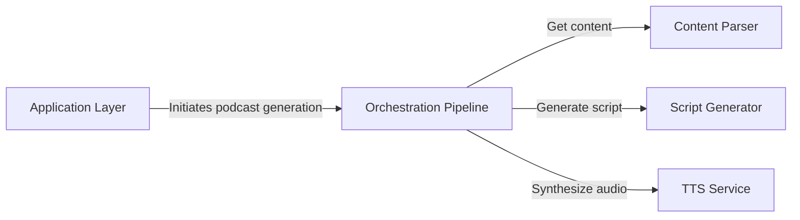

## Details

One paragraph explaining the functionality which is represented by this graph. What the main flow is and what is its purpose.

### Orchestration Pipeline [[Expand]](./Orchestration_Pipeline.md)
The central coordinator that manages the end-to-end workflow. It sequentially invokes the parser, generator, and TTS service, passing data between them to ensure a smooth transformation from source content to final audio.

**Related Classes/Methods**:

- `src/podcast_generator/podcast_generator.py`

### Application Layer
The primary entry point for users, providing both a web API (FastAPI) and a command-line interface (Typer). It acts as a facade, simplifying interaction with the underlying orchestration pipeline.

**Related Classes/Methods**:

- `src/podcast_generator/main.py`
- `src/podcast_generator/cli.py`

### Content Parser
Responsible for fetching and extracting raw text from various sources. It employs a strategy pattern to select the appropriate extractor (e.g., for a website URL or a PDF file) based on the input type.

**Related Classes/Methods**:

- `src/podcast_generator/content_parser.py`

### Script Generator
Interfaces with Large Language Models (LLMs) like OpenAI or Gemini. This component takes the extracted text, sends it to the configured LLM service, and receives a summarized, conversational podcast script.

**Related Classes/Methods**:

- `src/podcast_generator/script_generator.py`

### TTS Service
Converts the generated text script into spoken audio. It uses a factory to select the configured Text-to-Speech (TTS) provider and is responsible for both generating individual audio segments and concatenating them into a single, final audio file.

**Related Classes/Methods**:

- `src/podcast_generator/tts.py`
- `src/podcast_generator/audio.py`

### [FAQ](https://github.com/CodeBoarding/GeneratedOnBoardings/tree/main?tab=readme-ov-file#faq)