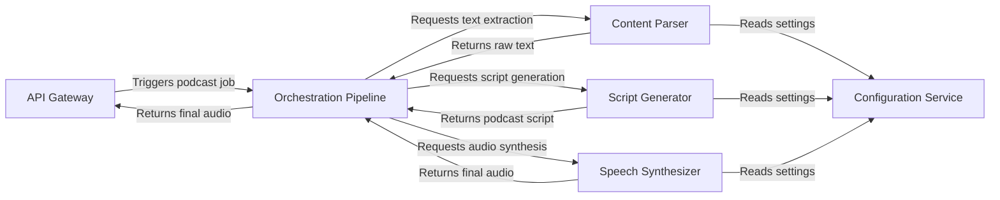

## Details

One paragraph explaining the functionality which is represented by this graph. What the main flow is and what is its purpose.

### API Gateway [[Expand]](./API_Gateway.md)
Exposes the podcast generation service via a RESTful API. It receives user requests and triggers the main orchestration pipeline, returning the final audio file upon completion.

**Related Classes/Methods**:

- `src/podcast_generator/main.py`

### Orchestration Pipeline [[Expand]](./Orchestration_Pipeline.md)
The central coordinator that manages the end-to-end workflow. It sequentially invokes the parser, generator, and synthesizer, passing data between them to ensure a smooth transformation from source content to final audio.

**Related Classes/Methods**:

- `src/podcast_generator/podcast_generator.py`

### Content Parser
A facade responsible for ingesting content from various sources (e.g., websites, PDFs, YouTube). It uses a strategy pattern to select the appropriate extractor and returns clean, raw text to the pipeline.

**Related Classes/Methods**:

- `src/podcast_generator/utils/content_extractor.py`

### Script Generator
Transforms the raw text provided by the Content Parser into a structured, conversational podcast script. It uses LLMs and can employ different strategies to tailor the content's length and format.

**Related Classes/Methods**:

- `src/podcast_generator/utils/text_to_podcast.py`

### Speech Synthesizer
Converts the final podcast script into an audio file. It acts as a facade for various Text-to-Speech (TTS) providers, using a factory to select the appropriate service and manage audio generation.

**Related Classes/Methods**:

- `src/podcast_generator/utils/tts.py`

### Configuration Service
A centralized component that manages and provides access to all application settings. This includes API keys, LLM prompt templates, TTS voice selections, and other operational parameters.

**Related Classes/Methods**:

- `src/podcast_generator/params.py`

### [FAQ](https://github.com/CodeBoarding/GeneratedOnBoardings/tree/main?tab=readme-ov-file#faq)