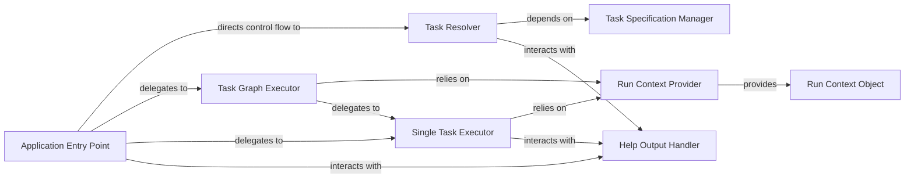

## Details

The `Application Core / Task Orchestrator` subsystem is the heart of `poethepoet`, responsible for coordinating the entire task execution flow. It embodies the project's core functionality as a CLI task runner, managing task resolution, execution, and environmental setup.

### Application Entry Point
The primary dispatcher and orchestrator. It receives parsed arguments and delegates control to specific execution paths (single task, task graph, or help display). This component directly implements the "Command Pattern" by directing the overall flow.

**Related Classes/Methods**:

- <a href="https://github.com/nat-n/poethepoet/blob/main/poethepoet/app.py#L123-L163" target="_blank" rel="noopener noreferrer">`poethepoet.app.__call__`:123-163</a>

### Task Resolver
Interprets user input against defined tasks, acting as a crucial validation and lookup mechanism. It's fundamental to the "Configuration-driven Architecture" as it translates user commands into executable task specifications.

**Related Classes/Methods**:

- <a href="https://github.com/nat-n/poethepoet/blob/main/poethepoet/app.py#L180-L218" target="_blank" rel="noopener noreferrer">`poethepoet.app.resolve_task`:180-218</a>

### Task Graph Executor
Manages the execution of complex, interdependent tasks by determining and following the correct execution order based on task dependencies. This component implements the "Pipeline/Workflow Pattern" for multi-step operations.

**Related Classes/Methods**:

- <a href="https://github.com/nat-n/poethepoet/blob/main/poethepoet/app.py#L232-L262" target="_blank" rel="noopener noreferrer">`poethepoet.app._run_task_graph`:232-262</a>

### Single Task Executor
The atomic unit for executing individual tasks. It represents the core "Task Runner" functionality, handling the direct execution of a single, resolved task.

**Related Classes/Methods**:

- <a href="https://github.com/nat-n/poethepoet/blob/main/poethepoet/app.py#L220-L230" target="_blank" rel="noopener noreferrer">`poethepoet.app.run_task`:220-230</a>

### Run Context Provider
Prepares and provides the necessary execution environment for tasks, ensuring they run with the correct environment variables, working directory, and Python executable. This is vital for "Environment Isolation."

**Related Classes/Methods**:

- <a href="https://github.com/nat-n/poethepoet/blob/main/poethepoet/app.py#L264-L279" target="_blank" rel="noopener noreferrer">`poethepoet.app.get_run_context`:264-279</a>

### Task Specification Manager
Acts as the repository for all defined tasks, providing their metadata and execution details, typically loaded from `pyproject.toml`. It's central to the "Configuration-driven Architecture" by making task definitions accessible.

**Related Classes/Methods**:

- <a href="https://github.com/nat-n/poethepoet/blob/main/poethepoet/app.py#L172-L178" target="_blank" rel="noopener noreferrer">`poethepoet.app.task_specs`:172-178</a>

### Run Context Object
A critical data structure that encapsulates the entire execution environment for a task, including paths, environment variables, and the Python executable. While not a method, its instantiation and management by the `Run Context Provider` are fundamental to environment isolation.

**Related Classes/Methods**:

- <a href="https://github.com/nat-n/poethepoet/blob/main/poethepoet/context.py#L48-L144" target="_blank" rel="noopener noreferrer">`poethepoet.context.RunContext`:48-144</a>

### Help Output Handler
Responsible for generating and displaying user guidance, help messages, and informative error messages. It's a key part of the "CLI Interface (Frontend)" and "Help/Documentation Generator" aspects, enhancing user experience.

**Related Classes/Methods**:

- <a href="https://github.com/nat-n/poethepoet/blob/main/poethepoet/app.py#L281-L307" target="_blank" rel="noopener noreferrer">`poethepoet.app.print_help`:281-307</a>

### [FAQ](https://github.com/CodeBoarding/GeneratedOnBoardings/tree/main?tab=readme-ov-file#faq)