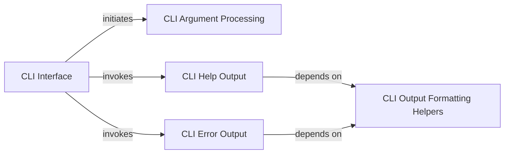

## Details

The `CLI Interface` subsystem is the primary user interaction point for `poethepoet`, responsible for parsing command-line arguments and initiating the application's core logic. It acts as the initial entry point for users to interact with and trigger the application's core task execution.

### CLI Interface [[Expand]](./CLI_Interface.md)
The primary user interaction point for `poethepoet`, responsible for parsing command-line arguments and initiating the application's core logic. It acts as the initial entry point for users to interact with and trigger the application's core task execution.

**Related Classes/Methods**:

- <a href="https://github.com/nat-n/poethepoet/blob/main/poethepoet/ui.py#L1-L2" target="_blank" rel="noopener noreferrer">`poethepoet.ui`:1-2</a>

### CLI Argument Processing
This component defines the command-line interface's grammar and parses user-provided arguments. It translates raw command-line input into structured data, determining which task to execute and with what parameters.

**Related Classes/Methods**:

- <a href="https://github.com/nat-n/poethepoet/blob/main/poethepoet/ui.py#L154-L166" target="_blank" rel="noopener noreferrer">`poethepoet.ui.parse_args`:154-166</a>
- <a href="https://github.com/nat-n/poethepoet/blob/main/poethepoet/ui.py#L35-L152" target="_blank" rel="noopener noreferrer">`poethepoet.ui.build_parser`:35-152</a>

### CLI Help Output
Manages the generation and display of comprehensive help information, detailing available tasks, their descriptions, and usage instructions. This is crucial for user discoverability in a task runner.

**Related Classes/Methods**:

- <a href="https://github.com/nat-n/poethepoet/blob/main/poethepoet/ui.py#L168-L274" target="_blank" rel="noopener noreferrer">`poethepoet.ui.print_help`:168-274</a>

### CLI Error Output
Handles the formatting and presentation of error messages to the user. This component ensures clear, actionable feedback when issues arise, aiding in debugging and understanding application failures.

**Related Classes/Methods**:

- <a href="https://github.com/nat-n/poethepoet/blob/main/poethepoet/ui.py#L359-L372" target="_blank" rel="noopener noreferrer">`poethepoet.ui.print_error`:359-372</a>

### CLI Output Formatting Helpers
A collection of internal utility functions providing consistent and structured formatting for various CLI outputs. This ensures a uniform user experience across help messages, error reports, and other informational outputs.

**Related Classes/Methods**:

- <a href="https://github.com/nat-n/poethepoet/blob/main/poethepoet/ui.py#L276-L296" target="_blank" rel="noopener noreferrer">`poethepoet.ui._format_poe_error`:276-296</a>
- <a href="https://github.com/nat-n/poethepoet/blob/main/poethepoet/ui.py#L353-L357" target="_blank" rel="noopener noreferrer">`poethepoet.ui._padr`:353-357</a>
- <a href="https://github.com/nat-n/poethepoet/blob/main/poethepoet/ui.py#L298-L323" target="_blank" rel="noopener noreferrer">`poethepoet.ui._format_single_task_help`:298-323</a>
- <a href="https://github.com/nat-n/poethepoet/blob/main/poethepoet/ui.py#L325-L346" target="_blank" rel="noopener noreferrer">`poethepoet.ui._format_args_help`:325-346</a>
- <a href="https://github.com/nat-n/poethepoet/blob/main/poethepoet/ui.py#L348-L351" target="_blank" rel="noopener noreferrer">`poethepoet.ui._align`:348-351</a>
- <a href="https://github.com/nat-n/poethepoet/blob/main/poethepoet/ui.py#L374-L378" target="_blank" rel="noopener noreferrer">`poethepoet.ui._format_error_lines`:374-378</a>

### [FAQ](https://github.com/CodeBoarding/GeneratedOnBoardings/tree/main?tab=readme-ov-file#faq)