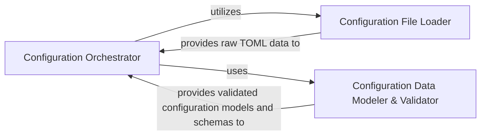

## Details

The Configuration Manager subsystem is responsible for loading, parsing, and validating the pyproject.toml file to provide task definitions, project settings, and environment configurations to the rest of the poethepoet application.

### Configuration Orchestrator
This is the core component of the Configuration Manager. It orchestrates the entire configuration loading process, acting as the primary interface for the rest of the application to access Poe's configuration. It integrates raw file data with structured and validated configuration partitions, including managing external package configurations and included files. It also provides lookup capabilities for defined tasks.

**Related Classes/Methods**:

- <a href="https://github.com/nat-n/poethepoet/blob/main/poethepoet/config/config.py" target="_blank" rel="noopener noreferrer">`poethepoet.config.config`</a>

### Configuration File Loader
This component handles the low-level file system interactions to locate and read the pyproject.toml configuration file. It is responsible for finding the correct configuration file(s) within the project structure and providing their raw TOML content.

**Related Classes/Methods**:

- <a href="https://github.com/nat-n/poethepoet/blob/main/poethepoet/config/file.py" target="_blank" rel="noopener noreferrer">`poethepoet.config.file`</a>

### Configuration Data Modeler & Validator
This component defines the data structures (schemas) for various parts of the Poe configuration (e.g., project-specific, packaged, or included configurations). It is responsible for validating the loaded configuration data against these defined schemas and partitioning it into logical, accessible segments, ensuring data integrity and consistency.

**Related Classes/Methods**:

- <a href="https://github.com/nat-n/poethepoet/blob/main/poethepoet/config/partition.py" target="_blank" rel="noopener noreferrer">`poethepoet.config.partition`</a>

### [FAQ](https://github.com/CodeBoarding/GeneratedOnBoardings/tree/main?tab=readme-ov-file#faq)