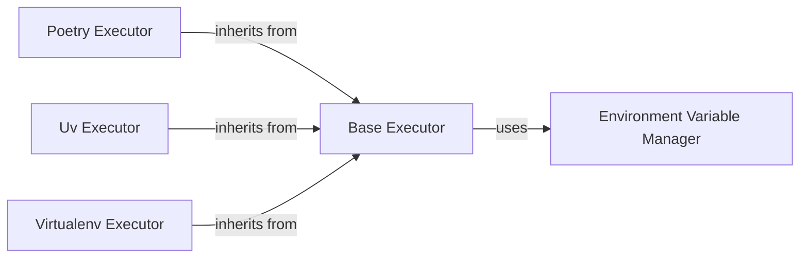

## Details

The `Execution Environment Manager` subsystem is central to `poethepoet`'s ability to run tasks in various isolated Python environments. It provides an abstraction layer for command execution and meticulous management of environment variables, aligning with the project's "Environment Isolation" and "Task Executor/Runner" architectural patterns.

### Base Executor
Defines the abstract interface and common logic for executing commands. It handles fundamental aspects like resolving executables, managing subprocesses, and providing error handling for execution failures. This component embodies the core "Command" aspect of the Command Pattern, serving as the base for all specific execution strategies.

**Related Classes/Methods**:

- <a href="https://github.com/nat-n/poethepoet/blob/main/poethepoet/executor/base.py" target="_blank" rel="noopener noreferrer">`poethepoet.executor.base`</a>

### Environment Variable Manager
Manages the lifecycle of environment variables, including their initialization, application, cloning, and updating. It ensures that each task runs with a precisely configured set of environment variables, contributing directly to "Environment Isolation."

**Related Classes/Methods**:

- <a href="https://github.com/nat-n/poethepoet/blob/main/poethepoet/env/manager.py" target="_blank" rel="noopener noreferrer">`poethepoet.env.manager`</a>

### Poetry Executor
A concrete implementation of `Base Executor` tailored for executing commands within a Poetry-managed virtual environment. It handles Poetry-specific commands and the resolution of the Poetry virtual environment. This component directly supports the "Poetry Integration" aspect of the project.

**Related Classes/Methods**:

- <a href="https://github.com/nat-n/poethepoet/blob/main/poethepoet/executor/poetry.py" target="_blank" rel="noopener noreferrer">`poethepoet.executor.poetry`</a>

### Uv Executor
A concrete implementation of `Base Executor` designed for executing commands in `uv`-managed environments. It manages `uv`-specific commands and environment setup.

**Related Classes/Methods**:

- <a href="https://github.com/nat-n/poethepoet/blob/main/poethepoet/executor/uv.py" target="_blank" rel="noopener noreferrer">`poethepoet.executor.uv`</a>

### Virtualenv Executor
A concrete implementation of `Base Executor` for running commands within generic Python virtual environments. It handles standard virtual environment activation and command execution.

**Related Classes/Methods**:

- <a href="https://github.com/nat-n/poethepoet/blob/main/poethepoet/executor/virtualenv.py" target="_blank" rel="noopener noreferrer">`poethepoet.executor.virtualenv`</a>

### [FAQ](https://github.com/CodeBoarding/GeneratedOnBoardings/tree/main?tab=readme-ov-file#faq)