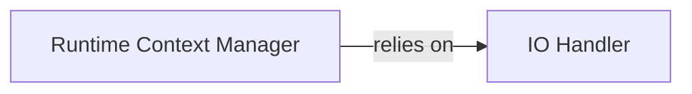

## Details

This subsystem is fundamental for any CLI tool, providing the necessary infrastructure for user interaction and maintaining the operational state during task execution. It adheres to the CLI Tool and Task Runner/Automation Tool patterns by centralizing input/output and runtime state, which are critical for user feedback and consistent task execution.

### IO Handler
Manages all standard input/output operations for the CLI tool, ensuring a consistent and user-friendly command-line experience. This includes handling general messages, warnings, errors, debug information, verbosity levels, and ANSI color support. For a CLI tool, robust and configurable IO is paramount for user feedback and debugging.

**Related Classes/Methods**:

- <a href="https://github.com/nat-n/poethepoet/blob/main/poethepoet/io.py" target="_blank" rel="noopener noreferrer">`poethepoet.io`</a>
- <a href="https://github.com/nat-n/poethepoet/blob/main/poethepoet/io.py#L149-L156" target="_blank" rel="noopener noreferrer">`poethepoet.io.print`:149-156</a>
- <a href="https://github.com/nat-n/poethepoet/blob/main/poethepoet/io.py#L158-L166" target="_blank" rel="noopener noreferrer">`poethepoet.io.print_warning`:158-166</a>
- <a href="https://github.com/nat-n/poethepoet/blob/main/poethepoet/io.py#L168-L175" target="_blank" rel="noopener noreferrer">`poethepoet.io.print_error`:168-175</a>
- <a href="https://github.com/nat-n/poethepoet/blob/main/poethepoet/io.py#L186-L193" target="_blank" rel="noopener noreferrer">`poethepoet.io.print_debug`:186-193</a>
- <a href="https://github.com/nat-n/poethepoet/blob/main/poethepoet/io.py#L177-L184" target="_blank" rel="noopener noreferrer">`poethepoet.io.print_poe_action`:177-184</a>
- <a href="https://github.com/nat-n/poethepoet/blob/main/poethepoet/io.py#L195-L199" target="_blank" rel="noopener noreferrer">`poethepoet.io.is_debug_enabled`:195-199</a>
- <a href="https://github.com/nat-n/poethepoet/blob/main/poethepoet/io.py#L110-L114" target="_blank" rel="noopener noreferrer">`poethepoet.io.get_default_io`:110-114</a>
- <a href="https://github.com/nat-n/poethepoet/blob/main/poethepoet/io.py#L132-L147" target="_blank" rel="noopener noreferrer">`poethepoet.io.configure`:132-147</a>
- <a href="https://github.com/nat-n/poethepoet/blob/main/poethepoet/io.py#L95-L108" target="_blank" rel="noopener noreferrer">`poethepoet.io._init_colors`:95-108</a>
- <a href="https://github.com/nat-n/poethepoet/blob/main/poethepoet/io.py#L209-L210" target="_blank" rel="noopener noreferrer">`poethepoet.io.write_out`:209-210</a>
- <a href="https://github.com/nat-n/poethepoet/blob/main/poethepoet/io.py#L212-L215" target="_blank" rel="noopener noreferrer">`poethepoet.io.write_err`:212-215</a>
- <a href="https://github.com/nat-n/poethepoet/blob/main/poethepoet/io.py#L201-L207" target="_blank" rel="noopener noreferrer">`poethepoet.io._check_verbosity`:201-207</a>

### Runtime Context Manager
Provides and manages the runtime context for task execution, which is critical for a task runner. This involves encapsulating shared data, maintaining a cache for task outputs (essential for inter-task dependency resolution and efficient execution), and providing access to the task executor. It ensures that tasks run within a well-defined, consistent, and stateful environment.

**Related Classes/Methods**:

- <a href="https://github.com/nat-n/poethepoet/blob/main/poethepoet/context.py" target="_blank" rel="noopener noreferrer">`poethepoet.context`</a>
- <a href="https://github.com/nat-n/poethepoet/blob/main/poethepoet/context.py#L48-L144" target="_blank" rel="noopener noreferrer">`poethepoet.context.RunContext`:48-144</a>
- <a href="https://github.com/nat-n/poethepoet/blob/main/poethepoet/context.py#L204-L236" target="_blank" rel="noopener noreferrer">`poethepoet.context.TaskOutputCache`:204-236</a>
- <a href="https://github.com/nat-n/poethepoet/blob/main/poethepoet/context.py#L210-L221" target="_blank" rel="noopener noreferrer">`poethepoet.context.save_task_output`:210-221</a>
- <a href="https://github.com/nat-n/poethepoet/blob/main/poethepoet/context.py#L223-L227" target="_blank" rel="noopener noreferrer">`poethepoet.context.has_task_output`:223-227</a>
- <a href="https://github.com/nat-n/poethepoet/blob/main/poethepoet/context.py#L229-L236" target="_blank" rel="noopener noreferrer">`poethepoet.context.get_task_output`:229-236</a>
- <a href="https://github.com/nat-n/poethepoet/blob/main/poethepoet/context.py#L166-L201" target="_blank" rel="noopener noreferrer">`poethepoet.context.get_executor`:166-201</a>
- <a href="https://github.com/nat-n/poethepoet/blob/main/poethepoet/context.py#L87-L96" target="_blank" rel="noopener noreferrer">`poethepoet.context._get_dep_values`:87-96</a>

### [FAQ](https://github.com/CodeBoarding/GeneratedOnBoardings/tree/main?tab=readme-ov-file#faq)