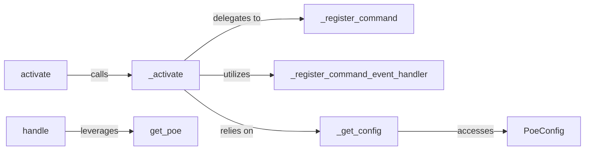

## Details

The `Plugin System` in `poethepoet` is designed to extend the core functionality by allowing external tools and custom logic to integrate seamlessly. It primarily focuses on registering custom CLI commands and handling events, aligning with the project's "Plugin Architecture" and "Command Pattern" biases.

### activate
The public entry point for initiating the plugin activation lifecycle. It serves as the primary interface for the `poe` application to engage with the plugin system.

**Related Classes/Methods**:

- <a href="https://github.com/nat-n/poethepoet/blob/main/poethepoet/plugin.py#L92-L110" target="_blank" rel="noopener noreferrer">`activate`:92-110</a>

### _activate
The core orchestrator responsible for setting up a plugin. This includes registering custom commands, configuring event handlers, and retrieving plugin-specific settings. It drives the internal activation process.

**Related Classes/Methods**:

- <a href="https://github.com/nat-n/poethepoet/blob/main/poethepoet/plugin.py#L112-L160" target="_blank" rel="noopener noreferrer">`_activate`:112-160</a>

### _register_command
Manages the integration of custom CLI commands provided by plugins into `poethepoet`'s command-line interface. This component is crucial for extending the CLI.

**Related Classes/Methods**:

- <a href="https://github.com/nat-n/poethepoet/blob/main/poethepoet/plugin.py#L183-L205" target="_blank" rel="noopener noreferrer">`_register_command`:183-205</a>

### _register_command_event_handler
Handles the dynamic registration of callback functions for command-related events. This allows plugins to inject custom logic at various stages of command execution.

**Related Classes/Methods**:

- <a href="https://github.com/nat-n/poethepoet/blob/main/poethepoet/plugin.py#L207-L232" target="_blank" rel="noopener noreferrer">`_register_command_event_handler`:207-232</a>

### handle
A general entry point that allows the main `poe` application to invoke plugin-defined operations. It acts as a bridge for executing plugin-specific logic.

**Related Classes/Methods**:

- <a href="https://github.com/nat-n/poethepoet/blob/main/poethepoet/plugin.py#L43-L48" target="_blank" rel="noopener noreferrer">`handle`:43-48</a>

### _get_config
Responsible for retrieving plugin-specific configuration settings, ensuring plugins can access their defined parameters from the `PoeConfig`.

**Related Classes/Methods**:

- <a href="https://github.com/nat-n/poethepoet/blob/main/poethepoet/plugin.py#L162-L174" target="_blank" rel="noopener noreferrer">`_get_config`:162-174</a>

### get_poe
Provides plugins with access to the main `poe` application instance. This is vital for plugins that need to interact with or query the core `poethepoet` environment.

**Related Classes/Methods**:

- <a href="https://github.com/nat-n/poethepoet/blob/main/poethepoet/plugin.py#L50-L88" target="_blank" rel="noopener noreferrer">`get_poe`:50-88</a>

### PoeConfig
The central configuration object for `poethepoet`. While not strictly part of the plugin's *active* logic, it is a critical dependency that stores and provides all configuration data, including plugin-specific settings.

**Related Classes/Methods**:

- <a href="https://github.com/nat-n/poethepoet/blob/main/poethepoet/config/config.py#L14-L403" target="_blank" rel="noopener noreferrer">`PoeConfig`:14-403</a>

### [FAQ](https://github.com/CodeBoarding/GeneratedOnBoardings/tree/main?tab=readme-ov-file#faq)