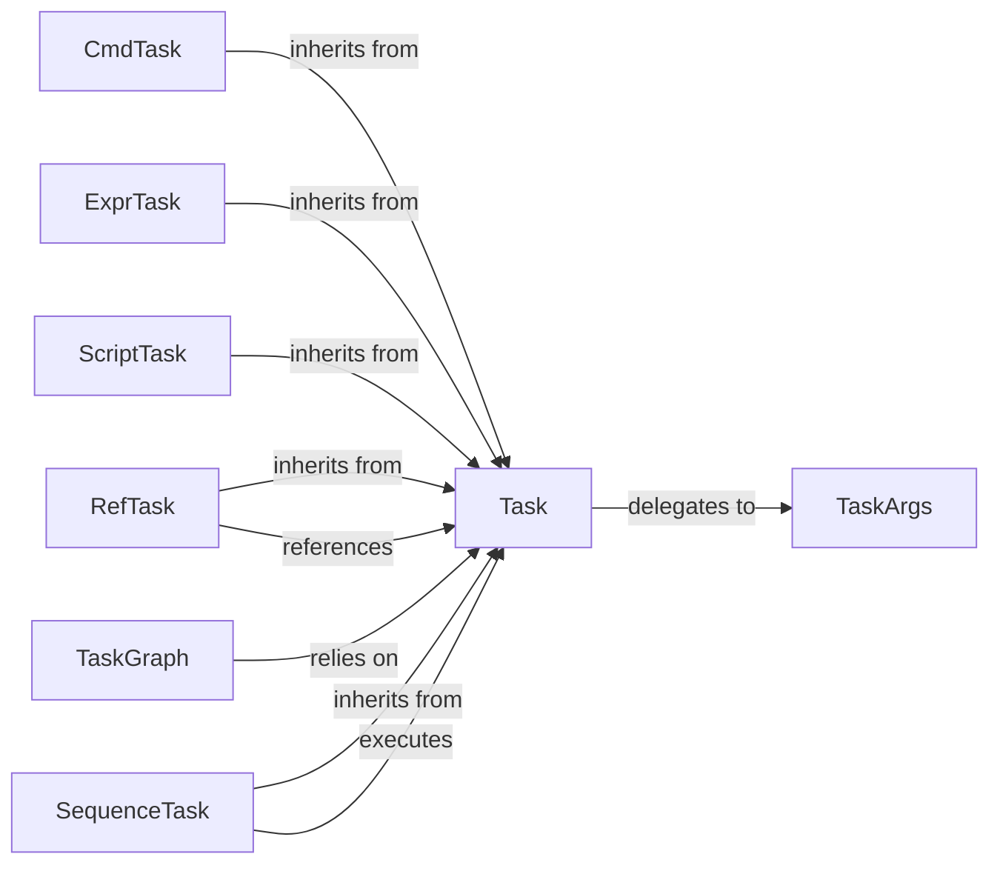

## Details

The `Task Definition & Resolution` subsystem is responsible for defining various task types, managing their properties, and resolving task dependencies to prepare tasks for execution.

### Task
Abstract base class for all task definitions, providing a common interface and core lifecycle methods. It embodies the Command Pattern, serving as the blueprint for all executable operations within the system.

**Related Classes/Methods**:

- <a href="https://github.com/nat-n/poethepoet/blob/main/poethepoet/task/base.py" target="_blank" rel="noopener noreferrer">`poethepoet/task/base.py:Task`</a>

### TaskGraph
Responsible for constructing and managing the Directed Acyclic Graph (DAG) of tasks. It resolves task dependencies, ensuring tasks are executed in the correct topological order.

**Related Classes/Methods**:

- <a href="https://github.com/nat-n/poethepoet/blob/main/poethepoet/task/graph.py" target="_blank" rel="noopener noreferrer">`poethepoet/task/graph.py:TaskGraph`</a>

### TaskArgs
Manages the definition, parsing, and validation of command-line arguments specific to individual tasks, allowing tasks to be configurable and dynamic.

**Related Classes/Methods**:

- <a href="https://github.com/nat-n/poethepoet/blob/main/poethepoet/task/args.py" target="_blank" rel="noopener noreferrer">`poethepoet/task/args.py:TaskArgs`</a>

### CmdTask
A concrete task implementation designed for executing single shell commands directly. It encapsulates the logic for running external processes.

**Related Classes/Methods**:

- <a href="https://github.com/nat-n/poethepoet/blob/main/poethepoet/task/cmd.py" target="_blank" rel="noopener noreferrer">`poethepoet/task/cmd.py:CmdTask`</a>

### ExprTask
A concrete task implementation for evaluating arbitrary Python expressions. This allows for dynamic, in-line Python logic to be executed as a task.

**Related Classes/Methods**:

- <a href="https://github.com/nat-n/poethepoet/blob/main/poethepoet/task/expr.py" target="_blank" rel="noopener noreferrer">`poethepoet/task/expr.py:ExprTask`</a>

### RefTask
A concrete task implementation that references and executes other defined tasks. This enables task composition and reusability, forming a crucial part of task dependency chains.

**Related Classes/Methods**:

- <a href="https://github.com/nat-n/poethepoet/blob/main/poethepoet/task/ref.py" target="_blank" rel="noopener noreferrer">`poethepoet/task/ref.py:RefTask`</a>

### ScriptTask
A concrete task implementation for executing Python scripts. It provides a mechanism to run external Python files as part of a task workflow.

**Related Classes/Methods**:

- <a href="https://github.com/nat-n/poethepoet/blob/main/poethepoet/task/script.py" target="_blank" rel="noopener noreferrer">`poethepoet/task/script.py:ScriptTask`</a>

### SequenceTask
A concrete task implementation for executing a predefined sequence of other tasks. This allows for the creation of complex workflows by chaining multiple tasks together.

**Related Classes/Methods**:

- <a href="https://github.com/nat-n/poethepoet/blob/main/poethepoet/task/sequence.py" target="_blank" rel="noopener noreferrer">`poethepoet/task/sequence.py:SequenceTask`</a>

### [FAQ](https://github.com/CodeBoarding/GeneratedOnBoardings/tree/main?tab=readme-ov-file#faq)