```mermaid
graph LR
    CLI_Interface["CLI Interface"]
    Configuration_Manager["Configuration Manager"]
    Application_Core_Task_Orchestrator["Application Core / Task Orchestrator"]
    Task_Definition_Resolution["Task Definition & Resolution"]
    Execution_Environment_Manager["Execution Environment Manager"]
    IO_Context_Management["IO & Context Management"]
    Plugin_System["Plugin System"]
    CLI_Interface -- "initiates" --> Application_Core_Task_Orchestrator
    Application_Core_Task_Orchestrator -- "requests configuration from" --> Configuration_Manager
    Configuration_Manager -- "provides configurations to" --> Application_Core_Task_Orchestrator
    Application_Core_Task_Orchestrator -- "delegates task resolution to" --> Task_Definition_Resolution
    Task_Definition_Resolution -- "returns resolved task details to" --> Application_Core_Task_Orchestrator
    Application_Core_Task_Orchestrator -- "delegates task execution to" --> Execution_Environment_Manager
    Execution_Environment_Manager -- "returns execution results to" --> Application_Core_Task_Orchestrator
    Application_Core_Task_Orchestrator -- "interacts with" --> IO_Context_Management
    Task_Definition_Resolution -- "interacts with" --> IO_Context_Management
    Execution_Environment_Manager -- "sends output to" --> IO_Context_Management
    IO_Context_Management -- "displays output via" --> CLI_Interface
    Plugin_System -- "registers commands and hooks with" --> Application_Core_Task_Orchestrator
    Plugin_System -- "retrieves configurations from" --> Configuration_Manager
    click CLI_Interface href "https://github.com/CodeBoarding/GeneratedOnBoardings/blob/main/poethepoet/CLI_Interface.md" "Details"
    click Configuration_Manager href "https://github.com/CodeBoarding/GeneratedOnBoardings/blob/main/poethepoet/Configuration_Manager.md" "Details"
    click Application_Core_Task_Orchestrator href "https://github.com/CodeBoarding/GeneratedOnBoardings/blob/main/poethepoet/Application_Core_Task_Orchestrator.md" "Details"
    click Task_Definition_Resolution href "https://github.com/CodeBoarding/GeneratedOnBoardings/blob/main/poethepoet/Task_Definition_Resolution.md" "Details"
    click Execution_Environment_Manager href "https://github.com/CodeBoarding/GeneratedOnBoardings/blob/main/poethepoet/Execution_Environment_Manager.md" "Details"
    click IO_Context_Management href "https://github.com/CodeBoarding/GeneratedOnBoardings/blob/main/poethepoet/IO_Context_Management.md" "Details"
    click Plugin_System href "https://github.com/CodeBoarding/GeneratedOnBoardings/blob/main/poethepoet/Plugin_System.md" "Details"
```

## Details

The `poethepoet` architecture is designed as a robust CLI task runner, emphasizing a clear separation of concerns for efficient task orchestration. The flow begins with the **CLI Interface** capturing user commands, which are then processed by the central **Application Core / Task Orchestrator**. This core component dynamically loads task and project configurations from the **Configuration Manager**, leveraging `pyproject.toml` as the single source of truth. Task dependencies and types are meticulously handled by the **Task Definition & Resolution** component, ensuring tasks are prepared correctly. Execution is then delegated to the **Execution Environment Manager**, which abstracts away the complexities of running commands across various environments like Poetry or uv. All runtime context and user feedback are managed by the **IO & Context Management** component, providing a consistent interface. Furthermore, the **Plugin System** offers extensibility, allowing `poethepoet` to integrate seamlessly with other tools and expand its capabilities. This modular design facilitates maintainability, scalability, and clear data flow, making it ideal for automated task execution and workflow management.

### CLI Interface [[Expand]](./CLI_Interface.md)
The primary user interaction point, responsible for parsing command-line arguments and initiating the application's core logic.

**Related Classes/Methods**:

- <a href="https://github.com/nat-n/poethepoet/blob/main/poethepoet/ui.py" target="_blank" rel="noopener noreferrer">`poethepoet/ui.py`</a>

### Configuration Manager [[Expand]](./Configuration_Manager.md)
Loads, parses, and validates the `pyproject.toml` file, providing task definitions, project settings, and environment configurations.

**Related Classes/Methods**:

- <a href="https://github.com/nat-n/poethepoet/blob/main/poethepoet/config/config.py" target="_blank" rel="noopener noreferrer">`poethepoet/config/config.py`</a>
- <a href="https://github.com/nat-n/poethepoet/blob/main/poethepoet/config/file.py" target="_blank" rel="noopener noreferrer">`poethepoet/config/file.py`</a>
- <a href="https://github.com/nat-n/poethepoet/blob/main/poethepoet/config/partition.py" target="_blank" rel="noopener noreferrer">`poethepoet/config/partition.py`</a>

### Application Core / Task Orchestrator [[Expand]](./Application_Core_Task_Orchestrator.md)
The central component that coordinates the entire task execution flow, from receiving parsed arguments to delegating task resolution and execution.

**Related Classes/Methods**:

- <a href="https://github.com/nat-n/poethepoet/blob/main/poethepoet/app.py" target="_blank" rel="noopener noreferrer">`poethepoet/app.py`</a>

### Task Definition & Resolution [[Expand]](./Task_Definition_Resolution.md)
Defines various task types, manages their properties, and resolves task dependencies, preparing tasks for execution.

**Related Classes/Methods**:

- <a href="https://github.com/nat-n/poethepoet/blob/main/poethepoet/task/base.py" target="_blank" rel="noopener noreferrer">`poethepoet/task/base.py`</a>
- <a href="https://github.com/nat-n/poethepoet/blob/main/poethepoet/task/graph.py" target="_blank" rel="noopener noreferrer">`poethepoet/task/graph.py`</a>

### Execution Environment Manager [[Expand]](./Execution_Environment_Manager.md)
Provides an abstraction layer for executing commands and scripts within specific environments (Poetry, uv, virtualenv) and manages environment variables.

**Related Classes/Methods**:

- <a href="https://github.com/nat-n/poethepoet/blob/main/poethepoet/executor/base.py" target="_blank" rel="noopener noreferrer">`poethepoet.executor.base.py`</a>
- <a href="https://github.com/nat-n/poethepoet/blob/main/poethepoet/env/manager.py" target="_blank" rel="noopener noreferrer">`poethepoet/env/manager.py`</a>

### IO & Context Management [[Expand]](./IO_Context_Management.md)
Handles all standard input/output operations (messages, warnings, errors) and maintains the runtime context for task execution, including shared data and caching.

**Related Classes/Methods**:

- <a href="https://github.com/nat-n/poethepoet/blob/main/poethepoet/io.py" target="_blank" rel="noopener noreferrer">`poethepoet/io.py`</a>
- <a href="https://github.com/nat-n/poethepoet/blob/main/poethepoet/context.py" target="_blank" rel="noopener noreferrer">`poethepoet/context.py`</a>

### Plugin System [[Expand]](./Plugin_System.md)
Provides integration points for external tools, specifically designed to extend `poethepoet`'s command-line interface by registering custom commands and event handlers.

**Related Classes/Methods**:

- <a href="https://github.com/nat-n/poethepoet/blob/main/poethepoet/plugin.py" target="_blank" rel="noopener noreferrer">`poethepoet.plugin.py`</a>

### [FAQ](https://github.com/CodeBoarding/GeneratedOnBoardings/tree/main?tab=readme-ov-file#faq)