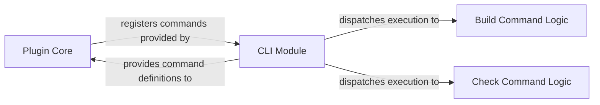

## Details

One paragraph explaining the functionality which is represented by this graph. What the main flow is and what is its purpose.

### Plugin Core
This component serves as the foundational interface for the plugin within the Poetry environment. Its primary responsibility is to register the buildproject and checkproject commands with Poetry, ensuring they are discoverable and executable by users. It also manages the plugin's lifecycle within the Poetry framework.

**Related Classes/Methods**:

- `poetry_multiproject_plugin.plugin`

### CLI Module
Responsible for handling user interactions via the command line. It parses command-line arguments (e.g., poetry multiproject build, poetry multiproject check), validates inputs, and then dispatches the execution to the relevant command logic (Build Command Logic or Check Command Logic).

**Related Classes/Methods**:

- <a href="https://github.com/DavidVujic/poetry-multiproject-plugin/blob/main/poetry_multiproject_plugin/commands/__init__.py" target="_blank" rel="noopener noreferrer">`poetry_multiproject_plugin/commands/__init__.py`</a>

### Build Command Logic
Encapsulates the specific business logic required to perform the "build project" operation. This component receives validated parameters from the CLI Module and executes the necessary steps to build a project, adhering to the plugin's build automation patterns.

**Related Classes/Methods**:

- `poetry_multiproject_plugin/commands/buildproject/project.py`

### Check Command Logic
Contains the specific business logic for the "check project" operation. Similar to the Build Command Logic, it receives validated inputs from the CLI Module and performs the required checks on a project, consistent with the plugin's quality assurance or validation patterns.

**Related Classes/Methods**:

- `poetry_multiproject_plugin/commands/checkproject/check.py`

### [FAQ](https://github.com/CodeBoarding/GeneratedOnBoardings/tree/main?tab=readme-ov-file#faq)