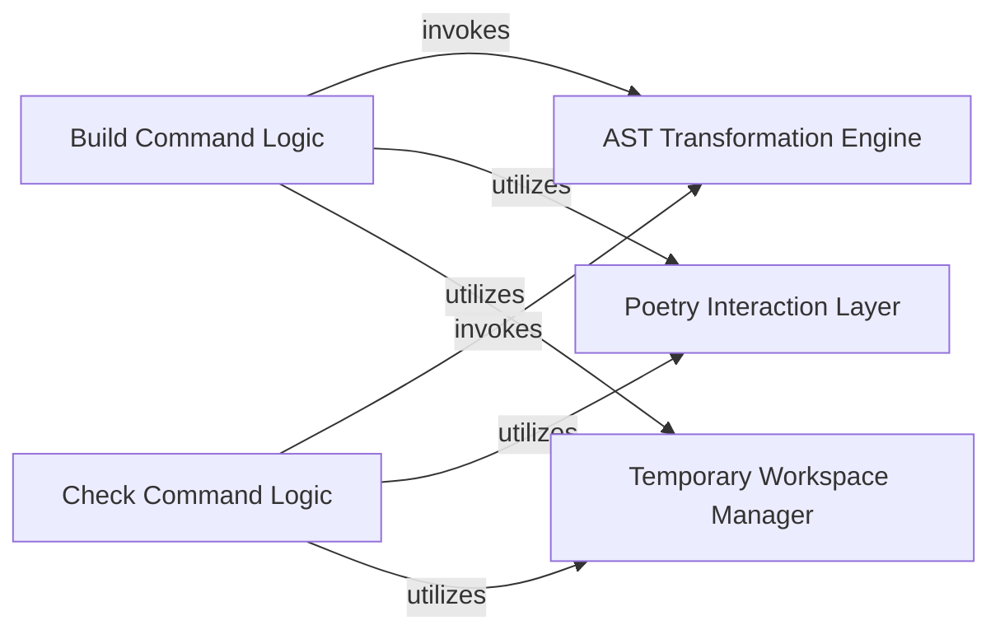

## Details

The `Project Utilities` subsystem is a collection of specialized components that provide core functionalities for the build tool, enabling code transformation, dependency management, and static analysis within a temporary environment. These components are crucial for adapting monorepo structures to standard build processes and ensuring code quality.

### AST Transformation Engine
This component provides an AST-based engine responsible for rewriting Python source code. Its primary function is to adjust import paths and other code structures to ensure compatibility when projects are extracted or built from a monorepo context into a temporary, isolated environment. This is a critical capability for enabling flexible project builds.

**Related Classes/Methods**:

- `poetry_multiproject_plugin.ast_transformer`

### Poetry Interaction Layer
This component abstracts and manages all interactions with the Poetry dependency manager. It handles tasks such as installing project dependencies, resolving package conflicts, and setting up the Python environment within the temporary workspace. This layer ensures consistent and isolated dependency management for all operations.

**Related Classes/Methods**:

- `poetry_multiproject_plugin.poetry_integration`

### Check Command Logic
This component orchestrates and executes external static analysis tools, such as MyPy, to perform code validation. It manages the setup of the analysis environment, triggers code transformations if necessary, and processes the results of the static analysis to ensure code quality and adherence to standards.

**Related Classes/Methods**:

- `poetry_multiproject_plugin.commands.check`

### Build Command Logic
This component encapsulates the core logic for building the project. It coordinates the entire build process, including preparing the source code (potentially via AST transformations), installing necessary dependencies, and ultimately packaging the project for distribution. It ensures that the build process is reproducible and isolated.

**Related Classes/Methods**:

- `poetry_multiproject_plugin.commands.build`

### Temporary Workspace Manager
This component is responsible for the creation, management, and cleanup of isolated temporary environments (workspaces) where build and check operations are performed. It ensures that each operation runs in a clean, reproducible state, preventing interference between different project tasks or with the host system.

**Related Classes/Methods**:

- `poetry_multiproject_plugin.workspace_manager`

### [FAQ](https://github.com/CodeBoarding/GeneratedOnBoardings/tree/main?tab=readme-ov-file#faq)