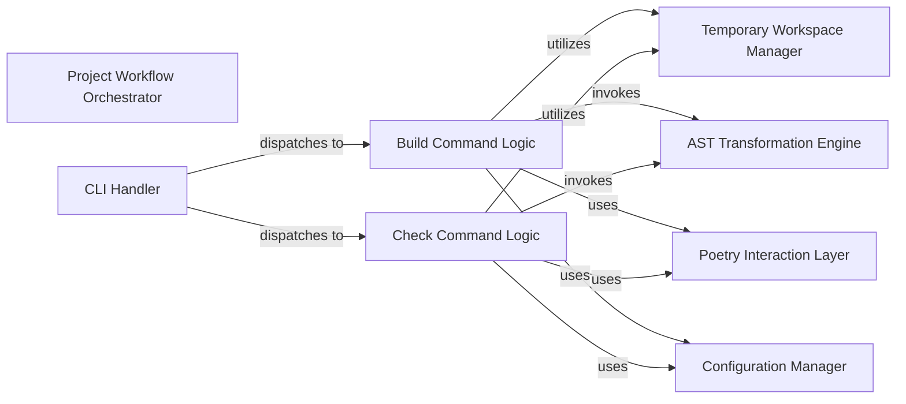

## Details

Abstract Components Overview

### Project Workflow Orchestrator [[Expand]](./Project_Workflow_Orchestrator.md)
This core component defines and manages the high-level execution flow for both building and checking multi-projects. It coordinates the various sub-processes, such as setting up the temporary workspace, preparing dependencies, performing code transformations, and initiating static analysis, by interacting with other specialized components. Conceptually, it represents the overarching control flow for the plugin's primary commands.

**Related Classes/Methods**:

- `poetry_multiproject_plugin.commands.buildproject.project`
- `poetry_multiproject_plugin.commands.checkproject.check`

### CLI Handler
This component is responsible for parsing command-line arguments and dispatching the appropriate `Build Command Logic` or `Check Command Logic` based on user input. It serves as the entry point for initiating the project workflows.

**Related Classes/Methods**:

- `poetry_multiproject_plugin.plugin`

### Build Command Logic
Orchestrates the entire build process for a specified subproject. This includes preparing the environment, applying necessary code transformations, and invoking Poetry commands to build the project. It is a direct executor of the `Project Workflow Orchestrator`'s build-related directives.

**Related Classes/Methods**:

- `poetry_multiproject_plugin.commands.buildproject.project`

### Check Command Logic
Orchestrates the process of running checks (e.g., MyPy) on a subproject. Similar to the build logic, it prepares the environment, applies transformations if needed, and executes external checking tools. It is a direct executor of the `Project Workflow Orchestrator`'s check-related directives.

**Related Classes/Methods**:

- `poetry_multiproject_plugin.commands.checkproject.check`

### Temporary Workspace Manager
Manages the creation, setup, and cleanup of temporary environments and handles file operations (e.g., copying subproject files) required for isolated build and check processes.

**Related Classes/Methods**:

- `poetry_multiproject_plugin.components.project.create`
- <a href="https://github.com/DavidVujic/poetry-multiproject-plugin/blob/main/poetry_multiproject_plugin/components/project/cleanup.py#L1-L1" target="_blank" rel="noopener noreferrer">`poetry_multiproject_plugin.components.project.cleanup` (1:1)</a>

### AST Transformation Engine
Applies code transformations to Python source files, typically by parsing the Abstract Syntax Tree (AST) and modifying it. This is essential for adapting code within the temporary workspace before building or checking.

**Related Classes/Methods**:

- `poetry_multiproject_plugin.components.parsing.rewrite`

### Poetry Interaction Layer
Provides an abstraction layer for executing Poetry commands. This component ensures that the plugin interacts correctly and consistently with the underlying Poetry environment, handling dependency resolution, package installation, and build commands.

**Related Classes/Methods**:

- <a href="https://github.com/DavidVujic/poetry-multiproject-plugin/blob/main/poetry_multiproject_plugin/components/deps/installer.py#L1-L1" target="_blank" rel="noopener noreferrer">`poetry_multiproject_plugin.components.deps.installer` (1:1)</a>

### Configuration Manager [[Expand]](./Configuration_Manager.md)
Manages plugin-specific configuration settings, allowing the `Build Command Logic` and `Check Command Logic` to retrieve and apply custom parameters for their operations.

**Related Classes/Methods**:

- `poetry_multiproject_plugin.components.toml.read`

### [FAQ](https://github.com/CodeBoarding/GeneratedOnBoardings/tree/main?tab=readme-ov-file#faq)